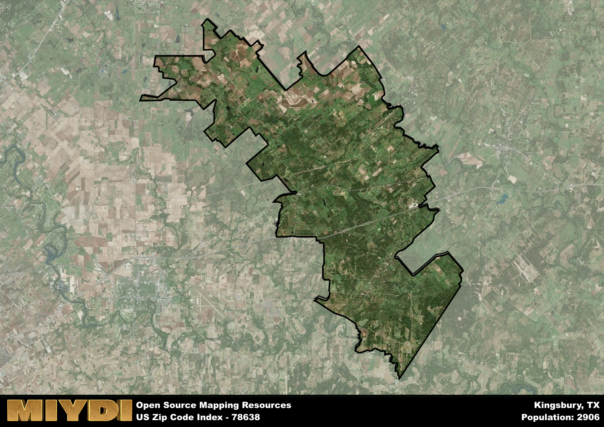

**Area Name:** Kingsbury

**Zip Code:** 78638

**State:** TX

Kingsbury is a part of the San Antonio-New Braunfels - TX Metro Area, and makes up  of the Metro's population.  

# Kingsbury: A Historic Gem in Central Texas  
Nestled in the heart of Central Texas, Kingsbury, with the zip code 78638, is a small rural community located within the larger Guadalupe County. Bordered by the cities of Seguin to the east and Luling to the west, Kingsbury seamlessly integrates with the surrounding countryside, offering residents a peaceful retreat from the hustle and bustle of urban life. Despite its rural setting, Kingsbury is conveniently located near major highways, providing easy access to nearby cities and attractions.

Originally settled in the mid-1800s, Kingsbury was named after Capt. Martin D. King, a prominent local landowner. The area experienced growth with the arrival of the Galveston, Harrisburg and San Antonio Railway, which contributed to its development as a farming community. Over the years, Kingsbury has retained its small-town charm while embracing modern amenities, making it an attractive destination for those seeking a tranquil lifestyle in a picturesque setting.

Today, Kingsbury boasts a thriving agricultural economy, with farms and ranches dotting the landscape. The community is home to a variety of local businesses, including shops, restaurants, and services that cater to residents and visitors alike. Outdoor enthusiasts can enjoy the abundant recreational opportunities in the area, from hiking and fishing to birdwatching and stargazing. Kingsbury also preserves its rich history through landmarks such as the Kingsbury Baptist Church and the historic downtown district, offering a glimpse into its storied past for generations to come.

# Kingsbury Demographics

The population of Kingsbury is 2906.  
Kingsbury has a population density of 24.63 per square mile.  
The area of Kingsbury is 118 square miles.  

## Kingsbury Income and Economic Data

These demographic numbers are sourced from IRS return data, providing comprehensive insights into the population dynamics and economic trends within Kingsbury.

**Breakdown of return types for Kingsbury**

The table offers insight into the composition of tax returns filed with the IRS, categorizing them into three main types. Single returns represent filings by individuals, joint returns by married couples, and head of household returns by individuals who qualify as heads of households, typically having dependents. This breakdown provides an understanding of the different filing statuses adopted by taxpayers when submitting their tax documentation.

| Return Types filed for Kingsbury                              | Percentage          |
|----------------------------------------------------------|---------------------|
| Single Returns                                            | 0.44 |
| Joint Returns                                             | 0.44 |
| Head Household Returns                                    | 0.09 |

The income and economic data presented here is sourced from the IRS income brackets, utilized for categorizing tax returns by income levels. This table displays income ranges for both single filers and married couples, along with the corresponding number of returns and the percentage within each bracket, providing valuable insight into the distribution of taxes across various income groups.

| Bracket Name       | Single Filer Income Range | Married Couple Range | Number of Returns | Percentage of Returns |
|--------------------|----------------------------|----------------------|-------------------|-----------------------|
| 10% Bracket        | Up to $10,275              | Up to $20,550        | 320 | 0.3% |
| 12% Bracket        | $10,276 - $41,775          | $20,551 - $83,550    | 310 | 0.29% |
| 22% Bracket        | $41,776 - $89,075          | $83,551 - $178,150   | 150 | 0.14% |
| 24% Bracket        | $89,076 - $170,050         | $178,151 - $340,100  | 90 | 0.08% |
| 32% Bracket        | $170,051 - $215,950        | $340,101 - $431,900  | 160 | 0.15% |
| 35% Bracket        | $215,951 - $539,900        | $431,901 - $647,850  | 50 | 0.05% |

### Exploring Taxpayer Diversity: A Breakdown of Different Types of Tax Returns in Kingsbury

The table offers insights into various types of tax returns filed, reflecting different aspects of taxpayer activities and demographics. Categories include charitable returns for donations, dependent returns for claimed dependents, educator population, elderly population, real estate returns, self-employment returns, student loan returns, and unemployment returns, providing valuable insights into taxpayer behavior and demographics.

| Kingsbury Filing Types                    | Count | Percentage |
|--------------------------------------|-------|------------|
| Charitable Donations                 | 30 | 0.028% |
| Dependents Claimed                   | 30 | 0.028% |
| Educator Residents                   | 20 | 0.019% |
| Elderly Population                   | 310 | 0.29% |
| Farming Population                   | 160 | 0.148% |
| Real Estate Transactions             | 30 | 0.028% |
| Self-Employed Individuals            | 140 | 0.13% |
| Student Loan Cases                   | 50 | 0.046% |
| Unemployment Benefit Filings         | 130 | 0.12% |

## Kingsbury AI and Census Variables

The values presented in this dataset for Kingsbury are AI-optimized, streamlined, and categorized into relevant buckets for enhanced utility in AI and mapping programs. These simplified values have been optimized to facilitate efficient analysis and integration into various technological applications, offering users accessible and actionable insights into demographics within the Kingsbury area.

| AI Variables for Kingsbury | Value |
|-------------|-------|
| Shape Area | 406090753.585938 |
| Shape Length | 171169.10711616 |
| CBSA Federal Processing Standard Code | 41700 |

## How to use this free AI optimized Geo-Spatial Data for Kingsbury, TX

This data is made freely available under the Creative Commons license, allowing for unrestricted use for any purpose. Users can access static resources directly from GitHub or leverage more advanced functionalities by utilizing the GeoJSON files. All datasets originate from official government or private sector sources and are meticulously compiled into relevant datasets within QGIS. However, the versatility of the data ensures compatibility with any mapping application.

## Data Accuracy Disclaimer
It's important to note that the data provided here may contain errors or discrepancies and should be considered as 'close enough' for business applications and AI rather than a definitive source of truth. This data is aggregated from multiple sources, some of which publish information on wildly different intervals, leading to potential inconsistencies. Additionally, certain data points may not be corrected for Covid-related changes, further impacting accuracy. Moreover, the assumption that demographic trends are consistent throughout a region may lead to discrepancies, as trends often concentrate in areas of highest population density. As a result, dense areas may be slightly underrepresented, while rural areas may be slightly overrepresented, resulting in a more conservative dataset. Furthermore, the focus primarily on areas within US Major and Minor Statistical areas means that approximately 40 million Americans living outside of these areas may not be fully represented. Lastly, the historical background and area descriptions generated using AI are susceptible to potential mistakes, so users should exercise caution when interpreting the information provided.
