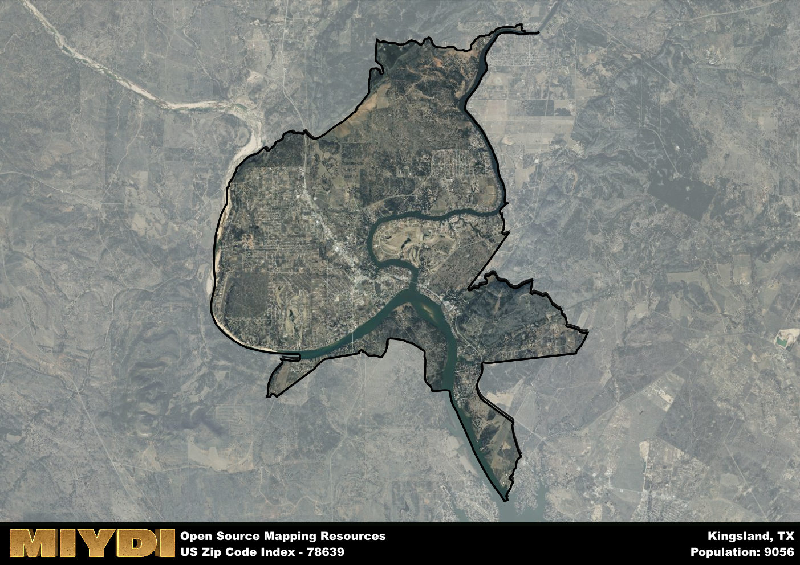

**Area Name:** Kingsland

**Zip Code:** 78639

**State:** TX

# Discover Kingsland: A Charming Lakeside Community in Central Texas

Located in the heart of the Texas Hill Country, zip code 78639 is synonymous with the picturesque community of Kingsland. Nestled along the banks of the Colorado River and Lake LBJ, Kingsland is surrounded by stunning natural beauty and is a popular destination for outdoor enthusiasts. The zip code area is bordered by the Highland Lakes and is in close proximity to the larger cities of Marble Falls and Llano, making it a convenient and idyllic retreat for residents and visitors alike.

Originally settled in the mid-19th century, Kingsland was named after Martin King, who established a ranch in the area. The community flourished with the arrival of the railroad in the late 1800s, leading to the development of the town as a hub for agriculture and trade. Over the years, Kingsland has evolved into a charming lakeside community known for its hospitality, scenic beauty, and vibrant local culture.

Today, Kingsland boasts a thriving economy driven by tourism, agriculture, and small businesses. The area offers a range of neighborhood-specific services, including quaint shops, cozy cafes, and family-owned restaurants. Residents and visitors can enjoy a variety of recreational amenities, such as boating, fishing, and hiking, as well as access to historic sites like the Kingsland Historical Society Museum. With its blend of natural beauty and small-town charm, Kingsland continues to enchant all who visit.

# Kingsland Demographics

The population of Kingsland is 9056.  
Kingsland has a population density of 355.42 per square mile.  
The area of Kingsland is 25.48 square miles.  

## Kingsland Income and Economic Data

These demographic numbers are sourced from IRS return data, providing comprehensive insights into the population dynamics and economic trends within Kingsland.

**Breakdown of return types for Kingsland**

The table offers insight into the composition of tax returns filed with the IRS, categorizing them into three main types. Single returns represent filings by individuals, joint returns by married couples, and head of household returns by individuals who qualify as heads of households, typically having dependents. This breakdown provides an understanding of the different filing statuses adopted by taxpayers when submitting their tax documentation.

| Return Types filed for Kingsland                              | Percentage          |
|----------------------------------------------------------|---------------------|
| Single Returns                                            | 0.47 |
| Joint Returns                                             | 0.41 |
| Head Household Returns                                    | 0.11 |

The income and economic data presented here is sourced from the IRS income brackets, utilized for categorizing tax returns by income levels. This table displays income ranges for both single filers and married couples, along with the corresponding number of returns and the percentage within each bracket, providing valuable insight into the distribution of taxes across various income groups.

| Bracket Name       | Single Filer Income Range | Married Couple Range | Number of Returns | Percentage of Returns |
|--------------------|----------------------------|----------------------|-------------------|-----------------------|
| 10% Bracket        | Up to $10,275              | Up to $20,550        | 1500 | 0.38% |
| 12% Bracket        | $10,276 - $41,775          | $20,551 - $83,550    | 950 | 0.24% |
| 22% Bracket        | $41,776 - $89,075          | $83,551 - $178,150   | 500 | 0.13% |
| 24% Bracket        | $89,076 - $170,050         | $178,151 - $340,100  | 340 | 0.09% |
| 32% Bracket        | $170,051 - $215,950        | $340,101 - $431,900  | 410 | 0.1% |
| 35% Bracket        | $215,951 - $539,900        | $431,901 - $647,850  | 210 | 0.05% |

### Exploring Taxpayer Diversity: A Breakdown of Different Types of Tax Returns in Kingsland

The table offers insights into various types of tax returns filed, reflecting different aspects of taxpayer activities and demographics. Categories include charitable returns for donations, dependent returns for claimed dependents, educator population, elderly population, real estate returns, self-employment returns, student loan returns, and unemployment returns, providing valuable insights into taxpayer behavior and demographics.

| Kingsland Filing Types                    | Count | Percentage |
|--------------------------------------|-------|------------|
| Charitable Donations                 | 210 | 0.054% |
| Dependents Claimed                   | 80 | 0.02% |
| Educator Residents                   | 60 | 0.015% |
| Elderly Population                   | 1550 | 0.4% |
| Farming Population                   | 60 | 0.015% |
| Real Estate Transactions             | 240 | 0.061% |
| Self-Employed Individuals            | 680 | 0.174% |
| Student Loan Cases                   | 110 | 0.028% |
| Unemployment Benefit Filings         | 330 | 0.08% |

## Kingsland AI and Census Variables

The values presented in this dataset for Kingsland are AI-optimized, streamlined, and categorized into relevant buckets for enhanced utility in AI and mapping programs. These simplified values have been optimized to facilitate efficient analysis and integration into various technological applications, offering users accessible and actionable insights into demographics within the Kingsland area.

| AI Variables for Kingsland | Value |
|-------------|-------|
| Shape Area | 89502147.1523438 |
| Shape Length | 65572.5568691117 |

## How to use this free AI optimized Geo-Spatial Data for Kingsland, TX

This data is made freely available under the Creative Commons license, allowing for unrestricted use for any purpose. Users can access static resources directly from GitHub or leverage more advanced functionalities by utilizing the GeoJSON files. All datasets originate from official government or private sector sources and are meticulously compiled into relevant datasets within QGIS. However, the versatility of the data ensures compatibility with any mapping application.

## Data Accuracy Disclaimer
It's important to note that the data provided here may contain errors or discrepancies and should be considered as 'close enough' for business applications and AI rather than a definitive source of truth. This data is aggregated from multiple sources, some of which publish information on wildly different intervals, leading to potential inconsistencies. Additionally, certain data points may not be corrected for Covid-related changes, further impacting accuracy. Moreover, the assumption that demographic trends are consistent throughout a region may lead to discrepancies, as trends often concentrate in areas of highest population density. As a result, dense areas may be slightly underrepresented, while rural areas may be slightly overrepresented, resulting in a more conservative dataset. Furthermore, the focus primarily on areas within US Major and Minor Statistical areas means that approximately 40 million Americans living outside of these areas may not be fully represented. Lastly, the historical background and area descriptions generated using AI are susceptible to potential mistakes, so users should exercise caution when interpreting the information provided.
