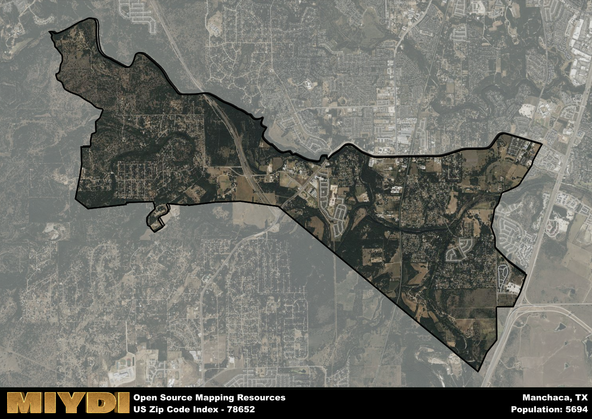

**Area Name:** Manchaca

**Zip Code:** 78652

**State:** TX

Manchaca is a part of the Austin-Round Rock-Georgetown - TX Metro Area, and makes up  of the Metro's population.  

# Manchaca: A Quaint Neighborhood in Southwest Austin

Located in the southwest corner of Austin, Texas, the zip code area 78652 encompasses the charming neighborhood of Manchaca. Bordered by the neighborhoods of Shady Hollow and Circle C Ranch, Manchaca seamlessly integrates into the larger urban fabric of Austin. Just a short drive away from downtown Austin, this area provides a peaceful retreat from the bustling city life while still offering easy access to major highways and amenities.

Originally settled in the mid-1800s, Manchaca has a rich history rooted in agriculture and ranching. The area was named after Tejano army officer José Antonio Menchaca, who served in the Republic of Texas army. Over the years, Manchaca has transformed from a small farming community into a thriving residential neighborhood known for its friendly community atmosphere and local businesses. The neighborhood prides itself on preserving its historical roots while embracing modern development and growth.

Today, Manchaca is a vibrant neighborhood with a mix of residential homes, local businesses, and parks. Residents enjoy a variety of dining options, shopping centers, and family-friendly activities. The area is known for its community events, such as farmers markets and festivals, which bring neighbors together. With its proximity to green spaces like the Slaughter Creek Preserve and the Lady Bird Johnson Wildflower Center, Manchaca offers residents plenty of opportunities for outdoor recreation and relaxation. This neighborhood's unique blend of history, community spirit, and modern conveniences make it a sought-after place to live in the Austin area.

# Manchaca Demographics

The population of Manchaca is 5694.  
Manchaca has a population density of 580.43 per square mile.  
The area of Manchaca is 9.81 square miles.  

## Manchaca Income and Economic Data

These demographic numbers are sourced from IRS return data, providing comprehensive insights into the population dynamics and economic trends within Manchaca.

**Breakdown of return types for Manchaca**

The table offers insight into the composition of tax returns filed with the IRS, categorizing them into three main types. Single returns represent filings by individuals, joint returns by married couples, and head of household returns by individuals who qualify as heads of households, typically having dependents. This breakdown provides an understanding of the different filing statuses adopted by taxpayers when submitting their tax documentation.

| Return Types filed for Manchaca                              | Percentage          |
|----------------------------------------------------------|---------------------|
| Single Returns                                            | 0.48 |
| Joint Returns                                             | 0.42 |
| Head Household Returns                                    | 0.08 |

The income and economic data presented here is sourced from the IRS income brackets, utilized for categorizing tax returns by income levels. This table displays income ranges for both single filers and married couples, along with the corresponding number of returns and the percentage within each bracket, providing valuable insight into the distribution of taxes across various income groups.

| Bracket Name       | Single Filer Income Range | Married Couple Range | Number of Returns | Percentage of Returns |
|--------------------|----------------------------|----------------------|-------------------|-----------------------|
| 10% Bracket        | Up to $10,275              | Up to $20,550        | 660 | 0.21% |
| 12% Bracket        | $10,276 - $41,775          | $20,551 - $83,550    | 620 | 0.2% |
| 22% Bracket        | $41,776 - $89,075          | $83,551 - $178,150   | 470 | 0.15% |
| 24% Bracket        | $89,076 - $170,050         | $178,151 - $340,100  | 370 | 0.12% |
| 32% Bracket        | $170,051 - $215,950        | $340,101 - $431,900  | 760 | 0.25% |
| 35% Bracket        | $215,951 - $539,900        | $431,901 - $647,850  | 200 | 0.06% |

### Exploring Taxpayer Diversity: A Breakdown of Different Types of Tax Returns in Manchaca

The table offers insights into various types of tax returns filed, reflecting different aspects of taxpayer activities and demographics. Categories include charitable returns for donations, dependent returns for claimed dependents, educator population, elderly population, real estate returns, self-employment returns, student loan returns, and unemployment returns, providing valuable insights into taxpayer behavior and demographics.

| Manchaca Filing Types                    | Count | Percentage |
|--------------------------------------|-------|------------|
| Charitable Donations                 | 220 | 0.071% |
| Dependents Claimed                   | 120 | 0.039% |
| Educator Residents                   | 110 | 0.036% |
| Elderly Population                   | 880 | 0.29% |
| Farming Population                   | 30 | 0.01% |
| Real Estate Transactions             | 300 | 0.097% |
| Self-Employed Individuals            | 530 | 0.172% |
| Student Loan Cases                   | 280 | 0.091% |
| Unemployment Benefit Filings         | 380 | 0.12% |

## Manchaca AI and Census Variables

The values presented in this dataset for Manchaca are AI-optimized, streamlined, and categorized into relevant buckets for enhanced utility in AI and mapping programs. These simplified values have been optimized to facilitate efficient analysis and integration into various technological applications, offering users accessible and actionable insights into demographics within the Manchaca area.

| AI Variables for Manchaca | Value |
|-------------|-------|
| Shape Area | 34098401.6445313 |
| Shape Length | 39762.80372685 |
| CBSA Federal Processing Standard Code | 12420 |

## How to use this free AI optimized Geo-Spatial Data for Manchaca, TX

This data is made freely available under the Creative Commons license, allowing for unrestricted use for any purpose. Users can access static resources directly from GitHub or leverage more advanced functionalities by utilizing the GeoJSON files. All datasets originate from official government or private sector sources and are meticulously compiled into relevant datasets within QGIS. However, the versatility of the data ensures compatibility with any mapping application.

## Data Accuracy Disclaimer
It's important to note that the data provided here may contain errors or discrepancies and should be considered as 'close enough' for business applications and AI rather than a definitive source of truth. This data is aggregated from multiple sources, some of which publish information on wildly different intervals, leading to potential inconsistencies. Additionally, certain data points may not be corrected for Covid-related changes, further impacting accuracy. Moreover, the assumption that demographic trends are consistent throughout a region may lead to discrepancies, as trends often concentrate in areas of highest population density. As a result, dense areas may be slightly underrepresented, while rural areas may be slightly overrepresented, resulting in a more conservative dataset. Furthermore, the focus primarily on areas within US Major and Minor Statistical areas means that approximately 40 million Americans living outside of these areas may not be fully represented. Lastly, the historical background and area descriptions generated using AI are susceptible to potential mistakes, so users should exercise caution when interpreting the information provided.
