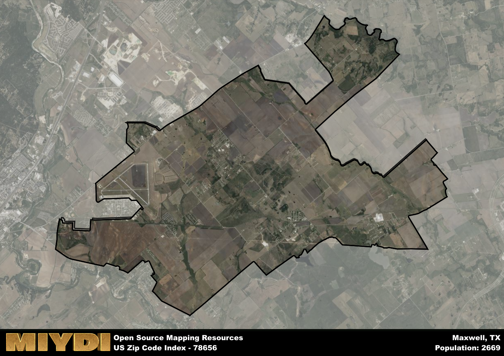

**Area Name:** Maxwell

**Zip Code:** 78656

**State:** TX

Maxwell is a part of the Austin-Round Rock-Georgetown - TX Metro Area, and makes up  of the Metro's population.  

# Maxwell: A Charming Neighborhood in Central Texas

Located in Central Texas, the zip code area 78656 encompasses the quaint neighborhood of Maxwell. Bordered by the cities of San Marcos to the east and Lockhart to the west, Maxwell is a small but integral part of the larger metropolitan area. Situated along major transportation routes, including Highway 142 and Interstate 35, Maxwell serves as a convenient hub for residents commuting to nearby urban centers.

Founded in the mid-19th century, Maxwell has a rich historical background that traces its roots to early settlers and pioneering families. The area experienced significant growth during the railroad expansion era, becoming a bustling community with thriving agriculture and commerce. Over the years, Maxwell has maintained its small-town charm while adapting to modern developments, preserving its unique heritage and character.

Today, Maxwell boasts a mix of residential areas, local businesses, and recreational opportunities that cater to its close-knit community. Residents can enjoy a range of amenities, from parks and community centers to locally-owned shops and restaurants. The neighborhood's strong sense of community spirit is evident in its annual events and festivals, which celebrate its history and culture. With a blend of historic landmarks and modern conveniences, Maxwell offers a tranquil yet vibrant lifestyle for its residents.

# Maxwell Demographics

The population of Maxwell is 2669.  
Maxwell has a population density of 80.03 per square mile.  
The area of Maxwell is 33.35 square miles.  

## Maxwell Income and Economic Data

These demographic numbers are sourced from IRS return data, providing comprehensive insights into the population dynamics and economic trends within Maxwell.

**Breakdown of return types for Maxwell**

The table offers insight into the composition of tax returns filed with the IRS, categorizing them into three main types. Single returns represent filings by individuals, joint returns by married couples, and head of household returns by individuals who qualify as heads of households, typically having dependents. This breakdown provides an understanding of the different filing statuses adopted by taxpayers when submitting their tax documentation.

| Return Types filed for Maxwell                              | Percentage          |
|----------------------------------------------------------|---------------------|
| Single Returns                                            | 0.52 |
| Joint Returns                                             | 0.3 |
| Head Household Returns                                    | 0.18 |

The income and economic data presented here is sourced from the IRS income brackets, utilized for categorizing tax returns by income levels. This table displays income ranges for both single filers and married couples, along with the corresponding number of returns and the percentage within each bracket, providing valuable insight into the distribution of taxes across various income groups.

| Bracket Name       | Single Filer Income Range | Married Couple Range | Number of Returns | Percentage of Returns |
|--------------------|----------------------------|----------------------|-------------------|-----------------------|
| 10% Bracket        | Up to $10,275              | Up to $20,550        | 400 | 0.33% |
| 12% Bracket        | $10,276 - $41,775          | $20,551 - $83,550    | 440 | 0.36% |
| 22% Bracket        | $41,776 - $89,075          | $83,551 - $178,150   | 190 | 0.16% |
| 24% Bracket        | $89,076 - $170,050         | $178,151 - $340,100  | 100 | 0.08% |
| 32% Bracket        | $170,051 - $215,950        | $340,101 - $431,900  | 90 | 0.07% |
| 35% Bracket        | $215,951 - $539,900        | $431,901 - $647,850  | 0 | 0% |

### Exploring Taxpayer Diversity: A Breakdown of Different Types of Tax Returns in Maxwell

The table offers insights into various types of tax returns filed, reflecting different aspects of taxpayer activities and demographics. Categories include charitable returns for donations, dependent returns for claimed dependents, educator population, elderly population, real estate returns, self-employment returns, student loan returns, and unemployment returns, providing valuable insights into taxpayer behavior and demographics.

| Maxwell Filing Types                    | Count | Percentage |
|--------------------------------------|-------|------------|
| Charitable Donations                 | 0 | 0% |
| Dependents Claimed                   | 20 | 0.016% |
| Educator Residents                   | 0 | 0% |
| Elderly Population                   | 230 | 0.19% |
| Farming Population                   | 30 | 0.025% |
| Real Estate Transactions             | 0 | 0% |
| Self-Employed Individuals            | 180 | 0.148% |
| Student Loan Cases                   | 40 | 0.033% |
| Unemployment Benefit Filings         | 150 | 0.12% |

## Maxwell AI and Census Variables

The values presented in this dataset for Maxwell are AI-optimized, streamlined, and categorized into relevant buckets for enhanced utility in AI and mapping programs. These simplified values have been optimized to facilitate efficient analysis and integration into various technological applications, offering users accessible and actionable insights into demographics within the Maxwell area.

| AI Variables for Maxwell | Value |
|-------------|-------|
| Shape Area | 115308177.34375 |
| Shape Length | 79118.4191995162 |
| CBSA Federal Processing Standard Code | 12420 |

## How to use this free AI optimized Geo-Spatial Data for Maxwell, TX

This data is made freely available under the Creative Commons license, allowing for unrestricted use for any purpose. Users can access static resources directly from GitHub or leverage more advanced functionalities by utilizing the GeoJSON files. All datasets originate from official government or private sector sources and are meticulously compiled into relevant datasets within QGIS. However, the versatility of the data ensures compatibility with any mapping application.

## Data Accuracy Disclaimer
It's important to note that the data provided here may contain errors or discrepancies and should be considered as 'close enough' for business applications and AI rather than a definitive source of truth. This data is aggregated from multiple sources, some of which publish information on wildly different intervals, leading to potential inconsistencies. Additionally, certain data points may not be corrected for Covid-related changes, further impacting accuracy. Moreover, the assumption that demographic trends are consistent throughout a region may lead to discrepancies, as trends often concentrate in areas of highest population density. As a result, dense areas may be slightly underrepresented, while rural areas may be slightly overrepresented, resulting in a more conservative dataset. Furthermore, the focus primarily on areas within US Major and Minor Statistical areas means that approximately 40 million Americans living outside of these areas may not be fully represented. Lastly, the historical background and area descriptions generated using AI are susceptible to potential mistakes, so users should exercise caution when interpreting the information provided.
