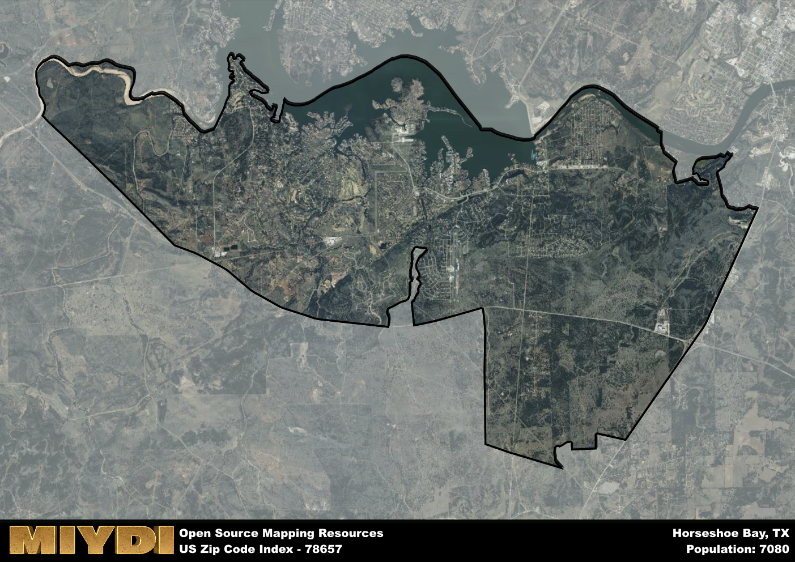

**Area Name:** Horseshoe Bay

**Zip Code:** 78657

**State:** TX

# Exploring Horseshoe Bay (Zip Code 78657)

Located in the heart of the Texas Hill Country, Horseshoe Bay encompasses the zip code 78657. This picturesque area is situated along the southern shore of Lake LBJ, just a short drive from the city of Marble Falls. Horseshoe Bay is known for its upscale residential communities, championship golf courses, and stunning waterfront properties. It is seamlessly integrated into the larger Highland Lakes region, offering residents and visitors alike a tranquil retreat from the bustling city life.

The history of Horseshoe Bay dates back to the 1970s when developers began transforming the area into a premier resort destination. Named after the horseshoe bend in the Colorado River, Horseshoe Bay quickly became a popular retreat for outdoor enthusiasts and golf aficionados. Over the years, the community has grown into a thriving residential area with a strong emphasis on luxury living and recreational amenities. Today, Horseshoe Bay continues to attract visitors seeking a peaceful escape surrounded by natural beauty.

Presently, Horseshoe Bay is a vibrant community known for its world-class golf courses, upscale marina, and beautiful lakeside properties. Residents and visitors can enjoy a wide range of recreational activities, including boating, fishing, and hiking in the nearby state parks. The area also boasts a variety of dining options, boutique shops, and cultural attractions, making it a popular destination for both tourists and full-time residents. With its stunning natural surroundings and luxurious amenities, Horseshoe Bay remains a sought-after location for those looking to experience the best of the Texas Hill Country.

# Horseshoe Bay Demographics

The population of Horseshoe Bay is 7080.  
Horseshoe Bay has a population density of 189.86 per square mile.  
The area of Horseshoe Bay is 37.29 square miles.  

## Horseshoe Bay Income and Economic Data

These demographic numbers are sourced from IRS return data, providing comprehensive insights into the population dynamics and economic trends within Horseshoe Bay.

**Breakdown of return types for Horseshoe Bay**

The table offers insight into the composition of tax returns filed with the IRS, categorizing them into three main types. Single returns represent filings by individuals, joint returns by married couples, and head of household returns by individuals who qualify as heads of households, typically having dependents. This breakdown provides an understanding of the different filing statuses adopted by taxpayers when submitting their tax documentation.

| Return Types filed for Horseshoe Bay                              | Percentage          |
|----------------------------------------------------------|---------------------|
| Single Returns                                            | 0.42 |
| Joint Returns                                             | 0.5 |
| Head Household Returns                                    | 0.06 |

The income and economic data presented here is sourced from the IRS income brackets, utilized for categorizing tax returns by income levels. This table displays income ranges for both single filers and married couples, along with the corresponding number of returns and the percentage within each bracket, providing valuable insight into the distribution of taxes across various income groups.

| Bracket Name       | Single Filer Income Range | Married Couple Range | Number of Returns | Percentage of Returns |
|--------------------|----------------------------|----------------------|-------------------|-----------------------|
| 10% Bracket        | Up to $10,275              | Up to $20,550        | 880 | 0.25% |
| 12% Bracket        | $10,276 - $41,775          | $20,551 - $83,550    | 700 | 0.2% |
| 22% Bracket        | $41,776 - $89,075          | $83,551 - $178,150   | 390 | 0.11% |
| 24% Bracket        | $89,076 - $170,050         | $178,151 - $340,100  | 310 | 0.09% |
| 32% Bracket        | $170,051 - $215,950        | $340,101 - $431,900  | 680 | 0.19% |
| 35% Bracket        | $215,951 - $539,900        | $431,901 - $647,850  | 570 | 0.16% |

### Exploring Taxpayer Diversity: A Breakdown of Different Types of Tax Returns in Horseshoe Bay

The table offers insights into various types of tax returns filed, reflecting different aspects of taxpayer activities and demographics. Categories include charitable returns for donations, dependent returns for claimed dependents, educator population, elderly population, real estate returns, self-employment returns, student loan returns, and unemployment returns, providing valuable insights into taxpayer behavior and demographics.

| Horseshoe Bay Filing Types                    | Count | Percentage |
|--------------------------------------|-------|------------|
| Charitable Donations                 | 560 | 0.159% |
| Dependents Claimed                   | 60 | 0.017% |
| Educator Residents                   | 50 | 0.014% |
| Elderly Population                   | 1880 | 0.53% |
| Farming Population                   | 80 | 0.023% |
| Real Estate Transactions             | 580 | 0.164% |
| Self-Employed Individuals            | 640 | 0.181% |
| Student Loan Cases                   | 90 | 0.025% |
| Unemployment Benefit Filings         | 320 | 0.09% |

## Horseshoe Bay AI and Census Variables

The values presented in this dataset for Horseshoe Bay are AI-optimized, streamlined, and categorized into relevant buckets for enhanced utility in AI and mapping programs. These simplified values have been optimized to facilitate efficient analysis and integration into various technological applications, offering users accessible and actionable insights into demographics within the Horseshoe Bay area.

| AI Variables for Horseshoe Bay | Value |
|-------------|-------|
| Shape Area | 130623671.390625 |
| Shape Length | 76389.4265045952 |

## How to use this free AI optimized Geo-Spatial Data for Horseshoe Bay, TX

This data is made freely available under the Creative Commons license, allowing for unrestricted use for any purpose. Users can access static resources directly from GitHub or leverage more advanced functionalities by utilizing the GeoJSON files. All datasets originate from official government or private sector sources and are meticulously compiled into relevant datasets within QGIS. However, the versatility of the data ensures compatibility with any mapping application.

## Data Accuracy Disclaimer
It's important to note that the data provided here may contain errors or discrepancies and should be considered as 'close enough' for business applications and AI rather than a definitive source of truth. This data is aggregated from multiple sources, some of which publish information on wildly different intervals, leading to potential inconsistencies. Additionally, certain data points may not be corrected for Covid-related changes, further impacting accuracy. Moreover, the assumption that demographic trends are consistent throughout a region may lead to discrepancies, as trends often concentrate in areas of highest population density. As a result, dense areas may be slightly underrepresented, while rural areas may be slightly overrepresented, resulting in a more conservative dataset. Furthermore, the focus primarily on areas within US Major and Minor Statistical areas means that approximately 40 million Americans living outside of these areas may not be fully represented. Lastly, the historical background and area descriptions generated using AI are susceptible to potential mistakes, so users should exercise caution when interpreting the information provided.
