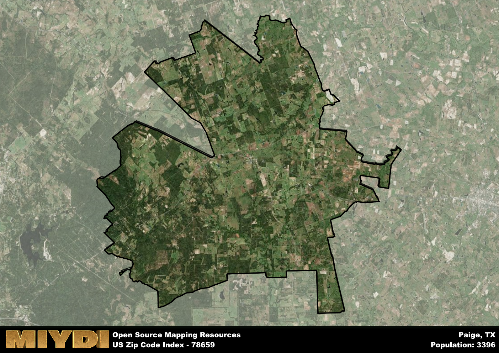

**Area Name:** Paige

**Zip Code:** 78659

**State:** TX

Paige is a part of the Austin-Round Rock-Georgetown - TX Metro Area, and makes up  of the Metro's population.  

# Paige: A Charming Rural Community in Central Texas

Located in the heart of Central Texas, the zip code area 78659 encompasses the charming rural community of Paige. Bordered by vast open fields and rolling hills, Paige is situated approximately 40 miles east of Austin and 100 miles west of Houston. The area is well-connected to major highways, allowing for easy access to neighboring towns such as Bastrop and Elgin, as well as the bustling urban centers of Austin and Houston.

Originally settled in the late 19th century, Paige has a rich historical narrative that reflects its agricultural roots and small-town charm. The area was named after Norman Paige, a prominent local landowner, and has since grown into a close-knit community known for its friendly residents and tranquil way of life. Over the years, Paige has maintained its rural character while embracing modern developments, making it a popular choice for those seeking a peaceful retreat from city life.

Today, Paige offers a mix of agricultural and residential properties, with family-owned farms and ranches dotting the landscape. The area boasts a variety of local businesses, including cozy cafes, boutique shops, and farmers markets, providing residents with essential services and amenities. Outdoor enthusiasts can explore the nearby parks and nature reserves, while history buffs can visit the historic sites that highlight Paige's unique heritage. With its peaceful surroundings and strong sense of community, Paige continues to attract visitors and new residents looking to experience the beauty of rural Texas.

# Paige Demographics

The population of Paige is 3396.  
Paige has a population density of 32.1 per square mile.  
The area of Paige is 105.78 square miles.  

## Paige Income and Economic Data

These demographic numbers are sourced from IRS return data, providing comprehensive insights into the population dynamics and economic trends within Paige.

**Breakdown of return types for Paige**

The table offers insight into the composition of tax returns filed with the IRS, categorizing them into three main types. Single returns represent filings by individuals, joint returns by married couples, and head of household returns by individuals who qualify as heads of households, typically having dependents. This breakdown provides an understanding of the different filing statuses adopted by taxpayers when submitting their tax documentation.

| Return Types filed for Paige                              | Percentage          |
|----------------------------------------------------------|---------------------|
| Single Returns                                            | 0.42 |
| Joint Returns                                             | 0.45 |
| Head Household Returns                                    | 0.11 |

The income and economic data presented here is sourced from the IRS income brackets, utilized for categorizing tax returns by income levels. This table displays income ranges for both single filers and married couples, along with the corresponding number of returns and the percentage within each bracket, providing valuable insight into the distribution of taxes across various income groups.

| Bracket Name       | Single Filer Income Range | Married Couple Range | Number of Returns | Percentage of Returns |
|--------------------|----------------------------|----------------------|-------------------|-----------------------|
| 10% Bracket        | Up to $10,275              | Up to $20,550        | 570 | 0.33% |
| 12% Bracket        | $10,276 - $41,775          | $20,551 - $83,550    | 420 | 0.24% |
| 22% Bracket        | $41,776 - $89,075          | $83,551 - $178,150   | 260 | 0.15% |
| 24% Bracket        | $89,076 - $170,050         | $178,151 - $340,100  | 170 | 0.1% |
| 32% Bracket        | $170,051 - $215,950        | $340,101 - $431,900  | 260 | 0.15% |
| 35% Bracket        | $215,951 - $539,900        | $431,901 - $647,850  | 60 | 0.03% |

### Exploring Taxpayer Diversity: A Breakdown of Different Types of Tax Returns in Paige

The table offers insights into various types of tax returns filed, reflecting different aspects of taxpayer activities and demographics. Categories include charitable returns for donations, dependent returns for claimed dependents, educator population, elderly population, real estate returns, self-employment returns, student loan returns, and unemployment returns, providing valuable insights into taxpayer behavior and demographics.

| Paige Filing Types                    | Count | Percentage |
|--------------------------------------|-------|------------|
| Charitable Donations                 | 60 | 0.034% |
| Dependents Claimed                   | 40 | 0.023% |
| Educator Residents                   | 30 | 0.017% |
| Elderly Population                   | 450 | 0.26% |
| Farming Population                   | 150 | 0.086% |
| Real Estate Transactions             | 70 | 0.04% |
| Self-Employed Individuals            | 290 | 0.167% |
| Student Loan Cases                   | 90 | 0.052% |
| Unemployment Benefit Filings         | 210 | 0.12% |

## Paige AI and Census Variables

The values presented in this dataset for Paige are AI-optimized, streamlined, and categorized into relevant buckets for enhanced utility in AI and mapping programs. These simplified values have been optimized to facilitate efficient analysis and integration into various technological applications, offering users accessible and actionable insights into demographics within the Paige area.

| AI Variables for Paige | Value |
|-------------|-------|
| Shape Area | 368017988.394531 |
| Shape Length | 138084.018367384 |
| CBSA Federal Processing Standard Code | 12420 |

## How to use this free AI optimized Geo-Spatial Data for Paige, TX

This data is made freely available under the Creative Commons license, allowing for unrestricted use for any purpose. Users can access static resources directly from GitHub or leverage more advanced functionalities by utilizing the GeoJSON files. All datasets originate from official government or private sector sources and are meticulously compiled into relevant datasets within QGIS. However, the versatility of the data ensures compatibility with any mapping application.

## Data Accuracy Disclaimer
It's important to note that the data provided here may contain errors or discrepancies and should be considered as 'close enough' for business applications and AI rather than a definitive source of truth. This data is aggregated from multiple sources, some of which publish information on wildly different intervals, leading to potential inconsistencies. Additionally, certain data points may not be corrected for Covid-related changes, further impacting accuracy. Moreover, the assumption that demographic trends are consistent throughout a region may lead to discrepancies, as trends often concentrate in areas of highest population density. As a result, dense areas may be slightly underrepresented, while rural areas may be slightly overrepresented, resulting in a more conservative dataset. Furthermore, the focus primarily on areas within US Major and Minor Statistical areas means that approximately 40 million Americans living outside of these areas may not be fully represented. Lastly, the historical background and area descriptions generated using AI are susceptible to potential mistakes, so users should exercise caution when interpreting the information provided.
