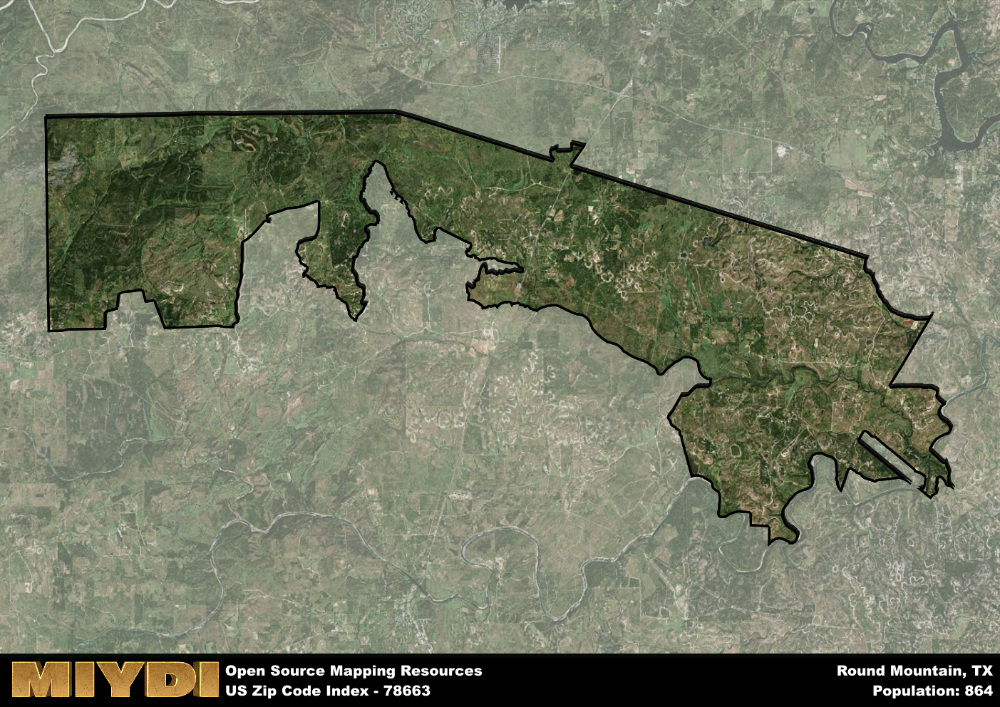

**Area Name:** Round Mountain

**Zip Code:** 78663

**State:** TX

Round Mountain is a part of the Austin-Round Rock-Georgetown - TX Metro Area, and makes up  of the Metro's population.  

# Round Mountain: A Historic Gem in the Heart of Texas Hill Country  

Round Mountain, zip code 78663, is a charming rural community nestled in the heart of Texas Hill Country. The area is located approximately 15 miles north of Marble Falls and 50 miles west of Austin. Surrounded by rolling hills and picturesque landscapes, Round Mountain seamlessly integrates with nearby towns such as Johnson City and Horseshoe Bay, creating a network of small, tight-knit communities within the larger metropolitan area.

Originally settled in the mid-19th century, Round Mountain was named for the unique, rounded hill that overlooks the town. The area was primarily agricultural, with farming and ranching playing a vital role in its economy. Over the years, Round Mountain has evolved into a peaceful residential community while still retaining its rural charm. The town's rich history is evident in its historic buildings, including the Round Mountain General Store, which dates back to the late 1800s.

Today, Round Mountain offers a tranquil escape from the hustle and bustle of city life. The area boasts a mix of small businesses, local shops, and family-owned restaurants, providing residents with essential services and a strong sense of community. Outdoor enthusiasts can explore the nearby hiking trails, fishing spots, and camping grounds, while history buffs can visit the Round Mountain Historical Society Museum to learn more about the area's past. With its scenic beauty and laid-back atmosphere, Round Mountain continues to be a hidden gem in Texas Hill Country.

# Round Mountain Demographics

The population of Round Mountain is 864.  
Round Mountain has a population density of 5.71 per square mile.  
The area of Round Mountain is 151.26 square miles.  

## Round Mountain Income and Economic Data

These demographic numbers are sourced from IRS return data, providing comprehensive insights into the population dynamics and economic trends within Round Mountain.

**Breakdown of return types for Round Mountain**

The table offers insight into the composition of tax returns filed with the IRS, categorizing them into three main types. Single returns represent filings by individuals, joint returns by married couples, and head of household returns by individuals who qualify as heads of households, typically having dependents. This breakdown provides an understanding of the different filing statuses adopted by taxpayers when submitting their tax documentation.

| Return Types filed for Round Mountain                              | Percentage          |
|----------------------------------------------------------|---------------------|
| Single Returns                                            | 0.4 |
| Joint Returns                                             | 0.52 |
| Head Household Returns                                    | 0.07 |

The income and economic data presented here is sourced from the IRS income brackets, utilized for categorizing tax returns by income levels. This table displays income ranges for both single filers and married couples, along with the corresponding number of returns and the percentage within each bracket, providing valuable insight into the distribution of taxes across various income groups.

| Bracket Name       | Single Filer Income Range | Married Couple Range | Number of Returns | Percentage of Returns |
|--------------------|----------------------------|----------------------|-------------------|-----------------------|
| 10% Bracket        | Up to $10,275              | Up to $20,550        | 120 | 0.29% |
| 12% Bracket        | $10,276 - $41,775          | $20,551 - $83,550    | 80 | 0.19% |
| 22% Bracket        | $41,776 - $89,075          | $83,551 - $178,150   | 50 | 0.12% |
| 24% Bracket        | $89,076 - $170,050         | $178,151 - $340,100  | 40 | 0.1% |
| 32% Bracket        | $170,051 - $215,950        | $340,101 - $431,900  | 80 | 0.19% |
| 35% Bracket        | $215,951 - $539,900        | $431,901 - $647,850  | 50 | 0.12% |

### Exploring Taxpayer Diversity: A Breakdown of Different Types of Tax Returns in Round Mountain

The table offers insights into various types of tax returns filed, reflecting different aspects of taxpayer activities and demographics. Categories include charitable returns for donations, dependent returns for claimed dependents, educator population, elderly population, real estate returns, self-employment returns, student loan returns, and unemployment returns, providing valuable insights into taxpayer behavior and demographics.

| Round Mountain Filing Types                    | Count | Percentage |
|--------------------------------------|-------|------------|
| Charitable Donations                 | 50 | 0.119% |
| Dependents Claimed                   | 0 | 0% |
| Educator Residents                   | 0 | 0% |
| Elderly Population                   | 170 | 0.4% |
| Farming Population                   | 70 | 0.167% |
| Real Estate Transactions             | 50 | 0.119% |
| Self-Employed Individuals            | 90 | 0.214% |
| Student Loan Cases                   | 0 | 0% |
| Unemployment Benefit Filings         | 30 | 0.07% |

## Round Mountain AI and Census Variables

The values presented in this dataset for Round Mountain are AI-optimized, streamlined, and categorized into relevant buckets for enhanced utility in AI and mapping programs. These simplified values have been optimized to facilitate efficient analysis and integration into various technological applications, offering users accessible and actionable insights into demographics within the Round Mountain area.

| AI Variables for Round Mountain | Value |
|-------------|-------|
| Shape Area | 528678063.664063 |
| Shape Length | 219597.316470914 |
| CBSA Federal Processing Standard Code | 12420 |

## How to use this free AI optimized Geo-Spatial Data for Round Mountain, TX

This data is made freely available under the Creative Commons license, allowing for unrestricted use for any purpose. Users can access static resources directly from GitHub or leverage more advanced functionalities by utilizing the GeoJSON files. All datasets originate from official government or private sector sources and are meticulously compiled into relevant datasets within QGIS. However, the versatility of the data ensures compatibility with any mapping application.

## Data Accuracy Disclaimer
It's important to note that the data provided here may contain errors or discrepancies and should be considered as 'close enough' for business applications and AI rather than a definitive source of truth. This data is aggregated from multiple sources, some of which publish information on wildly different intervals, leading to potential inconsistencies. Additionally, certain data points may not be corrected for Covid-related changes, further impacting accuracy. Moreover, the assumption that demographic trends are consistent throughout a region may lead to discrepancies, as trends often concentrate in areas of highest population density. As a result, dense areas may be slightly underrepresented, while rural areas may be slightly overrepresented, resulting in a more conservative dataset. Furthermore, the focus primarily on areas within US Major and Minor Statistical areas means that approximately 40 million Americans living outside of these areas may not be fully represented. Lastly, the historical background and area descriptions generated using AI are susceptible to potential mistakes, so users should exercise caution when interpreting the information provided.
