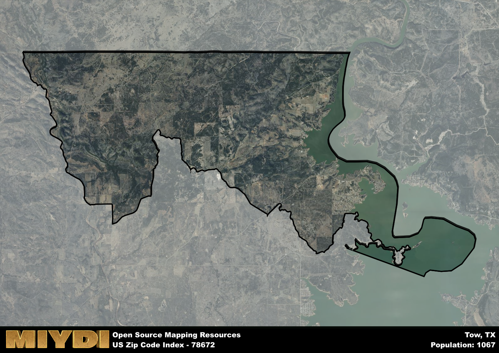

**Area Name:** Tow

**Zip Code:** 78672

**State:** TX

# Explore the Charming Neighborhood of Tow, Zip Code 78672  

Located in central Texas, the zip code 78672 area encompasses the picturesque neighborhood of Tow. Situated along the banks of Lake Buchanan, Tow is surrounded by stunning natural beauty and rolling hills. It is a part of the larger Burnet County region and is in close proximity to the city of Burnet. Tow is a peaceful retreat away from the hustle and bustle of urban life, providing residents with a tranquil setting to call home.

Tow has a rich historical narrative, with roots dating back to the mid-19th century. The area was originally settled by German immigrants who were drawn to the fertile land and abundant water sources. Over the years, Tow developed into a vibrant community known for its agriculture and ranching. The name "Tow" is believed to have originated from the German word "Thau," meaning water, highlighting the area's close connection to the nearby lake and rivers.

Today, Tow is a thriving community that offers a mix of residential homes, vacation rentals, and small businesses. The economy is driven by tourism, with visitors flocking to Tow to enjoy water activities on Lake Buchanan and explore the surrounding natural attractions. The neighborhood boasts a range of services, including local shops, restaurants, and recreational facilities. Residents and visitors alike can also visit historic sites like the Tow Community Center, which serves as a hub for community events and gatherings.

# Tow Demographics

The population of Tow is 1067.  
Tow has a population density of 20.22 per square mile.  
The area of Tow is 52.77 square miles.  

## Tow Income and Economic Data

These demographic numbers are sourced from IRS return data, providing comprehensive insights into the population dynamics and economic trends within Tow.

**Breakdown of return types for Tow**

The table offers insight into the composition of tax returns filed with the IRS, categorizing them into three main types. Single returns represent filings by individuals, joint returns by married couples, and head of household returns by individuals who qualify as heads of households, typically having dependents. This breakdown provides an understanding of the different filing statuses adopted by taxpayers when submitting their tax documentation.

| Return Types filed for Tow                              | Percentage          |
|----------------------------------------------------------|---------------------|
| Single Returns                                            | 0.45 |
| Joint Returns                                             | 0.48 |
| Head Household Returns                                    | 0.07 |

The income and economic data presented here is sourced from the IRS income brackets, utilized for categorizing tax returns by income levels. This table displays income ranges for both single filers and married couples, along with the corresponding number of returns and the percentage within each bracket, providing valuable insight into the distribution of taxes across various income groups.

| Bracket Name       | Single Filer Income Range | Married Couple Range | Number of Returns | Percentage of Returns |
|--------------------|----------------------------|----------------------|-------------------|-----------------------|
| 10% Bracket        | Up to $10,275              | Up to $20,550        | 170 | 0.39% |
| 12% Bracket        | $10,276 - $41,775          | $20,551 - $83,550    | 110 | 0.25% |
| 22% Bracket        | $41,776 - $89,075          | $83,551 - $178,150   | 60 | 0.14% |
| 24% Bracket        | $89,076 - $170,050         | $178,151 - $340,100  | 40 | 0.09% |
| 32% Bracket        | $170,051 - $215,950        | $340,101 - $431,900  | 60 | 0.14% |
| 35% Bracket        | $215,951 - $539,900        | $431,901 - $647,850  | 0 | 0% |

### Exploring Taxpayer Diversity: A Breakdown of Different Types of Tax Returns in Tow

The table offers insights into various types of tax returns filed, reflecting different aspects of taxpayer activities and demographics. Categories include charitable returns for donations, dependent returns for claimed dependents, educator population, elderly population, real estate returns, self-employment returns, student loan returns, and unemployment returns, providing valuable insights into taxpayer behavior and demographics.

| Tow Filing Types                    | Count | Percentage |
|--------------------------------------|-------|------------|
| Charitable Donations                 | 0 | 0% |
| Dependents Claimed                   | 0 | 0% |
| Educator Residents                   | 0 | 0% |
| Elderly Population                   | 220 | 0.5% |
| Farming Population                   | 0 | 0% |
| Real Estate Transactions             | 0 | 0% |
| Self-Employed Individuals            | 70 | 0.159% |
| Student Loan Cases                   | 0 | 0% |
| Unemployment Benefit Filings         | 40 | 0.09% |

## Tow AI and Census Variables

The values presented in this dataset for Tow are AI-optimized, streamlined, and categorized into relevant buckets for enhanced utility in AI and mapping programs. These simplified values have been optimized to facilitate efficient analysis and integration into various technological applications, offering users accessible and actionable insights into demographics within the Tow area.

| AI Variables for Tow | Value |
|-------------|-------|
| Shape Area | 186148842.351563 |
| Shape Length | 107402.968639207 |

## How to use this free AI optimized Geo-Spatial Data for Tow, TX

This data is made freely available under the Creative Commons license, allowing for unrestricted use for any purpose. Users can access static resources directly from GitHub or leverage more advanced functionalities by utilizing the GeoJSON files. All datasets originate from official government or private sector sources and are meticulously compiled into relevant datasets within QGIS. However, the versatility of the data ensures compatibility with any mapping application.

## Data Accuracy Disclaimer
It's important to note that the data provided here may contain errors or discrepancies and should be considered as 'close enough' for business applications and AI rather than a definitive source of truth. This data is aggregated from multiple sources, some of which publish information on wildly different intervals, leading to potential inconsistencies. Additionally, certain data points may not be corrected for Covid-related changes, further impacting accuracy. Moreover, the assumption that demographic trends are consistent throughout a region may lead to discrepancies, as trends often concentrate in areas of highest population density. As a result, dense areas may be slightly underrepresented, while rural areas may be slightly overrepresented, resulting in a more conservative dataset. Furthermore, the focus primarily on areas within US Major and Minor Statistical areas means that approximately 40 million Americans living outside of these areas may not be fully represented. Lastly, the historical background and area descriptions generated using AI are susceptible to potential mistakes, so users should exercise caution when interpreting the information provided.
