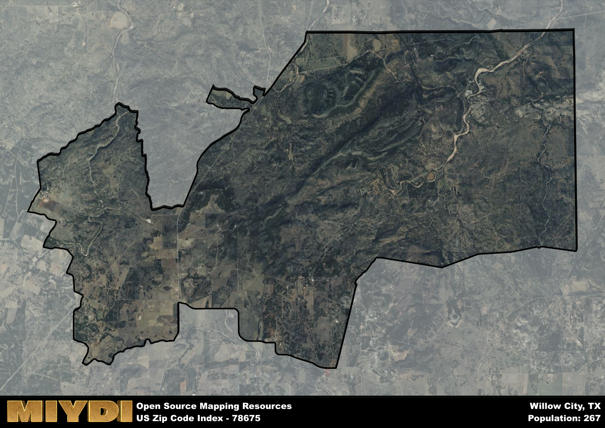

**Area Name:** Willow City

**Zip Code:** 78675

**State:** TX

Willow City is a part of the Fredericksburg - TX Micro Area, and makes up  of the Metro's population.  

# Willow City: A Charming Texan Getaway  
Located in the heart of Texas Hill Country, the zip code 78675 area of Willow City is known for its picturesque landscapes and small-town charm. Bordered by the towns of Fredericksburg to the west and Llano to the east, Willow City seamlessly integrates into the rural fabric of the region, offering visitors and residents a peaceful escape from the hustle and bustle of urban life.

With a history dating back to the mid-19th century, Willow City was established as a farming and ranching community. The area's growth was fueled by the arrival of German settlers seeking fertile land for agriculture. Over the years, Willow City became known for its wildflowers, particularly the annual bloom of bluebonnets that blankets the countryside in vibrant hues, attracting tourists and nature enthusiasts from far and wide.

Today, Willow City remains a haven for outdoor enthusiasts, offering activities such as hiking, birdwatching, and stargazing. The area is dotted with family-owned farms and vineyards, showcasing the region's agricultural heritage. Visitors can also explore historic sites like the Willow City Loop, a scenic drive that winds through rolling hills and valleys, providing stunning views of the surrounding landscape. With a strong sense of community and a commitment to preserving its natural beauty, Willow City continues to enchant visitors with its unique blend of history and charm.

# Willow City Demographics

The population of Willow City is 267.  
Willow City has a population density of 4.74 per square mile.  
The area of Willow City is 56.32 square miles.  

## Willow City AI and Census Variables

The values presented in this dataset for Willow City are AI-optimized, streamlined, and categorized into relevant buckets for enhanced utility in AI and mapping programs. These simplified values have been optimized to facilitate efficient analysis and integration into various technological applications, offering users accessible and actionable insights into demographics within the Willow City area.

| AI Variables for Willow City | Value |
|-------------|-------|
| Shape Area | 196924542.84375 |
| Shape Length | 84995.082918239 |
| CBSA Federal Processing Standard Code | 23240 |

## How to use this free AI optimized Geo-Spatial Data for Willow City, TX

This data is made freely available under the Creative Commons license, allowing for unrestricted use for any purpose. Users can access static resources directly from GitHub or leverage more advanced functionalities by utilizing the GeoJSON files. All datasets originate from official government or private sector sources and are meticulously compiled into relevant datasets within QGIS. However, the versatility of the data ensures compatibility with any mapping application.

## Data Accuracy Disclaimer
It's important to note that the data provided here may contain errors or discrepancies and should be considered as 'close enough' for business applications and AI rather than a definitive source of truth. This data is aggregated from multiple sources, some of which publish information on wildly different intervals, leading to potential inconsistencies. Additionally, certain data points may not be corrected for Covid-related changes, further impacting accuracy. Moreover, the assumption that demographic trends are consistent throughout a region may lead to discrepancies, as trends often concentrate in areas of highest population density. As a result, dense areas may be slightly underrepresented, while rural areas may be slightly overrepresented, resulting in a more conservative dataset. Furthermore, the focus primarily on areas within US Major and Minor Statistical areas means that approximately 40 million Americans living outside of these areas may not be fully represented. Lastly, the historical background and area descriptions generated using AI are susceptible to potential mistakes, so users should exercise caution when interpreting the information provided.
