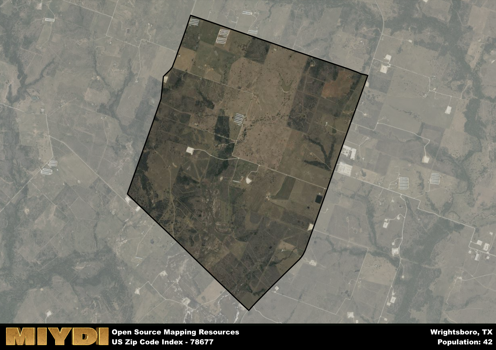

**Area Name:** Wrightsboro

**Zip Code:** 78677

**State:** TX

# Historic Charm and Community Spirit in Wrightsboro, TX (Zip Code 78677)

Located in central Texas, zip code 78677 encompasses the charming neighborhood of Wrightsboro, situated within the larger metropolitan area of San Antonio. Bordered by rolling hills and lush greenery, Wrightsboro is a peaceful oasis just a short drive from the bustling city center. The area seamlessly integrates with neighboring towns like New Braunfels and Seguin, offering residents the perfect balance of suburban tranquility and urban convenience.

Wrightsboro has a rich historical lineage, dating back to its establishment in the mid-19th century by the Wright family. The area flourished as a farming community, with cotton and corn as the primary crops. Over the years, Wrightsboro has retained its small-town charm and close-knit community spirit. Residents take pride in preserving its heritage, evident in the well-preserved historic buildings and landmarks that dot the neighborhood.

Today, Wrightsboro boasts a thriving local economy supported by family-owned businesses, agriculture, and tourism. Residents and visitors alike can enjoy a variety of recreational activities, from hiking and fishing along the Guadalupe River to exploring the quaint shops and restaurants in the historic downtown district. With its strong sense of community, picturesque surroundings, and rich history, Wrightsboro continues to be a hidden gem in the heart of Texas.

# Wrightsboro Demographics

The population of Wrightsboro is 42.  
Wrightsboro has a population density of 6.02 per square mile.  
The area of Wrightsboro is 6.98 square miles.  

## Wrightsboro AI and Census Variables

The values presented in this dataset for Wrightsboro are AI-optimized, streamlined, and categorized into relevant buckets for enhanced utility in AI and mapping programs. These simplified values have been optimized to facilitate efficient analysis and integration into various technological applications, offering users accessible and actionable insights into demographics within the Wrightsboro area.

| AI Variables for Wrightsboro | Value |
|-------------|-------|
| Shape Area | 23874869.4023438 |
| Shape Length | 19412.0442398559 |

## How to use this free AI optimized Geo-Spatial Data for Wrightsboro, TX

This data is made freely available under the Creative Commons license, allowing for unrestricted use for any purpose. Users can access static resources directly from GitHub or leverage more advanced functionalities by utilizing the GeoJSON files. All datasets originate from official government or private sector sources and are meticulously compiled into relevant datasets within QGIS. However, the versatility of the data ensures compatibility with any mapping application.

## Data Accuracy Disclaimer
It's important to note that the data provided here may contain errors or discrepancies and should be considered as 'close enough' for business applications and AI rather than a definitive source of truth. This data is aggregated from multiple sources, some of which publish information on wildly different intervals, leading to potential inconsistencies. Additionally, certain data points may not be corrected for Covid-related changes, further impacting accuracy. Moreover, the assumption that demographic trends are consistent throughout a region may lead to discrepancies, as trends often concentrate in areas of highest population density. As a result, dense areas may be slightly underrepresented, while rural areas may be slightly overrepresented, resulting in a more conservative dataset. Furthermore, the focus primarily on areas within US Major and Minor Statistical areas means that approximately 40 million Americans living outside of these areas may not be fully represented. Lastly, the historical background and area descriptions generated using AI are susceptible to potential mistakes, so users should exercise caution when interpreting the information provided.
