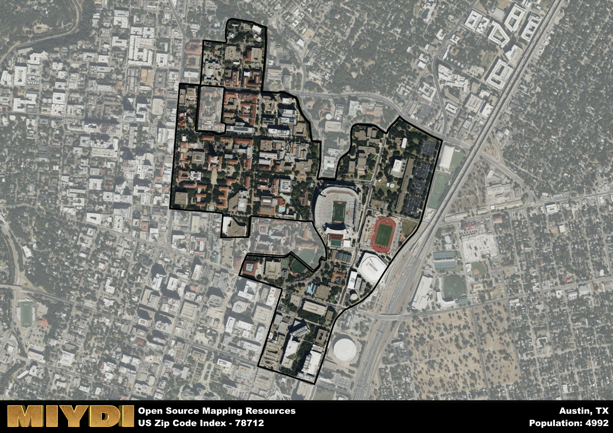

**Area Name:** Austin

**Zip Code:** 78712

**State:** TX

Austin is a part of the Austin-Round Rock-Georgetown - TX Metro Area, and makes up  of the Metro's population.  

# The Historic Neighborhood of University of Texas at Austin, 78712

The zip code area 78712 corresponds to the neighborhood surrounding the University of Texas at Austin, located in the heart of the city. Bordered by Guadalupe Street to the west, Martin Luther King Jr. Boulevard to the south, and Interstate 35 to the east, this area is an integral part of the vibrant urban fabric of Austin. It is situated within close proximity to downtown Austin, allowing for easy access to major cultural and economic centers in the city.

The area of 78712 has a rich historical background, dating back to the establishment of the University of Texas at Austin in the late 19th century. Originally founded in 1883, the university has played a significant role in shaping the development of the neighborhood and the city as a whole. Over the years, the area has evolved into a bustling academic and cultural hub, attracting students, scholars, and visitors from around the world.

Today, the neighborhood of 78712 is a thriving community filled with a mix of residential, commercial, and academic spaces. The area is home to a diverse range of businesses, restaurants, and shops, catering to the needs of both students and locals. Residents and visitors can enjoy a variety of recreational amenities, including parks, trails, and historic sites. The neighborhood also boasts a rich cultural scene, with museums, theaters, and music venues showcasing the unique character of Austin.

# Austin Demographics

The population of Austin is 4992.  
Austin has a population density of 10400 per square mile.  
The area of Austin is 0.48 square miles.  

## Austin AI and Census Variables

The values presented in this dataset for Austin are AI-optimized, streamlined, and categorized into relevant buckets for enhanced utility in AI and mapping programs. These simplified values have been optimized to facilitate efficient analysis and integration into various technological applications, offering users accessible and actionable insights into demographics within the Austin area.

| AI Variables for Austin | Value |
|-------------|-------|
| Shape Area | 1675830.9609375 |
| Shape Length | 10036.3501960053 |
| CBSA Federal Processing Standard Code | 12420 |

## How to use this free AI optimized Geo-Spatial Data for Austin, TX

This data is made freely available under the Creative Commons license, allowing for unrestricted use for any purpose. Users can access static resources directly from GitHub or leverage more advanced functionalities by utilizing the GeoJSON files. All datasets originate from official government or private sector sources and are meticulously compiled into relevant datasets within QGIS. However, the versatility of the data ensures compatibility with any mapping application.

## Data Accuracy Disclaimer
It's important to note that the data provided here may contain errors or discrepancies and should be considered as 'close enough' for business applications and AI rather than a definitive source of truth. This data is aggregated from multiple sources, some of which publish information on wildly different intervals, leading to potential inconsistencies. Additionally, certain data points may not be corrected for Covid-related changes, further impacting accuracy. Moreover, the assumption that demographic trends are consistent throughout a region may lead to discrepancies, as trends often concentrate in areas of highest population density. As a result, dense areas may be slightly underrepresented, while rural areas may be slightly overrepresented, resulting in a more conservative dataset. Furthermore, the focus primarily on areas within US Major and Minor Statistical areas means that approximately 40 million Americans living outside of these areas may not be fully represented. Lastly, the historical background and area descriptions generated using AI are susceptible to potential mistakes, so users should exercise caution when interpreting the information provided.
