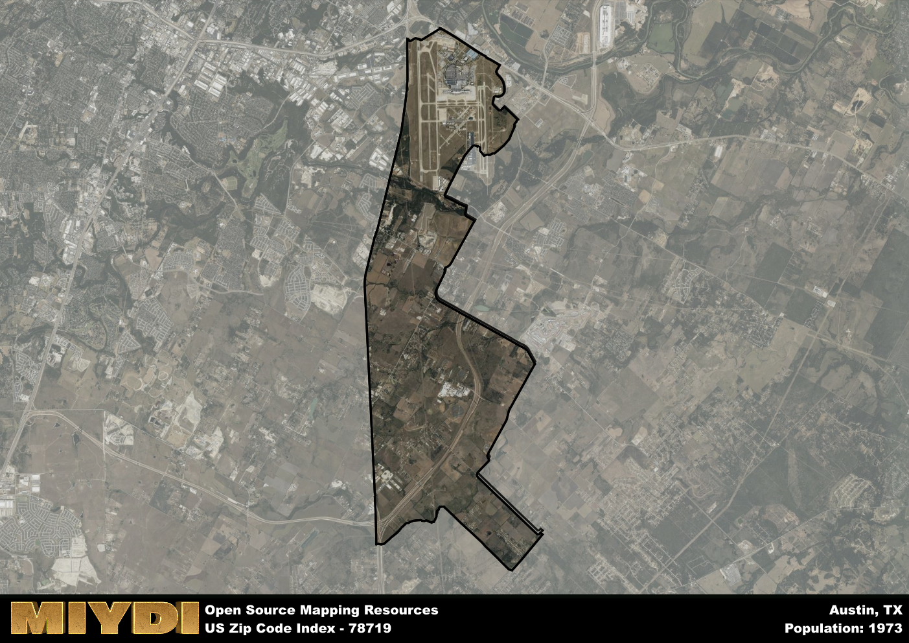

**Area Name:** Austin

**Zip Code:** 78719

**State:** TX

Austin is a part of the Austin-Round Rock-Georgetown - TX Metro Area, and makes up  of the Metro's population.  

# Hidden Gem in Austin: 78719  
The zip code 78719 corresponds to the neighborhood of Montopolis, located in southeast Austin, Texas. Bordered by the Colorado River to the north and encompassing areas such as McKinney Falls State Park and Austin-Bergstrom International Airport, Montopolis seamlessly integrates with the larger urban fabric of Austin. It is situated near major highways and provides easy access to downtown Austin, making it a convenient location for both residents and visitors.

Established in the mid-19th century, Montopolis has a rich historical narrative that reflects its diverse cultural heritage. Originally settled by German, Swedish, and Mexican immigrants, the neighborhood grew into a thriving community known for its agricultural roots and vibrant music scene. Over the years, Montopolis has experienced significant growth and transformation, shaping its current identity as a unique blend of urban and rural influences.

Today, Montopolis boasts a mix of residential, commercial, and industrial areas, offering a range of economic opportunities for its residents. The neighborhood is home to several local businesses, parks, and community centers that cater to the needs of its diverse population. Additionally, Montopolis is known for its cultural landmarks, such as the Montopolis School for the Performing Arts, which celebrates the neighborhood's artistic heritage. With its proximity to outdoor recreational areas and urban amenities, Montopolis continues to thrive as a hidden gem in the heart of Austin.

# Austin Demographics

The population of Austin is 1973.  
Austin has a population density of 96.81 per square mile.  
The area of Austin is 20.38 square miles.  

## Austin Income and Economic Data

These demographic numbers are sourced from IRS return data, providing comprehensive insights into the population dynamics and economic trends within Austin.

**Breakdown of return types for Austin**

The table offers insight into the composition of tax returns filed with the IRS, categorizing them into three main types. Single returns represent filings by individuals, joint returns by married couples, and head of household returns by individuals who qualify as heads of households, typically having dependents. This breakdown provides an understanding of the different filing statuses adopted by taxpayers when submitting their tax documentation.

| Return Types filed for Austin                              | Percentage          |
|----------------------------------------------------------|---------------------|
| Single Returns                                            | 0.47 |
| Joint Returns                                             | 0.32 |
| Head Household Returns                                    | 0.18 |

The income and economic data presented here is sourced from the IRS income brackets, utilized for categorizing tax returns by income levels. This table displays income ranges for both single filers and married couples, along with the corresponding number of returns and the percentage within each bracket, providing valuable insight into the distribution of taxes across various income groups.

| Bracket Name       | Single Filer Income Range | Married Couple Range | Number of Returns | Percentage of Returns |
|--------------------|----------------------------|----------------------|-------------------|-----------------------|
| 10% Bracket        | Up to $10,275              | Up to $20,550        | 330 | 0.39% |
| 12% Bracket        | $10,276 - $41,775          | $20,551 - $83,550    | 280 | 0.33% |
| 22% Bracket        | $41,776 - $89,075          | $83,551 - $178,150   | 130 | 0.15% |
| 24% Bracket        | $89,076 - $170,050         | $178,151 - $340,100  | 70 | 0.08% |
| 32% Bracket        | $170,051 - $215,950        | $340,101 - $431,900  | 40 | 0.05% |
| 35% Bracket        | $215,951 - $539,900        | $431,901 - $647,850  | 0 | 0% |

### Exploring Taxpayer Diversity: A Breakdown of Different Types of Tax Returns in Austin

The table offers insights into various types of tax returns filed, reflecting different aspects of taxpayer activities and demographics. Categories include charitable returns for donations, dependent returns for claimed dependents, educator population, elderly population, real estate returns, self-employment returns, student loan returns, and unemployment returns, providing valuable insights into taxpayer behavior and demographics.

| Austin Filing Types                    | Count | Percentage |
|--------------------------------------|-------|------------|
| Charitable Donations                 | 0 | 0% |
| Dependents Claimed                   | 0 | 0% |
| Educator Residents                   | 0 | 0% |
| Elderly Population                   | 140 | 0.16% |
| Farming Population                   | 0 | 0% |
| Real Estate Transactions             | 0 | 0% |
| Self-Employed Individuals            | 180 | 0.212% |
| Student Loan Cases                   | 30 | 0.035% |
| Unemployment Benefit Filings         | 70 | 0.08% |

## Austin AI and Census Variables

The values presented in this dataset for Austin are AI-optimized, streamlined, and categorized into relevant buckets for enhanced utility in AI and mapping programs. These simplified values have been optimized to facilitate efficient analysis and integration into various technological applications, offering users accessible and actionable insights into demographics within the Austin area.

| AI Variables for Austin | Value |
|-------------|-------|
| Shape Area | 70798487.3671875 |
| Shape Length | 55842.4870860807 |
| CBSA Federal Processing Standard Code | 12420 |

## How to use this free AI optimized Geo-Spatial Data for Austin, TX

This data is made freely available under the Creative Commons license, allowing for unrestricted use for any purpose. Users can access static resources directly from GitHub or leverage more advanced functionalities by utilizing the GeoJSON files. All datasets originate from official government or private sector sources and are meticulously compiled into relevant datasets within QGIS. However, the versatility of the data ensures compatibility with any mapping application.

## Data Accuracy Disclaimer
It's important to note that the data provided here may contain errors or discrepancies and should be considered as 'close enough' for business applications and AI rather than a definitive source of truth. This data is aggregated from multiple sources, some of which publish information on wildly different intervals, leading to potential inconsistencies. Additionally, certain data points may not be corrected for Covid-related changes, further impacting accuracy. Moreover, the assumption that demographic trends are consistent throughout a region may lead to discrepancies, as trends often concentrate in areas of highest population density. As a result, dense areas may be slightly underrepresented, while rural areas may be slightly overrepresented, resulting in a more conservative dataset. Furthermore, the focus primarily on areas within US Major and Minor Statistical areas means that approximately 40 million Americans living outside of these areas may not be fully represented. Lastly, the historical background and area descriptions generated using AI are susceptible to potential mistakes, so users should exercise caution when interpreting the information provided.
