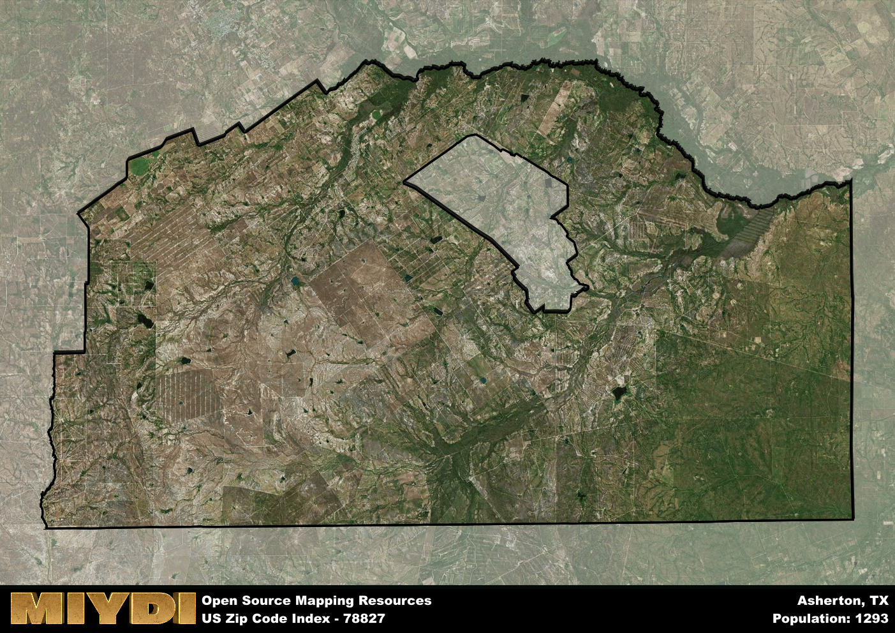

**Area Name:** Asherton

**Zip Code:** 78827

**State:** TX

Asherton is a part of the Laredo - TX Metro Area, and makes up  of the Metro's population.  

# Asherton: A Vibrant Community in South Texas

Located in south Texas, the zip code area 78827 is synonymous with the small town of Asherton. Situated within Dimmit County, Asherton is bordered by the city of Carrizo Springs to the west and is approximately 15 miles south of Crystal City. As part of the larger metropolitan context, Asherton serves as a vital hub for agricultural activities in the region, particularly in the production of peanuts, watermelon, and other crops.

Asherton has a rich historical narrative that dates back to its establishment in 1923 by Asher Richardson, the town's namesake. Originally founded as a railroad town, Asherton experienced rapid growth due to its strategic location on the San Antonio, Uvalde, and Gulf Railroad. The town quickly became a center for farming and ranching, attracting settlers looking for new opportunities in the fertile lands of south Texas.

Today, Asherton continues to thrive as a close-knit community with a strong agricultural base. The town's economy is driven by farming and ranching, with local businesses catering to the needs of residents and visitors alike. Asherton offers a range of services, including schools, medical facilities, and recreational amenities such as parks and community centers. The town also boasts several historic sites that highlight its unique heritage, making it a hidden gem within the bustling south Texas region.

# Asherton Demographics

The population of Asherton is 1293.  
Asherton has a population density of 2.13 per square mile.  
The area of Asherton is 606.67 square miles.  

## Asherton Income and Economic Data

These demographic numbers are sourced from IRS return data, providing comprehensive insights into the population dynamics and economic trends within Asherton.

**Breakdown of return types for Asherton**

The table offers insight into the composition of tax returns filed with the IRS, categorizing them into three main types. Single returns represent filings by individuals, joint returns by married couples, and head of household returns by individuals who qualify as heads of households, typically having dependents. This breakdown provides an understanding of the different filing statuses adopted by taxpayers when submitting their tax documentation.

| Return Types filed for Asherton                              | Percentage          |
|----------------------------------------------------------|---------------------|
| Single Returns                                            | 0.52 |
| Joint Returns                                             | 0.25 |
| Head Household Returns                                    | 0.25 |

The income and economic data presented here is sourced from the IRS income brackets, utilized for categorizing tax returns by income levels. This table displays income ranges for both single filers and married couples, along with the corresponding number of returns and the percentage within each bracket, providing valuable insight into the distribution of taxes across various income groups.

| Bracket Name       | Single Filer Income Range | Married Couple Range | Number of Returns | Percentage of Returns |
|--------------------|----------------------------|----------------------|-------------------|-----------------------|
| 10% Bracket        | Up to $10,275              | Up to $20,550        | 220 | 0.46% |
| 12% Bracket        | $10,276 - $41,775          | $20,551 - $83,550    | 140 | 0.29% |
| 22% Bracket        | $41,776 - $89,075          | $83,551 - $178,150   | 60 | 0.13% |
| 24% Bracket        | $89,076 - $170,050         | $178,151 - $340,100  | 30 | 0.06% |
| 32% Bracket        | $170,051 - $215,950        | $340,101 - $431,900  | 30 | 0.06% |
| 35% Bracket        | $215,951 - $539,900        | $431,901 - $647,850  | 0 | 0% |

### Exploring Taxpayer Diversity: A Breakdown of Different Types of Tax Returns in Asherton

The table offers insights into various types of tax returns filed, reflecting different aspects of taxpayer activities and demographics. Categories include charitable returns for donations, dependent returns for claimed dependents, educator population, elderly population, real estate returns, self-employment returns, student loan returns, and unemployment returns, providing valuable insights into taxpayer behavior and demographics.

| Asherton Filing Types                    | Count | Percentage |
|--------------------------------------|-------|------------|
| Charitable Donations                 | 0 | 0% |
| Dependents Claimed                   | 0 | 0% |
| Educator Residents                   | 0 | 0% |
| Elderly Population                   | 130 | 0.27% |
| Farming Population                   | 20 | 0.042% |
| Real Estate Transactions             | 0 | 0% |
| Self-Employed Individuals            | 40 | 0.083% |
| Student Loan Cases                   | 30 | 0.063% |
| Unemployment Benefit Filings         | 80 | 0.17% |

## Asherton AI and Census Variables

The values presented in this dataset for Asherton are AI-optimized, streamlined, and categorized into relevant buckets for enhanced utility in AI and mapping programs. These simplified values have been optimized to facilitate efficient analysis and integration into various technological applications, offering users accessible and actionable insights into demographics within the Asherton area.

| AI Variables for Asherton | Value |
|-------------|-------|
| Shape Area | 2035466313.20313 |
| Shape Length | 279057.751876093 |
| CBSA Federal Processing Standard Code | 29700 |

## How to use this free AI optimized Geo-Spatial Data for Asherton, TX

This data is made freely available under the Creative Commons license, allowing for unrestricted use for any purpose. Users can access static resources directly from GitHub or leverage more advanced functionalities by utilizing the GeoJSON files. All datasets originate from official government or private sector sources and are meticulously compiled into relevant datasets within QGIS. However, the versatility of the data ensures compatibility with any mapping application.

## Data Accuracy Disclaimer
It's important to note that the data provided here may contain errors or discrepancies and should be considered as 'close enough' for business applications and AI rather than a definitive source of truth. This data is aggregated from multiple sources, some of which publish information on wildly different intervals, leading to potential inconsistencies. Additionally, certain data points may not be corrected for Covid-related changes, further impacting accuracy. Moreover, the assumption that demographic trends are consistent throughout a region may lead to discrepancies, as trends often concentrate in areas of highest population density. As a result, dense areas may be slightly underrepresented, while rural areas may be slightly overrepresented, resulting in a more conservative dataset. Furthermore, the focus primarily on areas within US Major and Minor Statistical areas means that approximately 40 million Americans living outside of these areas may not be fully represented. Lastly, the historical background and area descriptions generated using AI are susceptible to potential mistakes, so users should exercise caution when interpreting the information provided.
