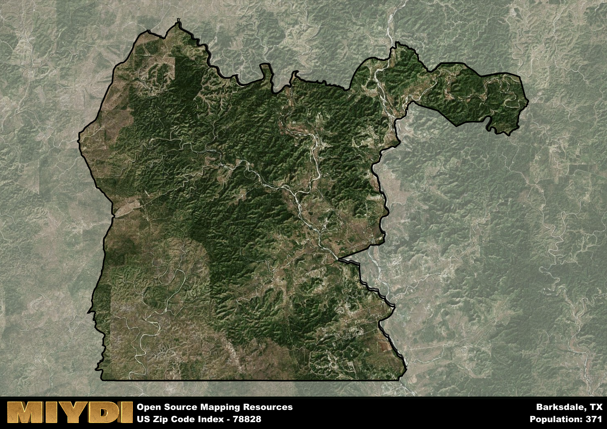

**Area Name:** Barksdale

**Zip Code:** 78828

**State:** TX

Barksdale is a part of the Uvalde - TX Micro Area, and makes up  of the Metro's population.  

# Barksdale: A Charming Zip Code Area in Texas Hill Country  

Located in the heart of Texas Hill Country, zip code 78828 corresponds to the quaint neighborhood of Barksdale. Barksdale is situated within Edwards County, surrounded by rolling hills and picturesque landscapes. The area is in close proximity to the larger cities of San Antonio and Austin, but maintains a distinct rural charm with its small-town atmosphere. Barksdale is known for its scenic beauty and outdoor recreational opportunities, making it a popular destination for nature enthusiasts and tourists alike.

Barksdale has a rich historical narrative, dating back to its early settlement by pioneers and ranchers in the 19th century. The area's name is derived from a prominent local family, reflecting its deep roots in the community. Over the years, Barksdale has grown into a tight-knit neighborhood with a strong sense of community pride. The area has preserved its historic buildings and landmarks, showcasing its heritage and traditions to visitors and residents alike.

Today, Barksdale is a thriving community with a mix of residential homes, local businesses, and recreational facilities. The economy is primarily driven by agriculture, ranching, and tourism, with many residents working in these industries. The neighborhood offers a range of services, including schools, shops, and restaurants, catering to the needs of its residents. Outdoor enthusiasts can explore the nearby rivers, parks, and hiking trails, while history buffs can visit the area's museums and historic sites. Barksdale remains a hidden gem in Texas Hill Country, offering a peaceful retreat for those looking to escape the hustle and bustle of city life.

# Barksdale Demographics

The population of Barksdale is 371.  
Barksdale has a population density of 1.53 per square mile.  
The area of Barksdale is 242.86 square miles.  

## Barksdale Income and Economic Data

These demographic numbers are sourced from IRS return data, providing comprehensive insights into the population dynamics and economic trends within Barksdale.

**Breakdown of return types for Barksdale**

The table offers insight into the composition of tax returns filed with the IRS, categorizing them into three main types. Single returns represent filings by individuals, joint returns by married couples, and head of household returns by individuals who qualify as heads of households, typically having dependents. This breakdown provides an understanding of the different filing statuses adopted by taxpayers when submitting their tax documentation.

| Return Types filed for Barksdale                              | Percentage          |
|----------------------------------------------------------|---------------------|
| Single Returns                                            | 0.36 |
| Joint Returns                                             | 0.55 |
| Head Household Returns                                    | 0 |

The income and economic data presented here is sourced from the IRS income brackets, utilized for categorizing tax returns by income levels. This table displays income ranges for both single filers and married couples, along with the corresponding number of returns and the percentage within each bracket, providing valuable insight into the distribution of taxes across various income groups.

| Bracket Name       | Single Filer Income Range | Married Couple Range | Number of Returns | Percentage of Returns |
|--------------------|----------------------------|----------------------|-------------------|-----------------------|
| 10% Bracket        | Up to $10,275              | Up to $20,550        | 40 | 0.36% |
| 12% Bracket        | $10,276 - $41,775          | $20,551 - $83,550    | 30 | 0.27% |
| 22% Bracket        | $41,776 - $89,075          | $83,551 - $178,150   | 20 | 0.18% |
| 24% Bracket        | $89,076 - $170,050         | $178,151 - $340,100  | 0 | 0% |
| 32% Bracket        | $170,051 - $215,950        | $340,101 - $431,900  | 20 | 0.18% |
| 35% Bracket        | $215,951 - $539,900        | $431,901 - $647,850  | 0 | 0% |

### Exploring Taxpayer Diversity: A Breakdown of Different Types of Tax Returns in Barksdale

The table offers insights into various types of tax returns filed, reflecting different aspects of taxpayer activities and demographics. Categories include charitable returns for donations, dependent returns for claimed dependents, educator population, elderly population, real estate returns, self-employment returns, student loan returns, and unemployment returns, providing valuable insights into taxpayer behavior and demographics.

| Barksdale Filing Types                    | Count | Percentage |
|--------------------------------------|-------|------------|
| Charitable Donations                 | 0 | 0% |
| Dependents Claimed                   | 0 | 0% |
| Educator Residents                   | 0 | 0% |
| Elderly Population                   | 60 | 0.55% |
| Farming Population                   | 20 | 0.182% |
| Real Estate Transactions             | 0 | 0% |
| Self-Employed Individuals            | 0 | 0% |
| Student Loan Cases                   | 0 | 0% |
| Unemployment Benefit Filings         | 0 | 0% |

## Barksdale AI and Census Variables

The values presented in this dataset for Barksdale are AI-optimized, streamlined, and categorized into relevant buckets for enhanced utility in AI and mapping programs. These simplified values have been optimized to facilitate efficient analysis and integration into various technological applications, offering users accessible and actionable insights into demographics within the Barksdale area.

| AI Variables for Barksdale | Value |
|-------------|-------|
| Shape Area | 837269776.191406 |
| Shape Length | 181589.926327007 |
| CBSA Federal Processing Standard Code | 46620 |

## How to use this free AI optimized Geo-Spatial Data for Barksdale, TX

This data is made freely available under the Creative Commons license, allowing for unrestricted use for any purpose. Users can access static resources directly from GitHub or leverage more advanced functionalities by utilizing the GeoJSON files. All datasets originate from official government or private sector sources and are meticulously compiled into relevant datasets within QGIS. However, the versatility of the data ensures compatibility with any mapping application.

## Data Accuracy Disclaimer
It's important to note that the data provided here may contain errors or discrepancies and should be considered as 'close enough' for business applications and AI rather than a definitive source of truth. This data is aggregated from multiple sources, some of which publish information on wildly different intervals, leading to potential inconsistencies. Additionally, certain data points may not be corrected for Covid-related changes, further impacting accuracy. Moreover, the assumption that demographic trends are consistent throughout a region may lead to discrepancies, as trends often concentrate in areas of highest population density. As a result, dense areas may be slightly underrepresented, while rural areas may be slightly overrepresented, resulting in a more conservative dataset. Furthermore, the focus primarily on areas within US Major and Minor Statistical areas means that approximately 40 million Americans living outside of these areas may not be fully represented. Lastly, the historical background and area descriptions generated using AI are susceptible to potential mistakes, so users should exercise caution when interpreting the information provided.
