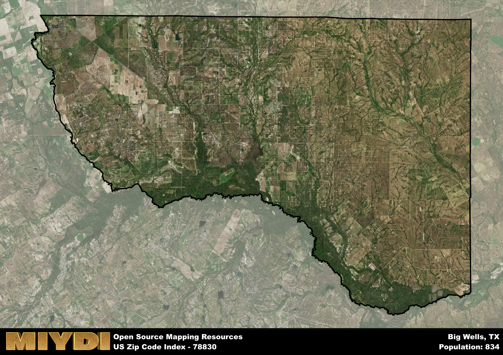

**Area Name:** Big Wells

**Zip Code:** 78830

**State:** TX

Big Wells is a part of the Pearsall - TX Micro Area, and makes up  of the Metro's population.  

# Big Wells: A Charming Community in South Texas

Situated in South Texas, zip code 78830 encompasses the charming neighborhood of Big Wells. Bordered by vast stretches of ranch land and agricultural fields, this area is located within close proximity to the city of Carrizo Springs and roughly 90 miles southwest of San Antonio. Despite its rural setting, Big Wells is an integral part of the larger metropolitan context, serving as a hub for agricultural activities and a close-knit community for its residents.

Originally founded as a stop along the San Antonio and Aransas Pass Railway in the late 19th century, Big Wells has a rich historical heritage. The area experienced significant growth during the oil boom of the early 20th century, attracting settlers looking for opportunities in the burgeoning industry. The name "Big Wells" is derived from the large artesian wells that once provided water to the community, a testament to its past reliance on natural resources for sustenance.

Today, Big Wells is a thriving community with a focus on agriculture and oil production. The area is home to a variety of local businesses, including family-owned farms and ranches, as well as oil drilling companies. Residents enjoy access to basic amenities such as schools, grocery stores, and healthcare facilities. For recreation, the neighborhood offers several parks and outdoor spaces where families can gather for picnics and community events. Visitors can also explore the area's historic sites, including the remnants of old oil wells and railroad depots that showcase Big Wells' enduring legacy.

# Big Wells Demographics

The population of Big Wells is 834.  
Big Wells has a population density of 3.16 per square mile.  
The area of Big Wells is 263.91 square miles.  

## Big Wells Income and Economic Data

These demographic numbers are sourced from IRS return data, providing comprehensive insights into the population dynamics and economic trends within Big Wells.

**Breakdown of return types for Big Wells**

The table offers insight into the composition of tax returns filed with the IRS, categorizing them into three main types. Single returns represent filings by individuals, joint returns by married couples, and head of household returns by individuals who qualify as heads of households, typically having dependents. This breakdown provides an understanding of the different filing statuses adopted by taxpayers when submitting their tax documentation.

| Return Types filed for Big Wells                              | Percentage          |
|----------------------------------------------------------|---------------------|
| Single Returns                                            | 0.46 |
| Joint Returns                                             | 0.29 |
| Head Household Returns                                    | 0.25 |

The income and economic data presented here is sourced from the IRS income brackets, utilized for categorizing tax returns by income levels. This table displays income ranges for both single filers and married couples, along with the corresponding number of returns and the percentage within each bracket, providing valuable insight into the distribution of taxes across various income groups.

| Bracket Name       | Single Filer Income Range | Married Couple Range | Number of Returns | Percentage of Returns |
|--------------------|----------------------------|----------------------|-------------------|-----------------------|
| 10% Bracket        | Up to $10,275              | Up to $20,550        | 110 | 0.46% |
| 12% Bracket        | $10,276 - $41,775          | $20,551 - $83,550    | 70 | 0.29% |
| 22% Bracket        | $41,776 - $89,075          | $83,551 - $178,150   | 30 | 0.13% |
| 24% Bracket        | $89,076 - $170,050         | $178,151 - $340,100  | 30 | 0.13% |
| 32% Bracket        | $170,051 - $215,950        | $340,101 - $431,900  | 0 | 0% |
| 35% Bracket        | $215,951 - $539,900        | $431,901 - $647,850  | 0 | 0% |

### Exploring Taxpayer Diversity: A Breakdown of Different Types of Tax Returns in Big Wells

The table offers insights into various types of tax returns filed, reflecting different aspects of taxpayer activities and demographics. Categories include charitable returns for donations, dependent returns for claimed dependents, educator population, elderly population, real estate returns, self-employment returns, student loan returns, and unemployment returns, providing valuable insights into taxpayer behavior and demographics.

| Big Wells Filing Types                    | Count | Percentage |
|--------------------------------------|-------|------------|
| Charitable Donations                 | 0 | 0% |
| Dependents Claimed                   | 0 | 0% |
| Educator Residents                   | 0 | 0% |
| Elderly Population                   | 50 | 0.21% |
| Farming Population                   | 0 | 0% |
| Real Estate Transactions             | 0 | 0% |
| Self-Employed Individuals            | 30 | 0.125% |
| Student Loan Cases                   | 0 | 0% |
| Unemployment Benefit Filings         | 50 | 0.21% |

## Big Wells AI and Census Variables

The values presented in this dataset for Big Wells are AI-optimized, streamlined, and categorized into relevant buckets for enhanced utility in AI and mapping programs. These simplified values have been optimized to facilitate efficient analysis and integration into various technological applications, offering users accessible and actionable insights into demographics within the Big Wells area.

| AI Variables for Big Wells | Value |
|-------------|-------|
| Shape Area | 889157106.3125 |
| Shape Length | 160626.897139531 |
| CBSA Federal Processing Standard Code | 37770 |

## How to use this free AI optimized Geo-Spatial Data for Big Wells, TX

This data is made freely available under the Creative Commons license, allowing for unrestricted use for any purpose. Users can access static resources directly from GitHub or leverage more advanced functionalities by utilizing the GeoJSON files. All datasets originate from official government or private sector sources and are meticulously compiled into relevant datasets within QGIS. However, the versatility of the data ensures compatibility with any mapping application.

## Data Accuracy Disclaimer
It's important to note that the data provided here may contain errors or discrepancies and should be considered as 'close enough' for business applications and AI rather than a definitive source of truth. This data is aggregated from multiple sources, some of which publish information on wildly different intervals, leading to potential inconsistencies. Additionally, certain data points may not be corrected for Covid-related changes, further impacting accuracy. Moreover, the assumption that demographic trends are consistent throughout a region may lead to discrepancies, as trends often concentrate in areas of highest population density. As a result, dense areas may be slightly underrepresented, while rural areas may be slightly overrepresented, resulting in a more conservative dataset. Furthermore, the focus primarily on areas within US Major and Minor Statistical areas means that approximately 40 million Americans living outside of these areas may not be fully represented. Lastly, the historical background and area descriptions generated using AI are susceptible to potential mistakes, so users should exercise caution when interpreting the information provided.
