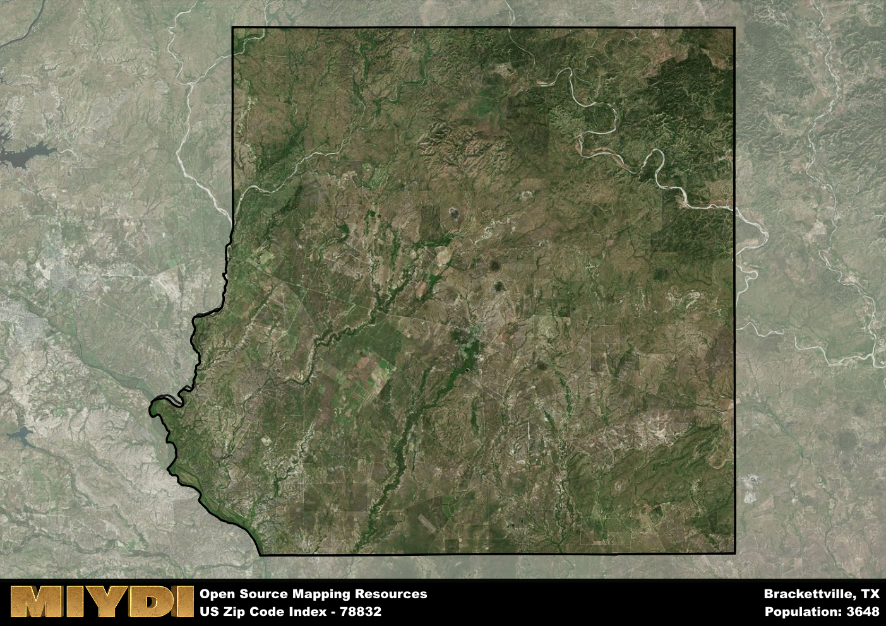

**Area Name:** Brackettville

**Zip Code:** 78832

**State:** TX

Brackettville is a part of the Del Rio - TX Micro Area, and makes up 2.49% of the Metro's population.  

# Brackettville: A Historic Community in Southwest Texas

Brackettville, zip code 78832, is located in Kinney County in Southwest Texas. This rural area is situated just east of the Texas-Mexico border, with surrounding districts including Spofford to the north and Fort Clark Springs to the south. Brackettville lies approximately 35 miles west of the city of Uvalde, a major population center in the region. The zip code area is characterized by vast open spaces, rolling hills, and a rich history dating back to the 19th century.

Brackettville has a unique historical narrative that dates back to its founding in the mid-1800s. Originally known as Las Moras Springs, the area was a popular stop for travelers along the San Antonio-El Paso Road due to its natural springs. The town was officially established in 1852 and renamed Brackettville in honor of Oscar B. Brackett, a US Army officer. Throughout its history, Brackettville has played a significant role as a gateway to the American West, serving as a hub for military operations and trade in the region.

Today, Brackettville maintains its rural charm and historic appeal while offering a range of amenities for residents and visitors. The economy is primarily driven by agriculture, ranching, and tourism, with local businesses catering to outdoor enthusiasts and history buffs. The area is home to Fort Clark Springs, a former US Army post turned resort community, as well as numerous historic sites such as the Alamo Village movie set. Residents enjoy access to parks, recreational facilities, and community events that celebrate the rich cultural heritage of Brackettville.

# Brackettville Demographics

The population of Brackettville is 3648.  
Brackettville has a population density of 2.67 per square mile.  
The area of Brackettville is 1365.17 square miles.  

### Exploring Real Estate Trends: A Comprehensive Analysis of the Brackettville Area and its Neighbors

This table contains an in-depth examination of the real estate market in the Brackettville area. Sourced from trusted real estate market firms, this dataset provides a wealth of raw data detailing the local real estate landscape, along with comparative analyses juxtaposing the market dynamics with those of neighboring areas. Explore the intricacies of the Brackettville real estate market and gain valuable insights into its relationship with adjacent regions.

| Real Estate Data for Brackettville                       | Value    |
|------------------------------------------------|----------|
| Average Listing Price for Brackettville               | 166553 |
| Median Listing Price for Brackettville                | 127000 |
| Median Days on Market for Brackettville               | 64 |
| Median Listing Price per Square Foot for Brackettville| 11 |
| Median Square Feet for Brackettville                  | 1400 |
| Real Estate Prices to Income Ratio           | 123.24% |
| Price per Square Foot Ratio                  | 82.92% |
| Price Median Ratio                           | 55.26% |
| Market Sales Speed Ratio                     | 78.2% |

This table offers essential real estate data for the Brackettville area, including average and median listing prices, median days on market, and property size. It also presents ratio metrics as percentages, providing insights into how the local market compares to the surrounding region. A ratio of 100% signifies performance in line with the regional average, while values above or below indicate overperformance or underperformance, respectively, relative to expectations.

## Brackettville Sports and Recreation Data

#### Annual Youth Sports Spending for Brackettville

This table provides fundamental insights into the Sports and Recreation data for the Brackettville area, detailing the estimated annual expenditure on Youth Athletics. This includes estimated spending by the major consumer brackets. 
| Sports Spending for Brackettville| Value |
|-------------------------|-------|
| Athlete Spending Compared to the region | 14.04% |
| Total Youth Athlete Spending | 69,357 |
| Athletic Spending - Essential Focused Consumer | 5,796 |
| Athletic Spending - Typical Consumer | 57,090 |
| Athletic Spending - Affluent Consumers | 26,352 |

#### Youth Coaching Estimates for Brackettville

This table presents the estimated number of coaches for the Brackettville area, derived from comprehensive national coaching surveys and athletic participation rates by state. It offers valuable insights into the vital role of coaching personnel in fostering athletic development and facilitating sports participation within the local community.

| Coaching Data for Brackettville | Value |
|-------------|-------|
| Total Coaches | 60 |
| Paid Coaches | 16 |
| Volunteer Coaches | 44 |

#### Youth Athlete Participation for Brackettville

This table shows the estimated total number of youth athletes in the Brackettville area, sourced from comprehensive national coaching surveys and athletic participation rates by state.

| Total YA Athletes in Brackettville | Value |
|-------------|-------|
| Total High School Athletes | 91 |
| Total Youth Athletes | 273 |
| Total Young Adult Athletes | 182 |
| Total Athletes to Age 25 | 547 |

#### High School Age Athletes - Breakdown by Sport for Brackettville

This table shows insights regarding high school age estimated players by sport in the Brackettville area, derived from national and state-level athletic participation trends. 

| HS Players by Sport in Brackettville | Value |
|-------------|-------|
| Football Players | 21 |
| Basketball Players | 13 |
| Soccer Players | 10 |
| Volleyball Players | 6 |
| Baseball Players | 11 |
| Tennis Players | 5 |
| Track Athletes | 15 |
| Golf Players | 3 |
| Swimming Athletes | 3 |
| Wrestling Competitors | 3 |
| Lacrosse Players | 0 |

Estimating the number of younger athletes presents unique challenges due to their varied starting ages, typically beginning around six years old, and a gradual decline in participation rates as they age. Unlike high school-aged athletes, younger athletes are less likely to switch sports as they grow older, contributing to the stability of participation numbers within specific sports at younger ages.  

As a general trend, the total number of younger athletes is approximately three times the number of high school-aged athletes, underscoring the significant presence of youth athletes in sports programs and highlighting the importance of early engagement in athletic activities.

## Brackettville AI and Census Variables

The values presented in this dataset for Brackettville are AI-optimized, streamlined, and categorized into relevant buckets for enhanced utility in AI and mapping programs. These simplified values have been optimized to facilitate efficient analysis and integration into various technological applications, offering users accessible and actionable insights into demographics within the Brackettville area.

| AI Variables for Brackettville | Value |
|-------------|-------|
| Shape Area | 4670177357.80078 |
| Shape Length | 286749.114331549 |
| CBSA Federal Processing Standard Code | 19620 |
| RE Price per Square Foot Ratio | 82.92% |
| RE Price Average Ratio | 64.92% |
| RE Speed Ratio | 78.2% |
| RE Income Ratio | 123.24% |
| RE Affordability Index Flag | 2 |
| Income Bracket Flag | 2 |
| RE Income Flag | 4 |
| RE Median Square Footage Price Flag | 2 |
| RE Median Square Footage Size Flag | 2 |
| RE Activity Flag | 3 |
| Poverty Line Risk Flag | 1 |

## How to use this free AI optimized Geo-Spatial Data for Brackettville, TX

This data is made freely available under the Creative Commons license, allowing for unrestricted use for any purpose. Users can access static resources directly from GitHub or leverage more advanced functionalities by utilizing the GeoJSON files. All datasets originate from official government or private sector sources and are meticulously compiled into relevant datasets within QGIS. However, the versatility of the data ensures compatibility with any mapping application.

## Data Accuracy Disclaimer
It's important to note that the data provided here may contain errors or discrepancies and should be considered as 'close enough' for business applications and AI rather than a definitive source of truth. This data is aggregated from multiple sources, some of which publish information on wildly different intervals, leading to potential inconsistencies. Additionally, certain data points may not be corrected for Covid-related changes, further impacting accuracy. Moreover, the assumption that demographic trends are consistent throughout a region may lead to discrepancies, as trends often concentrate in areas of highest population density. As a result, dense areas may be slightly underrepresented, while rural areas may be slightly overrepresented, resulting in a more conservative dataset. Furthermore, the focus primarily on areas within US Major and Minor Statistical areas means that approximately 40 million Americans living outside of these areas may not be fully represented. Lastly, the historical background and area descriptions generated using AI are susceptible to potential mistakes, so users should exercise caution when interpreting the information provided.
