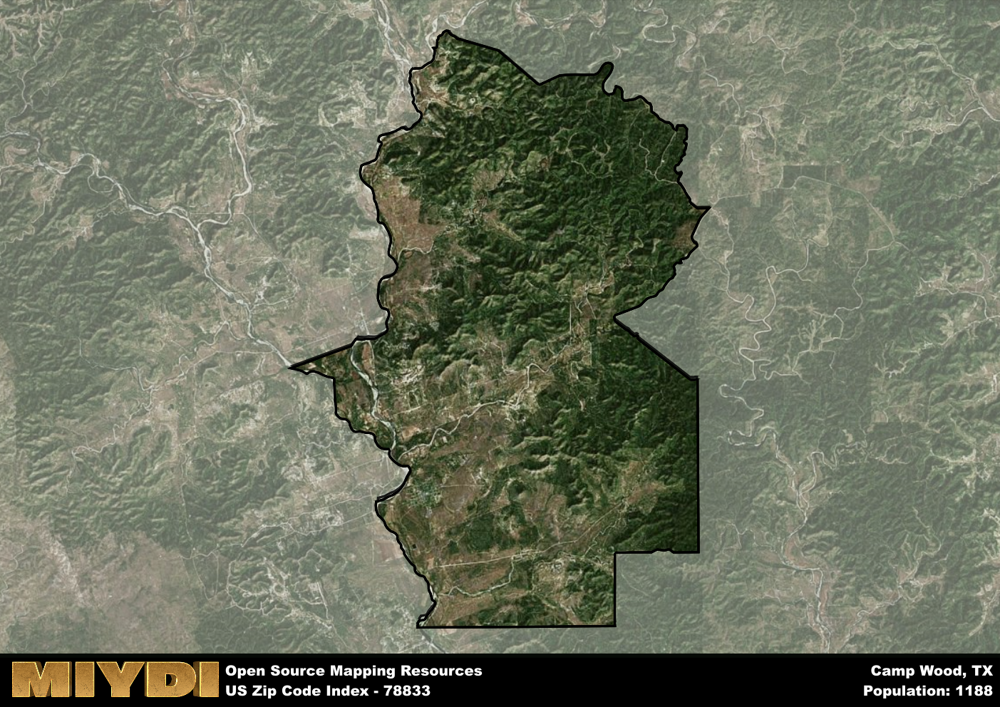

**Area Name:** Camp Wood

**Zip Code:** 78833

**State:** TX

Camp Wood is a part of the Uvalde - TX Micro Area, and makes up  of the Metro's population.  

# Camp Wood: A Charming Community in the Heart of the Texas Hill Country

Located in the picturesque Texas Hill Country, Camp Wood is a small community nestled within Real County and encompasses the zip code 78833. Surrounded by rolling hills and lush greenery, this area is bordered by the Nueces River to the west and the sprawling Los Maples State Natural Area to the east. While Camp Wood is a rural enclave, it is situated approximately 100 miles west of San Antonio, making it an idyllic escape for city dwellers seeking a peaceful retreat in nature.

Camp Wood has a rich history dating back to the mid-19th century when settlers began establishing homesteads along the Nueces River. The town's name is derived from a campsite used by early pioneers as they traversed the region. Over the years, Camp Wood evolved into a quaint community known for its friendly residents, strong sense of community, and deep connection to the surrounding natural landscape. Today, the area still retains its historic charm, with many original buildings and landmarks preserved as a testament to its past.

Present-day Camp Wood is a thriving community with a diverse economy that includes agriculture, tourism, and small businesses. Residents and visitors alike can enjoy a variety of outdoor activities, such as fishing, hiking, and birdwatching, thanks to the area's proximity to the Nueces River and nearby state parks. The town also boasts local shops, restaurants, and community services, providing essential amenities for its population. Camp Wood's unique blend of natural beauty, historical significance, and small-town charm make it a hidden gem within the Texas Hill Country.

# Camp Wood Demographics

The population of Camp Wood is 1188.  
Camp Wood has a population density of 13.63 per square mile.  
The area of Camp Wood is 87.18 square miles.  

## Camp Wood Income and Economic Data

These demographic numbers are sourced from IRS return data, providing comprehensive insights into the population dynamics and economic trends within Camp Wood.

**Breakdown of return types for Camp Wood**

The table offers insight into the composition of tax returns filed with the IRS, categorizing them into three main types. Single returns represent filings by individuals, joint returns by married couples, and head of household returns by individuals who qualify as heads of households, typically having dependents. This breakdown provides an understanding of the different filing statuses adopted by taxpayers when submitting their tax documentation.

| Return Types filed for Camp Wood                              | Percentage          |
|----------------------------------------------------------|---------------------|
| Single Returns                                            | 0.38 |
| Joint Returns                                             | 0.48 |
| Head Household Returns                                    | 0.14 |

The income and economic data presented here is sourced from the IRS income brackets, utilized for categorizing tax returns by income levels. This table displays income ranges for both single filers and married couples, along with the corresponding number of returns and the percentage within each bracket, providing valuable insight into the distribution of taxes across various income groups.

| Bracket Name       | Single Filer Income Range | Married Couple Range | Number of Returns | Percentage of Returns |
|--------------------|----------------------------|----------------------|-------------------|-----------------------|
| 10% Bracket        | Up to $10,275              | Up to $20,550        | 250 | 0.43% |
| 12% Bracket        | $10,276 - $41,775          | $20,551 - $83,550    | 130 | 0.22% |
| 22% Bracket        | $41,776 - $89,075          | $83,551 - $178,150   | 70 | 0.12% |
| 24% Bracket        | $89,076 - $170,050         | $178,151 - $340,100  | 60 | 0.1% |
| 32% Bracket        | $170,051 - $215,950        | $340,101 - $431,900  | 70 | 0.12% |
| 35% Bracket        | $215,951 - $539,900        | $431,901 - $647,850  | 0 | 0% |

### Exploring Taxpayer Diversity: A Breakdown of Different Types of Tax Returns in Camp Wood

The table offers insights into various types of tax returns filed, reflecting different aspects of taxpayer activities and demographics. Categories include charitable returns for donations, dependent returns for claimed dependents, educator population, elderly population, real estate returns, self-employment returns, student loan returns, and unemployment returns, providing valuable insights into taxpayer behavior and demographics.

| Camp Wood Filing Types                    | Count | Percentage |
|--------------------------------------|-------|------------|
| Charitable Donations                 | 0 | 0% |
| Dependents Claimed                   | 0 | 0% |
| Educator Residents                   | 0 | 0% |
| Elderly Population                   | 220 | 0.38% |
| Farming Population                   | 30 | 0.052% |
| Real Estate Transactions             | 0 | 0% |
| Self-Employed Individuals            | 120 | 0.207% |
| Student Loan Cases                   | 0 | 0% |
| Unemployment Benefit Filings         | 50 | 0.09% |

## Camp Wood AI and Census Variables

The values presented in this dataset for Camp Wood are AI-optimized, streamlined, and categorized into relevant buckets for enhanced utility in AI and mapping programs. These simplified values have been optimized to facilitate efficient analysis and integration into various technological applications, offering users accessible and actionable insights into demographics within the Camp Wood area.

| AI Variables for Camp Wood | Value |
|-------------|-------|
| Shape Area | 300391904.054688 |
| Shape Length | 94338.388843988 |
| CBSA Federal Processing Standard Code | 46620 |

## How to use this free AI optimized Geo-Spatial Data for Camp Wood, TX

This data is made freely available under the Creative Commons license, allowing for unrestricted use for any purpose. Users can access static resources directly from GitHub or leverage more advanced functionalities by utilizing the GeoJSON files. All datasets originate from official government or private sector sources and are meticulously compiled into relevant datasets within QGIS. However, the versatility of the data ensures compatibility with any mapping application.

## Data Accuracy Disclaimer
It's important to note that the data provided here may contain errors or discrepancies and should be considered as 'close enough' for business applications and AI rather than a definitive source of truth. This data is aggregated from multiple sources, some of which publish information on wildly different intervals, leading to potential inconsistencies. Additionally, certain data points may not be corrected for Covid-related changes, further impacting accuracy. Moreover, the assumption that demographic trends are consistent throughout a region may lead to discrepancies, as trends often concentrate in areas of highest population density. As a result, dense areas may be slightly underrepresented, while rural areas may be slightly overrepresented, resulting in a more conservative dataset. Furthermore, the focus primarily on areas within US Major and Minor Statistical areas means that approximately 40 million Americans living outside of these areas may not be fully represented. Lastly, the historical background and area descriptions generated using AI are susceptible to potential mistakes, so users should exercise caution when interpreting the information provided.
