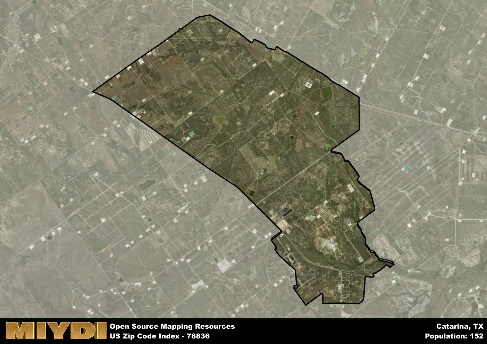

**Area Name:** Catarina

**Zip Code:** 78836

**State:** TX

# Catarina: A Hidden Gem in South Texas

Located in the heart of South Texas, the zip code 78836 corresponds to the small community of Catarina. Situated in Dimmit County, Catarina is surrounded by vast stretches of ranchland and oil fields, with the nearest major city being Laredo, approximately 80 miles to the south. Despite its rural location, Catarina plays a vital role in the region's oil and gas industry, with many residents employed in the various extraction and production facilities in the area.

Catarina was founded in the early 20th century as a stop along the railroad, serving as a hub for the cattle industry in South Texas. The town experienced rapid growth during the oil boom of the 1920s, attracting workers and businesses looking to capitalize on the region's natural resources. Over the years, Catarina has maintained its small-town charm while adapting to the changing economic landscape, making it a unique blend of old and new in the Texas countryside.

Today, Catarina remains a close-knit community with a strong focus on the oil and gas industry. In addition to the various drilling sites and refineries dotting the landscape, the town offers essential services such as schools, healthcare facilities, and local shops to meet the needs of its residents. Outdoor enthusiasts can explore the nearby Catarina Hills State Natural Area, while history buffs can visit the Catarina Cemetery, which holds the remains of many early settlers and oil workers who shaped the town's identity.

# Catarina Demographics

The population of Catarina is 152.  
Catarina has a population density of 5.24 per square mile.  
The area of Catarina is 28.99 square miles.  

## Catarina AI and Census Variables

The values presented in this dataset for Catarina are AI-optimized, streamlined, and categorized into relevant buckets for enhanced utility in AI and mapping programs. These simplified values have been optimized to facilitate efficient analysis and integration into various technological applications, offering users accessible and actionable insights into demographics within the Catarina area.

| AI Variables for Catarina | Value |
|-------------|-------|
| Shape Area | 97406448.1875 |
| Shape Length | 51587.5881995672 |

## How to use this free AI optimized Geo-Spatial Data for Catarina, TX

This data is made freely available under the Creative Commons license, allowing for unrestricted use for any purpose. Users can access static resources directly from GitHub or leverage more advanced functionalities by utilizing the GeoJSON files. All datasets originate from official government or private sector sources and are meticulously compiled into relevant datasets within QGIS. However, the versatility of the data ensures compatibility with any mapping application.

## Data Accuracy Disclaimer
It's important to note that the data provided here may contain errors or discrepancies and should be considered as 'close enough' for business applications and AI rather than a definitive source of truth. This data is aggregated from multiple sources, some of which publish information on wildly different intervals, leading to potential inconsistencies. Additionally, certain data points may not be corrected for Covid-related changes, further impacting accuracy. Moreover, the assumption that demographic trends are consistent throughout a region may lead to discrepancies, as trends often concentrate in areas of highest population density. As a result, dense areas may be slightly underrepresented, while rural areas may be slightly overrepresented, resulting in a more conservative dataset. Furthermore, the focus primarily on areas within US Major and Minor Statistical areas means that approximately 40 million Americans living outside of these areas may not be fully represented. Lastly, the historical background and area descriptions generated using AI are susceptible to potential mistakes, so users should exercise caution when interpreting the information provided.
