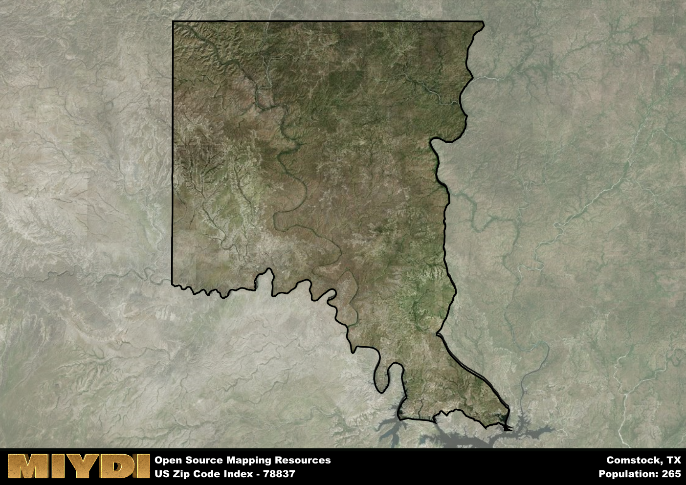

**Area Name:** Comstock

**Zip Code:** 78837

**State:** TX

Comstock is a part of the Del Rio - TX Micro Area, and makes up  of the Metro's population.  

# Unveiling the Charms of Comstock, Texas 78837

Located in Val Verde County in southwest Texas, the zip code area 78837 encompasses the charming community of Comstock. Bordered by the scenic Rio Grande to the south and vast stretches of wilderness to the north, Comstock is a small but vibrant neighborhood that serves as a gateway to the majestic landscapes of the nearby Seminole Canyon State Park. Situated within driving distance of the bustling city of Del Rio, Comstock enjoys a unique blend of rural tranquility and urban accessibility.

Comstock has a rich history dating back to the early 1800s when it served as a vital stop along the historic Chihuahua Trail, connecting Mexico to San Antonio. The area experienced a boom during the peak of the railroad era, attracting settlers and businesses looking to capitalize on the burgeoning transportation networks. Today, Comstock retains its frontier spirit, with many historic buildings and landmarks harkening back to its pioneer past.

Presently, Comstock thrives as a close-knit community with a focus on ranching and agriculture. The area is known for its picturesque vistas, outdoor recreational opportunities, and friendly locals who take pride in their heritage. Visitors can explore the rugged beauty of the surrounding desert landscapes, visit the Seminole Canyon State Park to view ancient rock art, or partake in local events celebrating the area's Western traditions. Comstock offers a peaceful retreat from the hustle and bustle of city life, making it a hidden gem in the heart of southwest Texas.

# Comstock Demographics

The population of Comstock is 265.  
Comstock has a population density of 0.17 per square mile.  
The area of Comstock is 1564.71 square miles.  

## Comstock AI and Census Variables

The values presented in this dataset for Comstock are AI-optimized, streamlined, and categorized into relevant buckets for enhanced utility in AI and mapping programs. These simplified values have been optimized to facilitate efficient analysis and integration into various technological applications, offering users accessible and actionable insights into demographics within the Comstock area.

| AI Variables for Comstock | Value |
|-------------|-------|
| Shape Area | 5419460587.5625 |
| Shape Length | 435213.942911266 |
| CBSA Federal Processing Standard Code | 19620 |

## How to use this free AI optimized Geo-Spatial Data for Comstock, TX

This data is made freely available under the Creative Commons license, allowing for unrestricted use for any purpose. Users can access static resources directly from GitHub or leverage more advanced functionalities by utilizing the GeoJSON files. All datasets originate from official government or private sector sources and are meticulously compiled into relevant datasets within QGIS. However, the versatility of the data ensures compatibility with any mapping application.

## Data Accuracy Disclaimer
It's important to note that the data provided here may contain errors or discrepancies and should be considered as 'close enough' for business applications and AI rather than a definitive source of truth. This data is aggregated from multiple sources, some of which publish information on wildly different intervals, leading to potential inconsistencies. Additionally, certain data points may not be corrected for Covid-related changes, further impacting accuracy. Moreover, the assumption that demographic trends are consistent throughout a region may lead to discrepancies, as trends often concentrate in areas of highest population density. As a result, dense areas may be slightly underrepresented, while rural areas may be slightly overrepresented, resulting in a more conservative dataset. Furthermore, the focus primarily on areas within US Major and Minor Statistical areas means that approximately 40 million Americans living outside of these areas may not be fully represented. Lastly, the historical background and area descriptions generated using AI are susceptible to potential mistakes, so users should exercise caution when interpreting the information provided.
