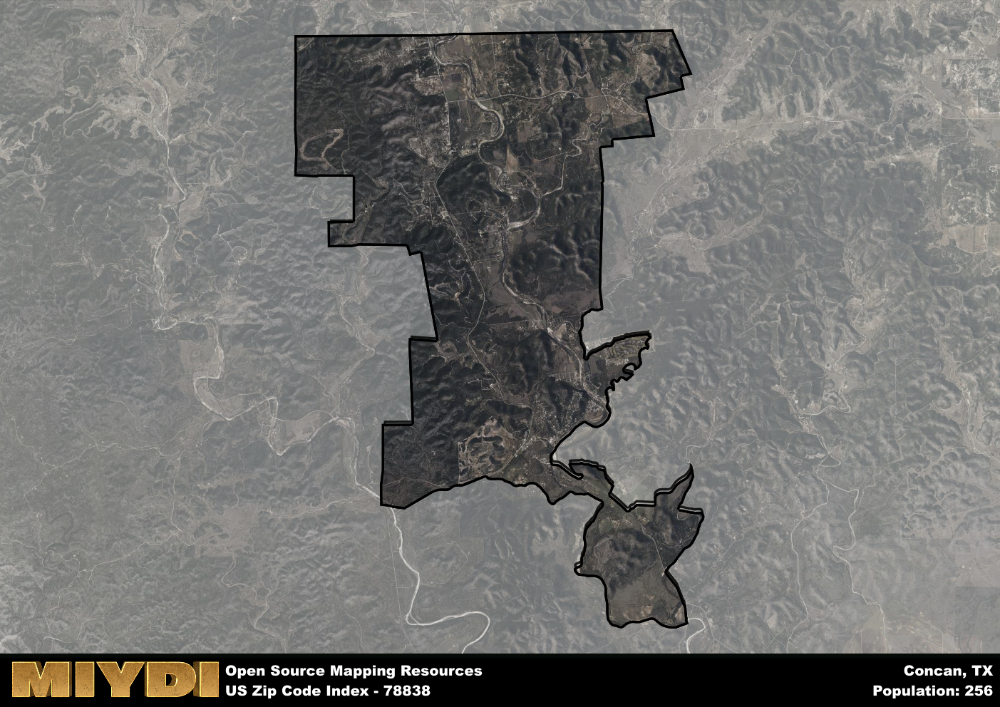

**Area Name:** Concan

**Zip Code:** 78838

**State:** TX

Concan is a part of the Uvalde - TX Micro Area, and makes up  of the Metro's population.  

# Concan: A Charming Neighborhood in the Heart of Texas Hill Country

Located in the picturesque Texas Hill Country, zip code 78838 encompasses the charming neighborhood of Concan. Situated in Uvalde County, Concan is surrounded by the stunning natural beauty of the Frio River and Garner State Park. It is a popular destination for outdoor enthusiasts seeking hiking, camping, and tubing adventures. While Concan maintains its small-town charm, it is also conveniently located near the larger cities of San Antonio and Austin, making it a peaceful retreat within reach of urban amenities.

Concan has a rich historical narrative, dating back to the mid-1800s when settlers began establishing homesteads in the area. The town was officially founded in the late 19th century and named after the local Concan Railroad Station. Over the years, Concan has evolved into a popular tourist destination, known for its scenic beauty and recreational opportunities. The town has managed to preserve its historic roots while embracing the influx of visitors seeking a peaceful getaway in the Texas Hill Country.

Today, Concan thrives as a hub for outdoor recreation and tourism. The area is dotted with vacation rentals, campgrounds, and resorts catering to visitors looking to explore the natural wonders of the region. In addition to outdoor activities like hiking and birdwatching, Concan offers a variety of dining options, boutique shops, and cultural attractions. The area is also home to several local events and festivals that celebrate the unique heritage and charm of Concan, making it a destination that appeals to both residents and visitors alike.

# Concan Demographics

The population of Concan is 256.  
Concan has a population density of 4.57 per square mile.  
The area of Concan is 55.97 square miles.  

## Concan Income and Economic Data

These demographic numbers are sourced from IRS return data, providing comprehensive insights into the population dynamics and economic trends within Concan.

**Breakdown of return types for Concan**

The table offers insight into the composition of tax returns filed with the IRS, categorizing them into three main types. Single returns represent filings by individuals, joint returns by married couples, and head of household returns by individuals who qualify as heads of households, typically having dependents. This breakdown provides an understanding of the different filing statuses adopted by taxpayers when submitting their tax documentation.

| Return Types filed for Concan                              | Percentage          |
|----------------------------------------------------------|---------------------|
| Single Returns                                            | 0.48 |
| Joint Returns                                             | 0.41 |
| Head Household Returns                                    | 0 |

The income and economic data presented here is sourced from the IRS income brackets, utilized for categorizing tax returns by income levels. This table displays income ranges for both single filers and married couples, along with the corresponding number of returns and the percentage within each bracket, providing valuable insight into the distribution of taxes across various income groups.

| Bracket Name       | Single Filer Income Range | Married Couple Range | Number of Returns | Percentage of Returns |
|--------------------|----------------------------|----------------------|-------------------|-----------------------|
| 10% Bracket        | Up to $10,275              | Up to $20,550        | 80 | 0.28% |
| 12% Bracket        | $10,276 - $41,775          | $20,551 - $83,550    | 60 | 0.21% |
| 22% Bracket        | $41,776 - $89,075          | $83,551 - $178,150   | 40 | 0.14% |
| 24% Bracket        | $89,076 - $170,050         | $178,151 - $340,100  | 30 | 0.1% |
| 32% Bracket        | $170,051 - $215,950        | $340,101 - $431,900  | 50 | 0.17% |
| 35% Bracket        | $215,951 - $539,900        | $431,901 - $647,850  | 30 | 0.1% |

### Exploring Taxpayer Diversity: A Breakdown of Different Types of Tax Returns in Concan

The table offers insights into various types of tax returns filed, reflecting different aspects of taxpayer activities and demographics. Categories include charitable returns for donations, dependent returns for claimed dependents, educator population, elderly population, real estate returns, self-employment returns, student loan returns, and unemployment returns, providing valuable insights into taxpayer behavior and demographics.

| Concan Filing Types                    | Count | Percentage |
|--------------------------------------|-------|------------|
| Charitable Donations                 | 0 | 0% |
| Dependents Claimed                   | 0 | 0% |
| Educator Residents                   | 0 | 0% |
| Elderly Population                   | 130 | 0.45% |
| Farming Population                   | 0 | 0% |
| Real Estate Transactions             | 20 | 0.069% |
| Self-Employed Individuals            | 70 | 0.241% |
| Student Loan Cases                   | 0 | 0% |
| Unemployment Benefit Filings         | 0 | 0% |

## Concan AI and Census Variables

The values presented in this dataset for Concan are AI-optimized, streamlined, and categorized into relevant buckets for enhanced utility in AI and mapping programs. These simplified values have been optimized to facilitate efficient analysis and integration into various technological applications, offering users accessible and actionable insights into demographics within the Concan area.

| AI Variables for Concan | Value |
|-------------|-------|
| Shape Area | 192235875.546875 |
| Shape Length | 106991.417847152 |
| CBSA Federal Processing Standard Code | 46620 |

## How to use this free AI optimized Geo-Spatial Data for Concan, TX

This data is made freely available under the Creative Commons license, allowing for unrestricted use for any purpose. Users can access static resources directly from GitHub or leverage more advanced functionalities by utilizing the GeoJSON files. All datasets originate from official government or private sector sources and are meticulously compiled into relevant datasets within QGIS. However, the versatility of the data ensures compatibility with any mapping application.

## Data Accuracy Disclaimer
It's important to note that the data provided here may contain errors or discrepancies and should be considered as 'close enough' for business applications and AI rather than a definitive source of truth. This data is aggregated from multiple sources, some of which publish information on wildly different intervals, leading to potential inconsistencies. Additionally, certain data points may not be corrected for Covid-related changes, further impacting accuracy. Moreover, the assumption that demographic trends are consistent throughout a region may lead to discrepancies, as trends often concentrate in areas of highest population density. As a result, dense areas may be slightly underrepresented, while rural areas may be slightly overrepresented, resulting in a more conservative dataset. Furthermore, the focus primarily on areas within US Major and Minor Statistical areas means that approximately 40 million Americans living outside of these areas may not be fully represented. Lastly, the historical background and area descriptions generated using AI are susceptible to potential mistakes, so users should exercise caution when interpreting the information provided.
