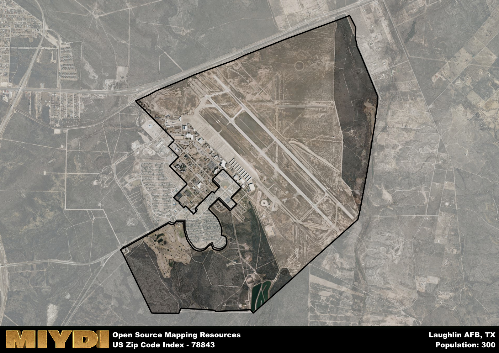

**Area Name:** Laughlin AFB

**Zip Code:** 78843

**State:** TX

Laughlin AFB is a part of the Del Rio - TX Micro Area, and makes up  of the Metro's population.  

# Laughlin AFB Zip Code 78843: A Jewel in Del Rio's Crown

Located in southwest Texas, Laughlin AFB Zip Code 78843 is situated within the city of Del Rio. This zip code area is home to Laughlin Air Force Base, a prominent military installation that plays a crucial role in the region's economy and culture. Del Rio itself is part of the larger Del Rio-Ciudad Acuña metropolitan area, facilitating easy access to amenities and services from both sides of the US-Mexico border. The city is situated along the banks of the Rio Grande and offers stunning views of the surrounding landscape.

The history of Laughlin AFB Zip Code 78843 is deeply intertwined with the military presence in the region. Established during World War II, Laughlin Air Force Base has grown into a key training center for pilots from both the United States and allied nations. Over the years, the base has played a vital role in national defense and has become a significant employer in the area. The zip code area surrounding the base has developed into a vibrant community, with residents proud of their military heritage.

Today, Laughlin AFB Zip Code 78843 boasts a diverse economy centered around the military base. Beyond its military significance, the area offers a range of neighborhood-specific services, including schools, healthcare facilities, and retail establishments. Residents and visitors can enjoy recreational amenities such as parks, golf courses, and sports facilities. The zip code area is also home to cultural and historic sites that showcase the region's rich heritage. Laughlin AFB Zip Code 78843 continues to thrive as a dynamic and welcoming community within the bustling city of Del Rio.

# Laughlin AFB Demographics

The population of Laughlin AFB is 300.  
Laughlin AFB has a population density of 65.22 per square mile.  
The area of Laughlin AFB is 4.6 square miles.  

## Laughlin AFB AI and Census Variables

The values presented in this dataset for Laughlin AFB are AI-optimized, streamlined, and categorized into relevant buckets for enhanced utility in AI and mapping programs. These simplified values have been optimized to facilitate efficient analysis and integration into various technological applications, offering users accessible and actionable insights into demographics within the Laughlin AFB area.

| AI Variables for Laughlin AFB | Value |
|-------------|-------|
| Shape Area | 15735244.15625 |
| Shape Length | 23110.0310252423 |
| CBSA Federal Processing Standard Code | 19620 |

## How to use this free AI optimized Geo-Spatial Data for Laughlin AFB, TX

This data is made freely available under the Creative Commons license, allowing for unrestricted use for any purpose. Users can access static resources directly from GitHub or leverage more advanced functionalities by utilizing the GeoJSON files. All datasets originate from official government or private sector sources and are meticulously compiled into relevant datasets within QGIS. However, the versatility of the data ensures compatibility with any mapping application.

## Data Accuracy Disclaimer
It's important to note that the data provided here may contain errors or discrepancies and should be considered as 'close enough' for business applications and AI rather than a definitive source of truth. This data is aggregated from multiple sources, some of which publish information on wildly different intervals, leading to potential inconsistencies. Additionally, certain data points may not be corrected for Covid-related changes, further impacting accuracy. Moreover, the assumption that demographic trends are consistent throughout a region may lead to discrepancies, as trends often concentrate in areas of highest population density. As a result, dense areas may be slightly underrepresented, while rural areas may be slightly overrepresented, resulting in a more conservative dataset. Furthermore, the focus primarily on areas within US Major and Minor Statistical areas means that approximately 40 million Americans living outside of these areas may not be fully represented. Lastly, the historical background and area descriptions generated using AI are susceptible to potential mistakes, so users should exercise caution when interpreting the information provided.
