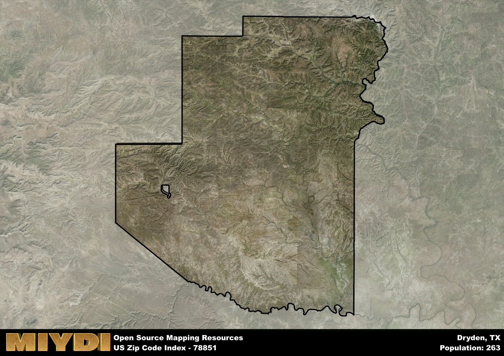

**Area Name:** Dryden

**Zip Code:** 78851

**State:** TX

Dryden is a part of the Del Rio - TX Micro Area, and makes up  of the Metro's population.  

# Dryden: A Hidden Gem in West Texas  
Located in Val Verde County, Dryden is a small unincorporated community in West Texas that falls under the 78851 zip code. Situated along State Highway 349, Dryden is surrounded by vast stretches of desert landscape and is approximately 60 miles southwest of the city of Del Rio. While it is a relatively isolated area, Dryden serves as a vital stop for travelers passing through the region, offering a glimpse into the unique charm of rural Texas.

Dryden has a rich history dating back to the late 19th century when it was established as a stop along the Southern Pacific Railroad. The area was named after Eugene Dryden, a civil engineer who worked on the railroad project. Over the years, Dryden has evolved from a railroad town to a ranching and agricultural community, with a resilient spirit that has weathered economic ups and downs. Despite its small size, Dryden has maintained a strong sense of community pride and a connection to its pioneer roots.

Today, Dryden continues to be a hub for ranching and farming activities, with residents primarily engaged in agriculture and livestock production. The area boasts a close-knit community that values its rural way of life and the natural beauty of the surrounding landscape. While services are limited, Dryden offers essential amenities such as a post office, a few local businesses, and access to outdoor recreational opportunities like hunting and hiking. Visitors can explore nearby attractions such as Seminole Canyon State Park and historic sites that showcase the area's cultural heritage.

# Dryden Demographics

The population of Dryden is 263.  
Dryden has a population density of 0.11 per square mile.  
The area of Dryden is 2355.63 square miles.  

## Dryden AI and Census Variables

The values presented in this dataset for Dryden are AI-optimized, streamlined, and categorized into relevant buckets for enhanced utility in AI and mapping programs. These simplified values have been optimized to facilitate efficient analysis and integration into various technological applications, offering users accessible and actionable insights into demographics within the Dryden area.

| AI Variables for Dryden | Value |
|-------------|-------|
| Shape Area | 8199253877.28906 |
| Shape Length | 474633.323346431 |
| CBSA Federal Processing Standard Code | 19620 |

## How to use this free AI optimized Geo-Spatial Data for Dryden, TX

This data is made freely available under the Creative Commons license, allowing for unrestricted use for any purpose. Users can access static resources directly from GitHub or leverage more advanced functionalities by utilizing the GeoJSON files. All datasets originate from official government or private sector sources and are meticulously compiled into relevant datasets within QGIS. However, the versatility of the data ensures compatibility with any mapping application.

## Data Accuracy Disclaimer
It's important to note that the data provided here may contain errors or discrepancies and should be considered as 'close enough' for business applications and AI rather than a definitive source of truth. This data is aggregated from multiple sources, some of which publish information on wildly different intervals, leading to potential inconsistencies. Additionally, certain data points may not be corrected for Covid-related changes, further impacting accuracy. Moreover, the assumption that demographic trends are consistent throughout a region may lead to discrepancies, as trends often concentrate in areas of highest population density. As a result, dense areas may be slightly underrepresented, while rural areas may be slightly overrepresented, resulting in a more conservative dataset. Furthermore, the focus primarily on areas within US Major and Minor Statistical areas means that approximately 40 million Americans living outside of these areas may not be fully represented. Lastly, the historical background and area descriptions generated using AI are susceptible to potential mistakes, so users should exercise caution when interpreting the information provided.
