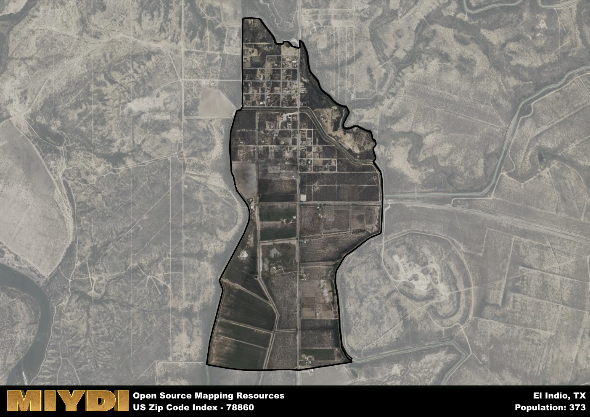

**Area Name:** El Indio

**Zip Code:** 78860

**State:** TX

El Indio is a part of the Eagle Pass - TX Micro Area, and makes up  of the Metro's population.  

# El Indio: A Unique Neighborhood in South Texas  
El Indio, corresponding to zip code 78860, is a small community located in Maverick County, Texas. Situated near the United States-Mexico border, El Indio is surrounded by vast expanses of desert terrain and is approximately 20 miles southeast of Eagle Pass, the county seat. While it is a relatively isolated area, El Indio maintains close ties with nearby communities such as Eagle Pass and Piedras Negras, Mexico, fostering a sense of interconnectedness within the larger South Texas region.

The history of El Indio is deeply rooted in its indigenous heritage and the Spanish colonization of the Americas. The area was originally inhabited by various Native American tribes before becoming a Spanish settlement in the early 18th century. The name "El Indio" translates to "The Indian," reflecting the indigenous presence in the region. Over time, El Indio evolved into a ranching and agricultural community, with its economy centered around cattle ranches and farming operations.

Today, El Indio remains a predominantly rural area with a focus on agriculture and ranching. The community is known for its picturesque landscapes, including the nearby Rio Grande River and vast fields of crops. In addition to its agricultural activities, El Indio offers limited services such as small businesses, schools, and churches to serve its residents. The area's rich history and cultural heritage are preserved through local museums and historical sites, providing visitors with a glimpse into the past of this unique neighborhood in South Texas.

# El Indio Demographics

The population of El Indio is 373.  
El Indio has a population density of 333.04 per square mile.  
The area of El Indio is 1.12 square miles.  

## El Indio AI and Census Variables

The values presented in this dataset for El Indio are AI-optimized, streamlined, and categorized into relevant buckets for enhanced utility in AI and mapping programs. These simplified values have been optimized to facilitate efficient analysis and integration into various technological applications, offering users accessible and actionable insights into demographics within the El Indio area.

| AI Variables for El Indio | Value |
|-------------|-------|
| Shape Area | 3758235.66015625 |
| Shape Length | 9711.24883531525 |
| CBSA Federal Processing Standard Code | 20580 |

## How to use this free AI optimized Geo-Spatial Data for El Indio, TX

This data is made freely available under the Creative Commons license, allowing for unrestricted use for any purpose. Users can access static resources directly from GitHub or leverage more advanced functionalities by utilizing the GeoJSON files. All datasets originate from official government or private sector sources and are meticulously compiled into relevant datasets within QGIS. However, the versatility of the data ensures compatibility with any mapping application.

## Data Accuracy Disclaimer
It's important to note that the data provided here may contain errors or discrepancies and should be considered as 'close enough' for business applications and AI rather than a definitive source of truth. This data is aggregated from multiple sources, some of which publish information on wildly different intervals, leading to potential inconsistencies. Additionally, certain data points may not be corrected for Covid-related changes, further impacting accuracy. Moreover, the assumption that demographic trends are consistent throughout a region may lead to discrepancies, as trends often concentrate in areas of highest population density. As a result, dense areas may be slightly underrepresented, while rural areas may be slightly overrepresented, resulting in a more conservative dataset. Furthermore, the focus primarily on areas within US Major and Minor Statistical areas means that approximately 40 million Americans living outside of these areas may not be fully represented. Lastly, the historical background and area descriptions generated using AI are susceptible to potential mistakes, so users should exercise caution when interpreting the information provided.
