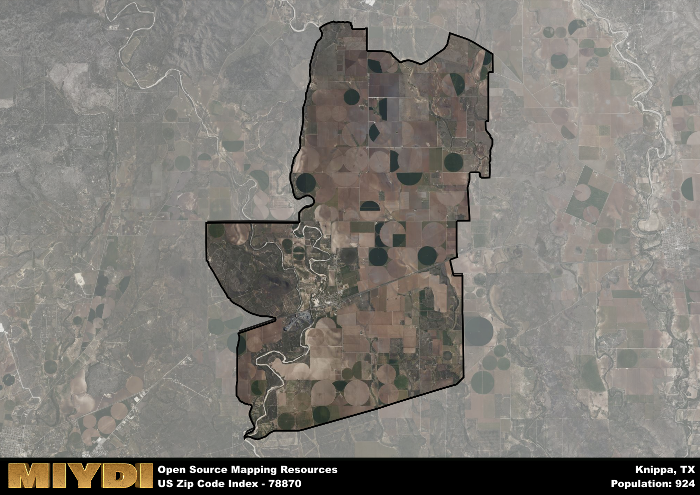

**Area Name:** Knippa

**Zip Code:** 78870

**State:** TX

Knippa is a part of the Uvalde - TX Micro Area, and makes up  of the Metro's population.  

# Knippa: A Quaint Texan Community in Zip Code 78870  

Located in southwestern Texas, the zip code 78870 area is synonymous with the small, rural community of Knippa. Situated within Uvalde County, Knippa is surrounded by vast stretches of farmland and ranches, with the nearest major population center being the city of Uvalde, approximately 20 miles to the southeast. Despite its rural setting, Knippa is well-connected to nearby districts and cities through a network of highways, making it a peaceful retreat while still being within reach of urban amenities.

Knippa has a rich historical background, originally founded as a farming community in the late 19th century by German immigrants. The town flourished as an agricultural hub, with cotton farming being a major industry that sustained the local economy. Over the years, Knippa has evolved into a close-knit community known for its friendly residents and strong sense of pride in its heritage. The town's name is derived from the Knippa family, early settlers who played a pivotal role in the area's development.

Today, Knippa retains its agricultural roots while also embracing modern amenities and services. The town boasts a thriving farming community, with crops like cotton, corn, and sorghum being cultivated in the surrounding fields. Residents and visitors alike can enjoy recreational activities such as hunting, fishing, and hiking in the picturesque countryside. Knippa also features local businesses, including family-owned shops and restaurants that offer a taste of traditional Texan hospitality. Visitors can explore historic sites like the Knippa School Museum, which showcases the town's past through exhibits and artifacts.

# Knippa Demographics

The population of Knippa is 924.  
Knippa has a population density of 13.56 per square mile.  
The area of Knippa is 68.13 square miles.  

## Knippa Income and Economic Data

These demographic numbers are sourced from IRS return data, providing comprehensive insights into the population dynamics and economic trends within Knippa.

**Breakdown of return types for Knippa**

The table offers insight into the composition of tax returns filed with the IRS, categorizing them into three main types. Single returns represent filings by individuals, joint returns by married couples, and head of household returns by individuals who qualify as heads of households, typically having dependents. This breakdown provides an understanding of the different filing statuses adopted by taxpayers when submitting their tax documentation.

| Return Types filed for Knippa                              | Percentage          |
|----------------------------------------------------------|---------------------|
| Single Returns                                            | 0.42 |
| Joint Returns                                             | 0.45 |
| Head Household Returns                                    | 0.13 |

The income and economic data presented here is sourced from the IRS income brackets, utilized for categorizing tax returns by income levels. This table displays income ranges for both single filers and married couples, along with the corresponding number of returns and the percentage within each bracket, providing valuable insight into the distribution of taxes across various income groups.

| Bracket Name       | Single Filer Income Range | Married Couple Range | Number of Returns | Percentage of Returns |
|--------------------|----------------------------|----------------------|-------------------|-----------------------|
| 10% Bracket        | Up to $10,275              | Up to $20,550        | 130 | 0.34% |
| 12% Bracket        | $10,276 - $41,775          | $20,551 - $83,550    | 110 | 0.29% |
| 22% Bracket        | $41,776 - $89,075          | $83,551 - $178,150   | 50 | 0.13% |
| 24% Bracket        | $89,076 - $170,050         | $178,151 - $340,100  | 30 | 0.08% |
| 32% Bracket        | $170,051 - $215,950        | $340,101 - $431,900  | 60 | 0.16% |
| 35% Bracket        | $215,951 - $539,900        | $431,901 - $647,850  | 0 | 0% |

### Exploring Taxpayer Diversity: A Breakdown of Different Types of Tax Returns in Knippa

The table offers insights into various types of tax returns filed, reflecting different aspects of taxpayer activities and demographics. Categories include charitable returns for donations, dependent returns for claimed dependents, educator population, elderly population, real estate returns, self-employment returns, student loan returns, and unemployment returns, providing valuable insights into taxpayer behavior and demographics.

| Knippa Filing Types                    | Count | Percentage |
|--------------------------------------|-------|------------|
| Charitable Donations                 | 0 | 0% |
| Dependents Claimed                   | 0 | 0% |
| Educator Residents                   | 0 | 0% |
| Elderly Population                   | 100 | 0.26% |
| Farming Population                   | 40 | 0.105% |
| Real Estate Transactions             | 0 | 0% |
| Self-Employed Individuals            | 80 | 0.211% |
| Student Loan Cases                   | 0 | 0% |
| Unemployment Benefit Filings         | 30 | 0.08% |

## Knippa AI and Census Variables

The values presented in this dataset for Knippa are AI-optimized, streamlined, and categorized into relevant buckets for enhanced utility in AI and mapping programs. These simplified values have been optimized to facilitate efficient analysis and integration into various technological applications, offering users accessible and actionable insights into demographics within the Knippa area.

| AI Variables for Knippa | Value |
|-------------|-------|
| Shape Area | 232956470.796875 |
| Shape Length | 81305.3093666931 |
| CBSA Federal Processing Standard Code | 46620 |

## How to use this free AI optimized Geo-Spatial Data for Knippa, TX

This data is made freely available under the Creative Commons license, allowing for unrestricted use for any purpose. Users can access static resources directly from GitHub or leverage more advanced functionalities by utilizing the GeoJSON files. All datasets originate from official government or private sector sources and are meticulously compiled into relevant datasets within QGIS. However, the versatility of the data ensures compatibility with any mapping application.

## Data Accuracy Disclaimer
It's important to note that the data provided here may contain errors or discrepancies and should be considered as 'close enough' for business applications and AI rather than a definitive source of truth. This data is aggregated from multiple sources, some of which publish information on wildly different intervals, leading to potential inconsistencies. Additionally, certain data points may not be corrected for Covid-related changes, further impacting accuracy. Moreover, the assumption that demographic trends are consistent throughout a region may lead to discrepancies, as trends often concentrate in areas of highest population density. As a result, dense areas may be slightly underrepresented, while rural areas may be slightly overrepresented, resulting in a more conservative dataset. Furthermore, the focus primarily on areas within US Major and Minor Statistical areas means that approximately 40 million Americans living outside of these areas may not be fully represented. Lastly, the historical background and area descriptions generated using AI are susceptible to potential mistakes, so users should exercise caution when interpreting the information provided.
