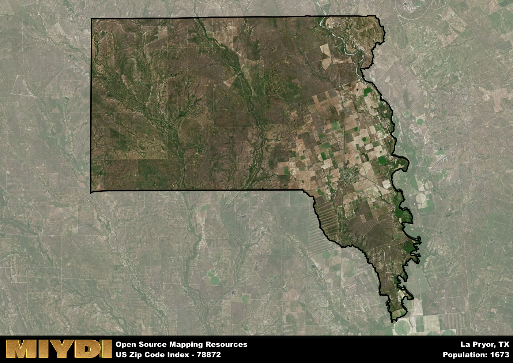

**Area Name:** La Pryor

**Zip Code:** 78872

**State:** TX

La Pryor is a part of the Uvalde - TX Micro Area, and makes up 1.14% of the Metro's population.  

# La Pryor (Zip Code 78872): A Quaint Neighborhood in Southwest Texas  

Located in southwest Texas, the zip code area 78872 encompasses the small community of La Pryor. Surrounded by vast open landscapes and agricultural fields, La Pryor is situated within the larger metropolitan area of Uvalde. The neighborhood is characterized by its rural setting and close-knit community, with easy access to nearby cities such as Eagle Pass and Del Rio.

La Pryor has a rich historical narrative dating back to the late 19th century when the town was established as a stop along the railroad. Named after Col. Isaac T. Pryor, a prominent figure in the area, La Pryor grew as a center for agriculture and ranching. Over the years, the community has maintained its small-town charm while embracing modern developments, making it a unique blend of tradition and progress.

Today, La Pryor is a thriving community with a focus on agriculture, oil production, and small businesses. Residents enjoy a range of neighborhood-specific services, including schools, churches, and local shops. The area also boasts recreational amenities such as parks and sports facilities, as well as cultural sites that highlight its rich heritage. La Pryor's strong sense of community and diverse economic activities make it a hidden gem within the vibrant landscape of southwest Texas.

# La Pryor Demographics

The population of La Pryor is 1673.  
La Pryor has a population density of 7.31 per square mile.  
The area of La Pryor is 228.9 square miles.  

### Exploring Real Estate Trends: A Comprehensive Analysis of the La Pryor Area and its Neighbors

This table contains an in-depth examination of the real estate market in the La Pryor area. Sourced from trusted real estate market firms, this dataset provides a wealth of raw data detailing the local real estate landscape, along with comparative analyses juxtaposing the market dynamics with those of neighboring areas. Explore the intricacies of the La Pryor real estate market and gain valuable insights into its relationship with adjacent regions.

| Real Estate Data for La Pryor                       | Value    |
|------------------------------------------------|----------|
| Average Listing Price for La Pryor               | 188292 |
| Median Listing Price for La Pryor                | 167425 |
| Median Days on Market for La Pryor               | 68 |
| Median Listing Price per Square Foot for La Pryor| 9 |
| Median Square Feet for La Pryor                  | 8388 |
| Real Estate Prices to Income Ratio           | 133.81% |
| Price per Square Foot Ratio                  | 29.14% |
| Price Median Ratio                           | 72.85% |
| Market Sales Speed Ratio                     | 83.1% |

This table offers essential real estate data for the La Pryor area, including average and median listing prices, median days on market, and property size. It also presents ratio metrics as percentages, providing insights into how the local market compares to the surrounding region. A ratio of 100% signifies performance in line with the regional average, while values above or below indicate overperformance or underperformance, respectively, relative to expectations.

## La Pryor Sports and Recreation Data

#### Annual Youth Sports Spending for La Pryor

This table provides fundamental insights into the Sports and Recreation data for the La Pryor area, detailing the estimated annual expenditure on Youth Athletics. This includes estimated spending by the major consumer brackets. 
| Sports Spending for La Pryor| Value |
|-------------------------|-------|
| Athlete Spending Compared to the region | 6.45% |
| Total Youth Athlete Spending | 61,408 |
| Athletic Spending - Essential Focused Consumer | 9,395 |
| Athletic Spending - Typical Consumer | 18,041 |
| Athletic Spending - Affluent Consumers | 03,917 |

#### Youth Coaching Estimates for La Pryor

This table presents the estimated number of coaches for the La Pryor area, derived from comprehensive national coaching surveys and athletic participation rates by state. It offers valuable insights into the vital role of coaching personnel in fostering athletic development and facilitating sports participation within the local community.

| Coaching Data for La Pryor | Value |
|-------------|-------|
| Total Coaches | 27 |
| Paid Coaches | 7 |
| Volunteer Coaches | 20 |

#### Youth Athlete Participation for La Pryor

This table shows the estimated total number of youth athletes in the La Pryor area, sourced from comprehensive national coaching surveys and athletic participation rates by state.

| Total YA Athletes in La Pryor | Value |
|-------------|-------|
| Total High School Athletes | 42 |
| Total Youth Athletes | 125 |
| Total Young Adult Athletes | 84 |
| Total Athletes to Age 25 | 251 |

#### High School Age Athletes - Breakdown by Sport for La Pryor

This table shows insights regarding high school age estimated players by sport in the La Pryor area, derived from national and state-level athletic participation trends. 

| HS Players by Sport in La Pryor | Value |
|-------------|-------|
| Football Players | 10 |
| Basketball Players | 6 |
| Soccer Players | 5 |
| Volleyball Players | 3 |
| Baseball Players | 5 |
| Tennis Players | 3 |
| Track Athletes | 7 |
| Golf Players | 1 |
| Swimming Athletes | 1 |
| Wrestling Competitors | 1 |
| Lacrosse Players | 0 |

Estimating the number of younger athletes presents unique challenges due to their varied starting ages, typically beginning around six years old, and a gradual decline in participation rates as they age. Unlike high school-aged athletes, younger athletes are less likely to switch sports as they grow older, contributing to the stability of participation numbers within specific sports at younger ages.  

As a general trend, the total number of younger athletes is approximately three times the number of high school-aged athletes, underscoring the significant presence of youth athletes in sports programs and highlighting the importance of early engagement in athletic activities.

## La Pryor AI and Census Variables

The values presented in this dataset for La Pryor are AI-optimized, streamlined, and categorized into relevant buckets for enhanced utility in AI and mapping programs. These simplified values have been optimized to facilitate efficient analysis and integration into various technological applications, offering users accessible and actionable insights into demographics within the La Pryor area.

| AI Variables for La Pryor | Value |
|-------------|-------|
| Shape Area | 777671937.835938 |
| Shape Length | 171192.546933035 |
| CBSA Federal Processing Standard Code | 46620 |
| RE Price per Square Foot Ratio | 29.14% |
| RE Price Average Ratio | 73.40% |
| RE Speed Ratio | 83.1% |
| RE Income Ratio | 133.81% |
| RE Affordability Index Flag | 3 |
| Income Bracket Flag | 2 |
| RE Income Flag | 4 |
| RE Median Square Footage Price Flag | 1 |
| RE Median Square Footage Size Flag | 7 |
| RE Activity Flag | 4 |
| Poverty Line Risk Flag | 2 |

## How to use this free AI optimized Geo-Spatial Data for La Pryor, TX

This data is made freely available under the Creative Commons license, allowing for unrestricted use for any purpose. Users can access static resources directly from GitHub or leverage more advanced functionalities by utilizing the GeoJSON files. All datasets originate from official government or private sector sources and are meticulously compiled into relevant datasets within QGIS. However, the versatility of the data ensures compatibility with any mapping application.

## Data Accuracy Disclaimer
It's important to note that the data provided here may contain errors or discrepancies and should be considered as 'close enough' for business applications and AI rather than a definitive source of truth. This data is aggregated from multiple sources, some of which publish information on wildly different intervals, leading to potential inconsistencies. Additionally, certain data points may not be corrected for Covid-related changes, further impacting accuracy. Moreover, the assumption that demographic trends are consistent throughout a region may lead to discrepancies, as trends often concentrate in areas of highest population density. As a result, dense areas may be slightly underrepresented, while rural areas may be slightly overrepresented, resulting in a more conservative dataset. Furthermore, the focus primarily on areas within US Major and Minor Statistical areas means that approximately 40 million Americans living outside of these areas may not be fully represented. Lastly, the historical background and area descriptions generated using AI are susceptible to potential mistakes, so users should exercise caution when interpreting the information provided.
