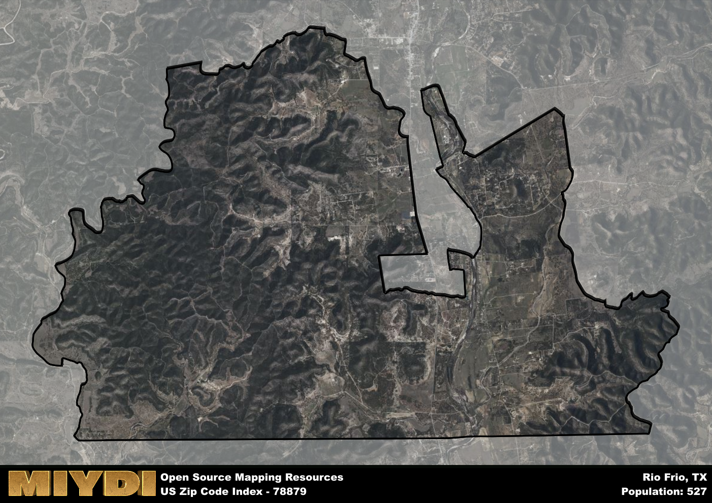

**Area Name:** Rio Frio

**Zip Code:** 78879

**State:** TX

Rio Frio is a part of the Uvalde - TX Micro Area, and makes up  of the Metro's population.  

# Rio Frio: A Charming Neighborhood in the Heart of Texas Hill Country  

Located in the picturesque Texas Hill Country, zip code 78879 encompasses the quaint neighborhood of Rio Frio. Surrounded by rolling hills and crystal-clear rivers, Rio Frio is situated near the popular towns of Utopia and Leakey. The zip code area is known for its stunning natural beauty, making it a popular destination for outdoor enthusiasts seeking hiking, fishing, and camping opportunities. Despite its rural setting, Rio Frio is just a short drive away from the bustling city of San Antonio, allowing residents to enjoy a peaceful lifestyle while still having access to urban amenities.

Rio Frio has a rich history dating back to the early days of Spanish colonization in Texas. The area was originally settled by Native American tribes before becoming a stop on the historic Chisholm Trail, a major cattle-driving route in the 19th century. Over the years, Rio Frio has evolved into a charming community known for its warm hospitality and strong sense of community. The name "Rio Frio" translates to "Cold River" in Spanish, a nod to the refreshing waters of the nearby Frio River that flows through the area.

Today, Rio Frio is a thriving community with a mix of local businesses, including family-owned restaurants, shops, and accommodations catering to tourists and residents alike. The area is a popular destination for tubing and kayaking on the Frio River, drawing visitors from across the state during the summer months. Rio Frio also boasts several historic sites, such as the Rio Frio Landmark Oak, a centuries-old tree that serves as a symbol of the area's enduring heritage. With its stunning natural landscapes and vibrant local culture, Rio Frio remains a hidden gem in the heart of the Texas Hill Country.

# Rio Frio Demographics

The population of Rio Frio is 527.  
Rio Frio has a population density of 10.41 per square mile.  
The area of Rio Frio is 50.63 square miles.  

## Rio Frio Income and Economic Data

These demographic numbers are sourced from IRS return data, providing comprehensive insights into the population dynamics and economic trends within Rio Frio.

**Breakdown of return types for Rio Frio**

The table offers insight into the composition of tax returns filed with the IRS, categorizing them into three main types. Single returns represent filings by individuals, joint returns by married couples, and head of household returns by individuals who qualify as heads of households, typically having dependents. This breakdown provides an understanding of the different filing statuses adopted by taxpayers when submitting their tax documentation.

| Return Types filed for Rio Frio                              | Percentage          |
|----------------------------------------------------------|---------------------|
| Single Returns                                            | 0.31 |
| Joint Returns                                             | 0.44 |
| Head Household Returns                                    | 0 |

The income and economic data presented here is sourced from the IRS income brackets, utilized for categorizing tax returns by income levels. This table displays income ranges for both single filers and married couples, along with the corresponding number of returns and the percentage within each bracket, providing valuable insight into the distribution of taxes across various income groups.

| Bracket Name       | Single Filer Income Range | Married Couple Range | Number of Returns | Percentage of Returns |
|--------------------|----------------------------|----------------------|-------------------|-----------------------|
| 10% Bracket        | Up to $10,275              | Up to $20,550        | 50 | 0.31% |
| 12% Bracket        | $10,276 - $41,775          | $20,551 - $83,550    | 30 | 0.19% |
| 22% Bracket        | $41,776 - $89,075          | $83,551 - $178,150   | 40 | 0.25% |
| 24% Bracket        | $89,076 - $170,050         | $178,151 - $340,100  | 0 | 0% |
| 32% Bracket        | $170,051 - $215,950        | $340,101 - $431,900  | 40 | 0.25% |
| 35% Bracket        | $215,951 - $539,900        | $431,901 - $647,850  | 0 | 0% |

### Exploring Taxpayer Diversity: A Breakdown of Different Types of Tax Returns in Rio Frio

The table offers insights into various types of tax returns filed, reflecting different aspects of taxpayer activities and demographics. Categories include charitable returns for donations, dependent returns for claimed dependents, educator population, elderly population, real estate returns, self-employment returns, student loan returns, and unemployment returns, providing valuable insights into taxpayer behavior and demographics.

| Rio Frio Filing Types                    | Count | Percentage |
|--------------------------------------|-------|------------|
| Charitable Donations                 | 0 | 0% |
| Dependents Claimed                   | 0 | 0% |
| Educator Residents                   | 0 | 0% |
| Elderly Population                   | 80 | 0.5% |
| Farming Population                   | 0 | 0% |
| Real Estate Transactions             | 0 | 0% |
| Self-Employed Individuals            | 0 | 0% |
| Student Loan Cases                   | 0 | 0% |
| Unemployment Benefit Filings         | 0 | 0% |

## Rio Frio AI and Census Variables

The values presented in this dataset for Rio Frio are AI-optimized, streamlined, and categorized into relevant buckets for enhanced utility in AI and mapping programs. These simplified values have been optimized to facilitate efficient analysis and integration into various technological applications, offering users accessible and actionable insights into demographics within the Rio Frio area.

| AI Variables for Rio Frio | Value |
|-------------|-------|
| Shape Area | 174283277.796875 |
| Shape Length | 91924.1247029269 |
| CBSA Federal Processing Standard Code | 46620 |

## How to use this free AI optimized Geo-Spatial Data for Rio Frio, TX

This data is made freely available under the Creative Commons license, allowing for unrestricted use for any purpose. Users can access static resources directly from GitHub or leverage more advanced functionalities by utilizing the GeoJSON files. All datasets originate from official government or private sector sources and are meticulously compiled into relevant datasets within QGIS. However, the versatility of the data ensures compatibility with any mapping application.

## Data Accuracy Disclaimer
It's important to note that the data provided here may contain errors or discrepancies and should be considered as 'close enough' for business applications and AI rather than a definitive source of truth. This data is aggregated from multiple sources, some of which publish information on wildly different intervals, leading to potential inconsistencies. Additionally, certain data points may not be corrected for Covid-related changes, further impacting accuracy. Moreover, the assumption that demographic trends are consistent throughout a region may lead to discrepancies, as trends often concentrate in areas of highest population density. As a result, dense areas may be slightly underrepresented, while rural areas may be slightly overrepresented, resulting in a more conservative dataset. Furthermore, the focus primarily on areas within US Major and Minor Statistical areas means that approximately 40 million Americans living outside of these areas may not be fully represented. Lastly, the historical background and area descriptions generated using AI are susceptible to potential mistakes, so users should exercise caution when interpreting the information provided.
