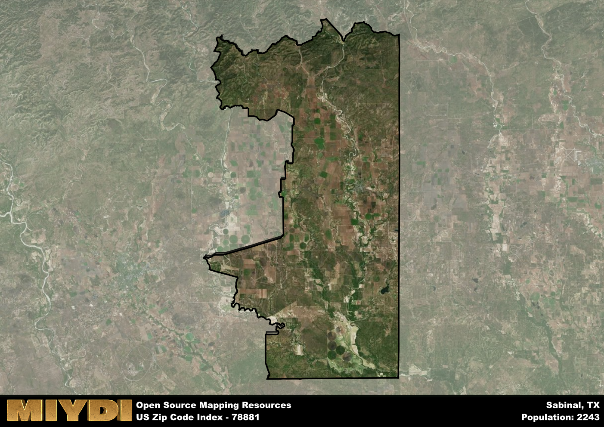

**Area Name:** Sabinal

**Zip Code:** 78881

**State:** TX

Sabinal is a part of the Uvalde - TX Micro Area, and makes up  of the Metro's population.  

# Sabinal: A Charming Texas Neighborhood  
Sabinal, located in the zip code 78881, is a charming neighborhood situated in Uvalde County, Texas. The area is nestled in the heart of the state, surrounded by the cities of Uvalde to the east and Hondo to the west. Sabinal is a part of the larger metropolitan area of San Antonio, serving as a peaceful retreat from the hustle and bustle of the city.

The history of Sabinal dates back to the mid-19th century when the area was first settled by pioneers drawn to the fertile land and abundant natural resources. The neighborhood experienced significant growth during the railroad era, becoming a vital transportation hub for the region. The name "Sabinal" is derived from the Spanish word for "cottonwood," a nod to the area's rich natural landscape.

Today, Sabinal is a thriving community known for its agricultural heritage and welcoming atmosphere. The neighborhood boasts a variety of local businesses, including family-owned farms and ranches that contribute to the area's economy. Residents and visitors alike can enjoy the peaceful surroundings of Sabinal Park, which features picnic areas, playgrounds, and walking trails. For those interested in history, the Sabinal Heritage Museum offers a glimpse into the area's past, showcasing artifacts and exhibits that highlight the neighborhood's unique heritage.

# Sabinal Demographics

The population of Sabinal is 2243.  
Sabinal has a population density of 6.67 per square mile.  
The area of Sabinal is 336.28 square miles.  

## Sabinal Income and Economic Data

These demographic numbers are sourced from IRS return data, providing comprehensive insights into the population dynamics and economic trends within Sabinal.

**Breakdown of return types for Sabinal**

The table offers insight into the composition of tax returns filed with the IRS, categorizing them into three main types. Single returns represent filings by individuals, joint returns by married couples, and head of household returns by individuals who qualify as heads of households, typically having dependents. This breakdown provides an understanding of the different filing statuses adopted by taxpayers when submitting their tax documentation.

| Return Types filed for Sabinal                              | Percentage          |
|----------------------------------------------------------|---------------------|
| Single Returns                                            | 0.51 |
| Joint Returns                                             | 0.3 |
| Head Household Returns                                    | 0.18 |

The income and economic data presented here is sourced from the IRS income brackets, utilized for categorizing tax returns by income levels. This table displays income ranges for both single filers and married couples, along with the corresponding number of returns and the percentage within each bracket, providing valuable insight into the distribution of taxes across various income groups.

| Bracket Name       | Single Filer Income Range | Married Couple Range | Number of Returns | Percentage of Returns |
|--------------------|----------------------------|----------------------|-------------------|-----------------------|
| 10% Bracket        | Up to $10,275              | Up to $20,550        | 410 | 0.42% |
| 12% Bracket        | $10,276 - $41,775          | $20,551 - $83,550    | 270 | 0.28% |
| 22% Bracket        | $41,776 - $89,075          | $83,551 - $178,150   | 130 | 0.13% |
| 24% Bracket        | $89,076 - $170,050         | $178,151 - $340,100  | 70 | 0.07% |
| 32% Bracket        | $170,051 - $215,950        | $340,101 - $431,900  | 70 | 0.07% |
| 35% Bracket        | $215,951 - $539,900        | $431,901 - $647,850  | 20 | 0.02% |

### Exploring Taxpayer Diversity: A Breakdown of Different Types of Tax Returns in Sabinal

The table offers insights into various types of tax returns filed, reflecting different aspects of taxpayer activities and demographics. Categories include charitable returns for donations, dependent returns for claimed dependents, educator population, elderly population, real estate returns, self-employment returns, student loan returns, and unemployment returns, providing valuable insights into taxpayer behavior and demographics.

| Sabinal Filing Types                    | Count | Percentage |
|--------------------------------------|-------|------------|
| Charitable Donations                 | 0 | 0% |
| Dependents Claimed                   | 0 | 0% |
| Educator Residents                   | 20 | 0.021% |
| Elderly Population                   | 250 | 0.26% |
| Farming Population                   | 60 | 0.062% |
| Real Estate Transactions             | 0 | 0% |
| Self-Employed Individuals            | 150 | 0.155% |
| Student Loan Cases                   | 30 | 0.031% |
| Unemployment Benefit Filings         | 90 | 0.09% |

## Sabinal AI and Census Variables

The values presented in this dataset for Sabinal are AI-optimized, streamlined, and categorized into relevant buckets for enhanced utility in AI and mapping programs. These simplified values have been optimized to facilitate efficient analysis and integration into various technological applications, offering users accessible and actionable insights into demographics within the Sabinal area.

| AI Variables for Sabinal | Value |
|-------------|-------|
| Shape Area | 1149293619.47656 |
| Shape Length | 216822.162351111 |
| CBSA Federal Processing Standard Code | 46620 |

## How to use this free AI optimized Geo-Spatial Data for Sabinal, TX

This data is made freely available under the Creative Commons license, allowing for unrestricted use for any purpose. Users can access static resources directly from GitHub or leverage more advanced functionalities by utilizing the GeoJSON files. All datasets originate from official government or private sector sources and are meticulously compiled into relevant datasets within QGIS. However, the versatility of the data ensures compatibility with any mapping application.

## Data Accuracy Disclaimer
It's important to note that the data provided here may contain errors or discrepancies and should be considered as 'close enough' for business applications and AI rather than a definitive source of truth. This data is aggregated from multiple sources, some of which publish information on wildly different intervals, leading to potential inconsistencies. Additionally, certain data points may not be corrected for Covid-related changes, further impacting accuracy. Moreover, the assumption that demographic trends are consistent throughout a region may lead to discrepancies, as trends often concentrate in areas of highest population density. As a result, dense areas may be slightly underrepresented, while rural areas may be slightly overrepresented, resulting in a more conservative dataset. Furthermore, the focus primarily on areas within US Major and Minor Statistical areas means that approximately 40 million Americans living outside of these areas may not be fully represented. Lastly, the historical background and area descriptions generated using AI are susceptible to potential mistakes, so users should exercise caution when interpreting the information provided.
