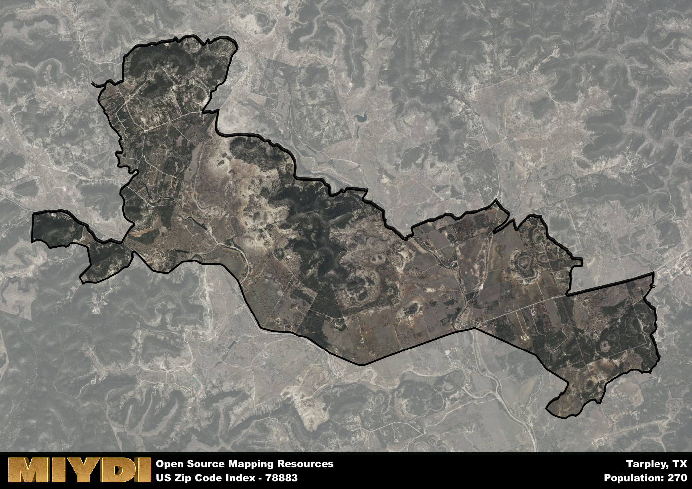

**Area Name:** Tarpley

**Zip Code:** 78883

**State:** TX

Tarpley is a part of the San Antonio-New Braunfels - TX Metro Area, and makes up  of the Metro's population.  

# Tarpley, TX 78883: A Charming Neighborhood in the Heart of Hill Country

Located in the picturesque Hill Country region of Texas, the zip code 78883 corresponds to the charming neighborhood of Tarpley. Bordered by rolling hills and lush greenery, Tarpley seamlessly integrates with the surrounding communities of Bandera and Medina, offering a peaceful retreat from the hustle and bustle of major cities like San Antonio, which is approximately 60 miles away. Despite its rural setting, Tarpley serves as a popular weekend destination for outdoor enthusiasts and nature lovers seeking a tranquil escape.

Established in the late 19th century, Tarpley has a rich historical narrative that traces back to its early days as a farming and ranching community. Named after one of its earliest settlers, Timothy Tarpley, the area grew steadily as families migrated to the region in search of fertile land and a simpler way of life. Over the years, Tarpley has retained its small-town charm and close-knit community spirit, with residents proud of their heritage and committed to preserving the area's unique character.

Today, Tarpley offers a mix of agricultural and tourism-based economic activities, with local businesses catering to visitors and residents alike. The neighborhood boasts a variety of services, including quaint bed and breakfasts, family-owned restaurants, and boutique shops showcasing local artisans. Outdoor enthusiasts can explore the nearby hiking trails and fishing spots, while history buffs can visit historic sites such as the Tarpley Cemetery and the Old Mill Community Center. With its scenic beauty and friendly atmosphere, Tarpley continues to captivate visitors and residents with its timeless appeal.

# Tarpley Demographics

The population of Tarpley is 270.  
Tarpley has a population density of 16.77 per square mile.  
The area of Tarpley is 16.1 square miles.  

## Tarpley Income and Economic Data

These demographic numbers are sourced from IRS return data, providing comprehensive insights into the population dynamics and economic trends within Tarpley.

**Breakdown of return types for Tarpley**

The table offers insight into the composition of tax returns filed with the IRS, categorizing them into three main types. Single returns represent filings by individuals, joint returns by married couples, and head of household returns by individuals who qualify as heads of households, typically having dependents. This breakdown provides an understanding of the different filing statuses adopted by taxpayers when submitting their tax documentation.

| Return Types filed for Tarpley                              | Percentage          |
|----------------------------------------------------------|---------------------|
| Single Returns                                            | 0.44 |
| Joint Returns                                             | 0.5 |
| Head Household Returns                                    | 0 |

The income and economic data presented here is sourced from the IRS income brackets, utilized for categorizing tax returns by income levels. This table displays income ranges for both single filers and married couples, along with the corresponding number of returns and the percentage within each bracket, providing valuable insight into the distribution of taxes across various income groups.

| Bracket Name       | Single Filer Income Range | Married Couple Range | Number of Returns | Percentage of Returns |
|--------------------|----------------------------|----------------------|-------------------|-----------------------|
| 10% Bracket        | Up to $10,275              | Up to $20,550        | 50 | 0.31% |
| 12% Bracket        | $10,276 - $41,775          | $20,551 - $83,550    | 40 | 0.25% |
| 22% Bracket        | $41,776 - $89,075          | $83,551 - $178,150   | 40 | 0.25% |
| 24% Bracket        | $89,076 - $170,050         | $178,151 - $340,100  | 0 | 0% |
| 32% Bracket        | $170,051 - $215,950        | $340,101 - $431,900  | 30 | 0.19% |
| 35% Bracket        | $215,951 - $539,900        | $431,901 - $647,850  | 0 | 0% |

### Exploring Taxpayer Diversity: A Breakdown of Different Types of Tax Returns in Tarpley

The table offers insights into various types of tax returns filed, reflecting different aspects of taxpayer activities and demographics. Categories include charitable returns for donations, dependent returns for claimed dependents, educator population, elderly population, real estate returns, self-employment returns, student loan returns, and unemployment returns, providing valuable insights into taxpayer behavior and demographics.

| Tarpley Filing Types                    | Count | Percentage |
|--------------------------------------|-------|------------|
| Charitable Donations                 | 0 | 0% |
| Dependents Claimed                   | 0 | 0% |
| Educator Residents                   | 0 | 0% |
| Elderly Population                   | 90 | 0.56% |
| Farming Population                   | 20 | 0.125% |
| Real Estate Transactions             | 0 | 0% |
| Self-Employed Individuals            | 20 | 0.125% |
| Student Loan Cases                   | 0 | 0% |
| Unemployment Benefit Filings         | 0 | 0% |

## Tarpley AI and Census Variables

The values presented in this dataset for Tarpley are AI-optimized, streamlined, and categorized into relevant buckets for enhanced utility in AI and mapping programs. These simplified values have been optimized to facilitate efficient analysis and integration into various technological applications, offering users accessible and actionable insights into demographics within the Tarpley area.

| AI Variables for Tarpley | Value |
|-------------|-------|
| Shape Area | 55441929.9804688 |
| Shape Length | 60087.7850274935 |
| CBSA Federal Processing Standard Code | 41700 |

## How to use this free AI optimized Geo-Spatial Data for Tarpley, TX

This data is made freely available under the Creative Commons license, allowing for unrestricted use for any purpose. Users can access static resources directly from GitHub or leverage more advanced functionalities by utilizing the GeoJSON files. All datasets originate from official government or private sector sources and are meticulously compiled into relevant datasets within QGIS. However, the versatility of the data ensures compatibility with any mapping application.

## Data Accuracy Disclaimer
It's important to note that the data provided here may contain errors or discrepancies and should be considered as 'close enough' for business applications and AI rather than a definitive source of truth. This data is aggregated from multiple sources, some of which publish information on wildly different intervals, leading to potential inconsistencies. Additionally, certain data points may not be corrected for Covid-related changes, further impacting accuracy. Moreover, the assumption that demographic trends are consistent throughout a region may lead to discrepancies, as trends often concentrate in areas of highest population density. As a result, dense areas may be slightly underrepresented, while rural areas may be slightly overrepresented, resulting in a more conservative dataset. Furthermore, the focus primarily on areas within US Major and Minor Statistical areas means that approximately 40 million Americans living outside of these areas may not be fully represented. Lastly, the historical background and area descriptions generated using AI are susceptible to potential mistakes, so users should exercise caution when interpreting the information provided.
