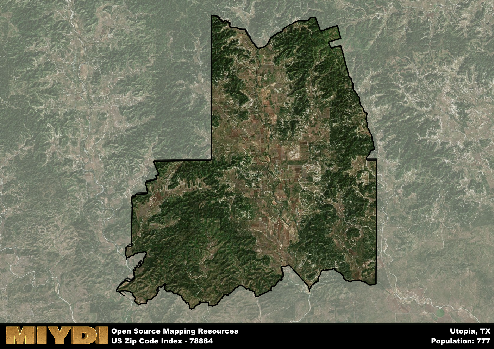

**Area Name:** Utopia

**Zip Code:** 78884

**State:** TX

Utopia is a part of the Uvalde - TX Micro Area, and makes up  of the Metro's population.  

# Utopia: A Quaint Community in the Heart of Texas Hill Country

Located in the picturesque Texas Hill Country, zip code 78884 encompasses the charming community of Utopia. Nestled among rolling hills and lush greenery, Utopia is bordered by the Sabinal River to the north and is situated approximately 80 miles northwest of San Antonio. The area is part of a larger rural region known for its natural beauty and outdoor recreational opportunities, making it a popular destination for nature enthusiasts and those seeking a peaceful retreat from city life.

Utopia has a rich history dating back to the mid-19th century when it was settled by German immigrants attracted to the fertile land and abundant water sources. The community grew around a small trading post and saw a significant increase in population during the early 20th century with the arrival of the railroad. The name "Utopia" was chosen by the town's founders to reflect their vision of an ideal community, characterized by prosperity, harmony, and natural beauty.

Today, Utopia maintains its small-town charm while offering a range of amenities and services for residents and visitors alike. The economy is primarily driven by agriculture, tourism, and small businesses, with local shops, restaurants, and bed-and-breakfasts catering to the needs of the community. Outdoor enthusiasts can explore nearby state parks, hiking trails, and fishing spots, while history buffs can visit historic sites such as the Utopia General Store and the Sabinal River Bridge. Utopia truly lives up to its name as a hidden gem in the Texas Hill Country.

# Utopia Demographics

The population of Utopia is 777.  
Utopia has a population density of 3.24 per square mile.  
The area of Utopia is 239.68 square miles.  

## Utopia Income and Economic Data

These demographic numbers are sourced from IRS return data, providing comprehensive insights into the population dynamics and economic trends within Utopia.

**Breakdown of return types for Utopia**

The table offers insight into the composition of tax returns filed with the IRS, categorizing them into three main types. Single returns represent filings by individuals, joint returns by married couples, and head of household returns by individuals who qualify as heads of households, typically having dependents. This breakdown provides an understanding of the different filing statuses adopted by taxpayers when submitting their tax documentation.

| Return Types filed for Utopia                              | Percentage          |
|----------------------------------------------------------|---------------------|
| Single Returns                                            | 0.42 |
| Joint Returns                                             | 0.53 |
| Head Household Returns                                    | 0.07 |

The income and economic data presented here is sourced from the IRS income brackets, utilized for categorizing tax returns by income levels. This table displays income ranges for both single filers and married couples, along with the corresponding number of returns and the percentage within each bracket, providing valuable insight into the distribution of taxes across various income groups.

| Bracket Name       | Single Filer Income Range | Married Couple Range | Number of Returns | Percentage of Returns |
|--------------------|----------------------------|----------------------|-------------------|-----------------------|
| 10% Bracket        | Up to $10,275              | Up to $20,550        | 190 | 0.35% |
| 12% Bracket        | $10,276 - $41,775          | $20,551 - $83,550    | 110 | 0.2% |
| 22% Bracket        | $41,776 - $89,075          | $83,551 - $178,150   | 90 | 0.16% |
| 24% Bracket        | $89,076 - $170,050         | $178,151 - $340,100  | 50 | 0.09% |
| 32% Bracket        | $170,051 - $215,950        | $340,101 - $431,900  | 80 | 0.15% |
| 35% Bracket        | $215,951 - $539,900        | $431,901 - $647,850  | 30 | 0.05% |

### Exploring Taxpayer Diversity: A Breakdown of Different Types of Tax Returns in Utopia

The table offers insights into various types of tax returns filed, reflecting different aspects of taxpayer activities and demographics. Categories include charitable returns for donations, dependent returns for claimed dependents, educator population, elderly population, real estate returns, self-employment returns, student loan returns, and unemployment returns, providing valuable insights into taxpayer behavior and demographics.

| Utopia Filing Types                    | Count | Percentage |
|--------------------------------------|-------|------------|
| Charitable Donations                 | 30 | 0.055% |
| Dependents Claimed                   | 0 | 0% |
| Educator Residents                   | 0 | 0% |
| Elderly Population                   | 260 | 0.47% |
| Farming Population                   | 70 | 0.127% |
| Real Estate Transactions             | 30 | 0.055% |
| Self-Employed Individuals            | 140 | 0.255% |
| Student Loan Cases                   | 20 | 0.036% |
| Unemployment Benefit Filings         | 30 | 0.05% |

## Utopia AI and Census Variables

The values presented in this dataset for Utopia are AI-optimized, streamlined, and categorized into relevant buckets for enhanced utility in AI and mapping programs. These simplified values have been optimized to facilitate efficient analysis and integration into various technological applications, offering users accessible and actionable insights into demographics within the Utopia area.

| AI Variables for Utopia | Value |
|-------------|-------|
| Shape Area | 824106381.625 |
| Shape Length | 170634.317283095 |
| CBSA Federal Processing Standard Code | 46620 |

## How to use this free AI optimized Geo-Spatial Data for Utopia, TX

This data is made freely available under the Creative Commons license, allowing for unrestricted use for any purpose. Users can access static resources directly from GitHub or leverage more advanced functionalities by utilizing the GeoJSON files. All datasets originate from official government or private sector sources and are meticulously compiled into relevant datasets within QGIS. However, the versatility of the data ensures compatibility with any mapping application.

## Data Accuracy Disclaimer
It's important to note that the data provided here may contain errors or discrepancies and should be considered as 'close enough' for business applications and AI rather than a definitive source of truth. This data is aggregated from multiple sources, some of which publish information on wildly different intervals, leading to potential inconsistencies. Additionally, certain data points may not be corrected for Covid-related changes, further impacting accuracy. Moreover, the assumption that demographic trends are consistent throughout a region may lead to discrepancies, as trends often concentrate in areas of highest population density. As a result, dense areas may be slightly underrepresented, while rural areas may be slightly overrepresented, resulting in a more conservative dataset. Furthermore, the focus primarily on areas within US Major and Minor Statistical areas means that approximately 40 million Americans living outside of these areas may not be fully represented. Lastly, the historical background and area descriptions generated using AI are susceptible to potential mistakes, so users should exercise caution when interpreting the information provided.
