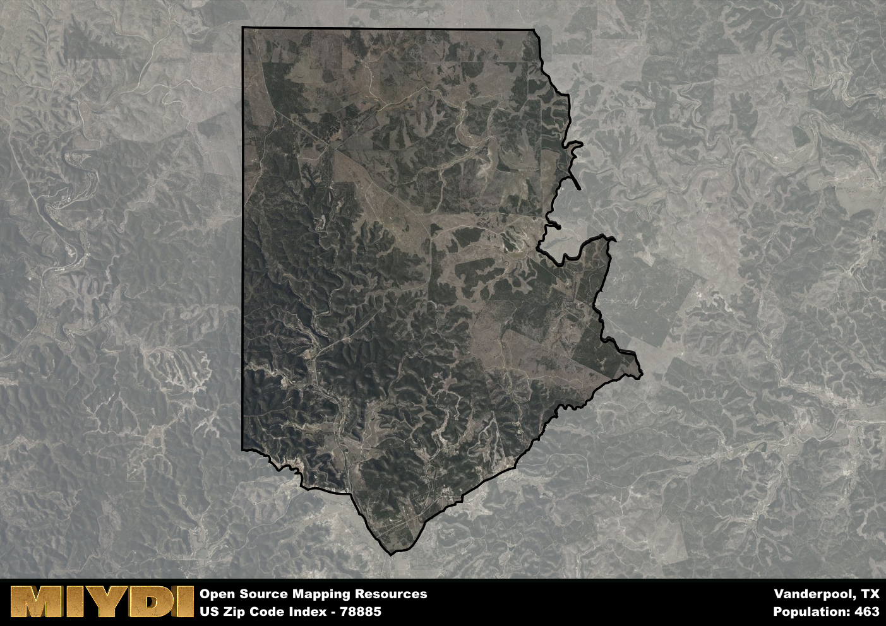

**Area Name:** Vanderpool

**Zip Code:** 78885

**State:** TX

Vanderpool is a part of the San Antonio-New Braunfels - TX Metro Area, and makes up  of the Metro's population.  

# The Charming Neighborhood of Vanderpool in Zip Code 78885

Located in the heart of the Texas Hill Country, zip code 78885 encompasses the cozy neighborhood of Vanderpool. Nestled among rolling hills and lush greenery, Vanderpool is surrounded by the towns of Utopia, Medina, and Lost Maples State Natural Area. Despite its rural setting, Vanderpool is just a short drive away from larger cities like San Antonio and Austin, making it a popular weekend getaway destination for city dwellers seeking tranquility.

Originally settled in the mid-19th century by German immigrants, Vanderpool has a rich history of agriculture and ranching. The area flourished with the arrival of the railroad in the late 1800s, becoming a hub for transporting livestock and agricultural goods. Today, Vanderpool maintains its small-town charm with historic buildings and family-owned businesses that have been passed down through generations. The name "Vanderpool" is said to have been derived from an early settler named George S. Vanderpool, who played a significant role in the community's development.

Present-day Vanderpool is a thriving community known for its ecotourism and outdoor recreational opportunities. Visitors flock to the area to explore Lost Maples State Natural Area, famous for its vibrant fall foliage and hiking trails. The neighborhood is also home to several bed and breakfasts, campgrounds, and local eateries that cater to nature enthusiasts and travelers passing through. Vanderpool's economy is driven by tourism, agriculture, and local artisans who showcase their crafts at the numerous festivals and markets held throughout the year.

# Vanderpool Demographics

The population of Vanderpool is 463.  
Vanderpool has a population density of 6.19 per square mile.  
The area of Vanderpool is 74.81 square miles.  

## Vanderpool AI and Census Variables

The values presented in this dataset for Vanderpool are AI-optimized, streamlined, and categorized into relevant buckets for enhanced utility in AI and mapping programs. These simplified values have been optimized to facilitate efficient analysis and integration into various technological applications, offering users accessible and actionable insights into demographics within the Vanderpool area.

| AI Variables for Vanderpool | Value |
|-------------|-------|
| Shape Area | 258333557.253906 |
| Shape Length | 80728.3353431029 |
| CBSA Federal Processing Standard Code | 41700 |

## How to use this free AI optimized Geo-Spatial Data for Vanderpool, TX

This data is made freely available under the Creative Commons license, allowing for unrestricted use for any purpose. Users can access static resources directly from GitHub or leverage more advanced functionalities by utilizing the GeoJSON files. All datasets originate from official government or private sector sources and are meticulously compiled into relevant datasets within QGIS. However, the versatility of the data ensures compatibility with any mapping application.

## Data Accuracy Disclaimer
It's important to note that the data provided here may contain errors or discrepancies and should be considered as 'close enough' for business applications and AI rather than a definitive source of truth. This data is aggregated from multiple sources, some of which publish information on wildly different intervals, leading to potential inconsistencies. Additionally, certain data points may not be corrected for Covid-related changes, further impacting accuracy. Moreover, the assumption that demographic trends are consistent throughout a region may lead to discrepancies, as trends often concentrate in areas of highest population density. As a result, dense areas may be slightly underrepresented, while rural areas may be slightly overrepresented, resulting in a more conservative dataset. Furthermore, the focus primarily on areas within US Major and Minor Statistical areas means that approximately 40 million Americans living outside of these areas may not be fully represented. Lastly, the historical background and area descriptions generated using AI are susceptible to potential mistakes, so users should exercise caution when interpreting the information provided.
