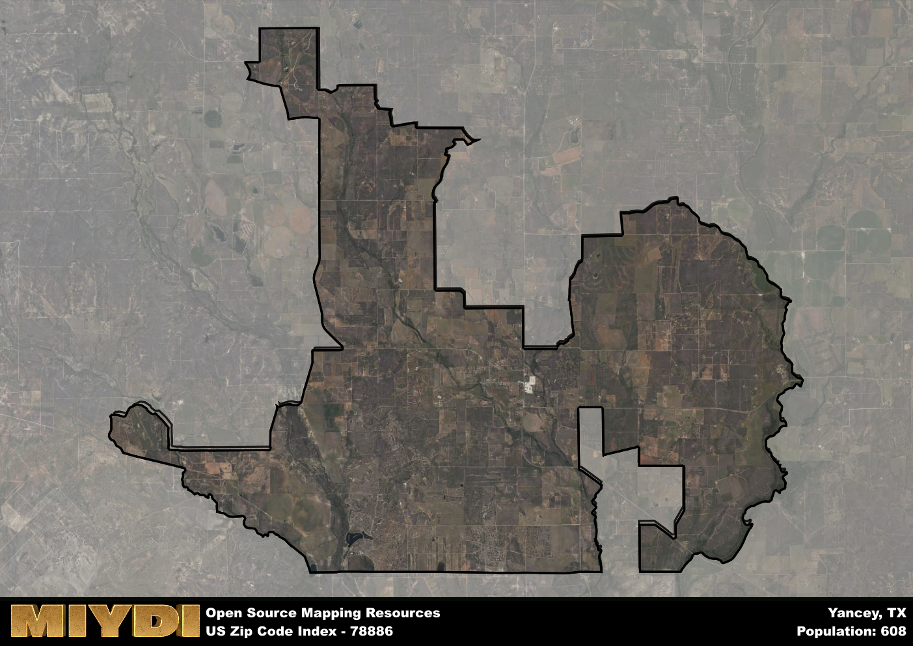

**Area Name:** Yancey

**Zip Code:** 78886

**State:** TX

Yancey is a part of the San Antonio-New Braunfels - TX Metro Area, and makes up  of the Metro's population.  

# Yancey: A Quaint Neighborhood in South Texas
Yancey, located in the zip code 78886, is a charming neighborhood situated in South Texas. Bordered by the towns of Hondo and D'Hanis, Yancey is a peaceful residential area that seamlessly blends with the surrounding countryside. Despite its rural setting, Yancey is conveniently located within driving distance of San Antonio, offering residents the best of both worlds - a tranquil small-town atmosphere with easy access to urban amenities.

Originally settled in the mid-19th century by German immigrants, Yancey has a rich historical heritage that is still evident in its architecture and culture today. The neighborhood was named after George W. Yancey, a prominent local landowner who played a significant role in the development of the area. Over the years, Yancey has evolved from a small farming community into a thriving residential neighborhood, attracting families and retirees looking for a peaceful place to call home.

Today, Yancey is a close-knit community known for its friendly residents and picturesque surroundings. The area is primarily residential, with well-maintained homes and tree-lined streets. Yancey also boasts a few local businesses, including a grocery store, a hardware store, and a couple of family-owned restaurants. Residents enjoy spending time at the community park, which features playgrounds, picnic areas, and walking trails. For history buffs, the Yancey Historical Museum offers a glimpse into the neighborhood's past, showcasing artifacts and photographs from the early days of settlement.

# Yancey Demographics

The population of Yancey is 608.  
Yancey has a population density of 11.31 per square mile.  
The area of Yancey is 53.78 square miles.  

## Yancey Income and Economic Data

These demographic numbers are sourced from IRS return data, providing comprehensive insights into the population dynamics and economic trends within Yancey.

**Breakdown of return types for Yancey**

The table offers insight into the composition of tax returns filed with the IRS, categorizing them into three main types. Single returns represent filings by individuals, joint returns by married couples, and head of household returns by individuals who qualify as heads of households, typically having dependents. This breakdown provides an understanding of the different filing statuses adopted by taxpayers when submitting their tax documentation.

| Return Types filed for Yancey                              | Percentage          |
|----------------------------------------------------------|---------------------|
| Single Returns                                            | 0.48 |
| Joint Returns                                             | 0.44 |
| Head Household Returns                                    | 0.12 |

The income and economic data presented here is sourced from the IRS income brackets, utilized for categorizing tax returns by income levels. This table displays income ranges for both single filers and married couples, along with the corresponding number of returns and the percentage within each bracket, providing valuable insight into the distribution of taxes across various income groups.

| Bracket Name       | Single Filer Income Range | Married Couple Range | Number of Returns | Percentage of Returns |
|--------------------|----------------------------|----------------------|-------------------|-----------------------|
| 10% Bracket        | Up to $10,275              | Up to $20,550        | 90 | 0.36% |
| 12% Bracket        | $10,276 - $41,775          | $20,551 - $83,550    | 70 | 0.28% |
| 22% Bracket        | $41,776 - $89,075          | $83,551 - $178,150   | 60 | 0.24% |
| 24% Bracket        | $89,076 - $170,050         | $178,151 - $340,100  | 0 | 0% |
| 32% Bracket        | $170,051 - $215,950        | $340,101 - $431,900  | 30 | 0.12% |
| 35% Bracket        | $215,951 - $539,900        | $431,901 - $647,850  | 0 | 0% |

### Exploring Taxpayer Diversity: A Breakdown of Different Types of Tax Returns in Yancey

The table offers insights into various types of tax returns filed, reflecting different aspects of taxpayer activities and demographics. Categories include charitable returns for donations, dependent returns for claimed dependents, educator population, elderly population, real estate returns, self-employment returns, student loan returns, and unemployment returns, providing valuable insights into taxpayer behavior and demographics.

| Yancey Filing Types                    | Count | Percentage |
|--------------------------------------|-------|------------|
| Charitable Donations                 | 0 | 0% |
| Dependents Claimed                   | 0 | 0% |
| Educator Residents                   | 0 | 0% |
| Elderly Population                   | 80 | 0.32% |
| Farming Population                   | 50 | 0.2% |
| Real Estate Transactions             | 0 | 0% |
| Self-Employed Individuals            | 30 | 0.12% |
| Student Loan Cases                   | 0 | 0% |
| Unemployment Benefit Filings         | 30 | 0.12% |

## Yancey AI and Census Variables

The values presented in this dataset for Yancey are AI-optimized, streamlined, and categorized into relevant buckets for enhanced utility in AI and mapping programs. These simplified values have been optimized to facilitate efficient analysis and integration into various technological applications, offering users accessible and actionable insights into demographics within the Yancey area.

| AI Variables for Yancey | Value |
|-------------|-------|
| Shape Area | 183243225.726563 |
| Shape Length | 115235.867232865 |
| CBSA Federal Processing Standard Code | 41700 |

## How to use this free AI optimized Geo-Spatial Data for Yancey, TX

This data is made freely available under the Creative Commons license, allowing for unrestricted use for any purpose. Users can access static resources directly from GitHub or leverage more advanced functionalities by utilizing the GeoJSON files. All datasets originate from official government or private sector sources and are meticulously compiled into relevant datasets within QGIS. However, the versatility of the data ensures compatibility with any mapping application.

## Data Accuracy Disclaimer
It's important to note that the data provided here may contain errors or discrepancies and should be considered as 'close enough' for business applications and AI rather than a definitive source of truth. This data is aggregated from multiple sources, some of which publish information on wildly different intervals, leading to potential inconsistencies. Additionally, certain data points may not be corrected for Covid-related changes, further impacting accuracy. Moreover, the assumption that demographic trends are consistent throughout a region may lead to discrepancies, as trends often concentrate in areas of highest population density. As a result, dense areas may be slightly underrepresented, while rural areas may be slightly overrepresented, resulting in a more conservative dataset. Furthermore, the focus primarily on areas within US Major and Minor Statistical areas means that approximately 40 million Americans living outside of these areas may not be fully represented. Lastly, the historical background and area descriptions generated using AI are susceptible to potential mistakes, so users should exercise caution when interpreting the information provided.
