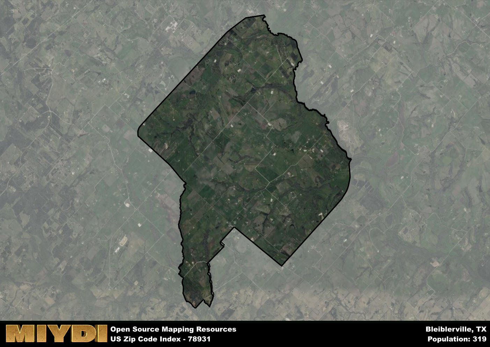

**Area Name:** Bleiblerville

**Zip Code:** 78931

**State:** TX

Bleiblerville is a part of the Houston-The Woodlands-Sugar Land - TX Metro Area, and makes up  of the Metro's population.  

# Bleiblerville: A Quaint Community in Central Texas  
Located in central Texas, zip code 78931 encompasses the charming neighborhood of Bleiblerville. Situated within Austin County, Bleiblerville is surrounded by the cities of Bellville to the north and Industry to the south. The area is known for its picturesque countryside views and its proximity to major transportation routes such as Highway 36. Despite its rural setting, Bleiblerville maintains strong connections to nearby urban centers, making it a desirable location for those seeking a peaceful yet accessible lifestyle.

Bleiblerville has a rich historical background dating back to its German immigrant settlement in the mid-19th century. The area was named after Anton Bleibler, a prominent settler who established a post office and general store in the community. Over the years, Bleiblerville has evolved into a close-knit community known for its agricultural roots and strong sense of heritage. The town's historic buildings and landmarks serve as reminders of its past, attracting visitors interested in exploring its cultural legacy.

Today, Bleiblerville remains a vibrant community with a mix of residential and agricultural properties. The area is primarily known for its farming and ranching activities, with local farmers producing crops such as corn, cotton, and hay. Residents and visitors alike can enjoy the peaceful surroundings by visiting the local parks and recreational areas. Additionally, Bleiblerville boasts a few small businesses, including family-owned stores and restaurants, adding to its small-town charm. With its historical significance and rural charm, Bleiblerville continues to attract those looking to experience a slice of authentic Texas life.

# Bleiblerville Demographics

The population of Bleiblerville is 319.  
Bleiblerville has a population density of 19.35 per square mile.  
The area of Bleiblerville is 16.49 square miles.  

## Bleiblerville Income and Economic Data

These demographic numbers are sourced from IRS return data, providing comprehensive insights into the population dynamics and economic trends within Bleiblerville.

**Breakdown of return types for Bleiblerville**

The table offers insight into the composition of tax returns filed with the IRS, categorizing them into three main types. Single returns represent filings by individuals, joint returns by married couples, and head of household returns by individuals who qualify as heads of households, typically having dependents. This breakdown provides an understanding of the different filing statuses adopted by taxpayers when submitting their tax documentation.

| Return Types filed for Bleiblerville                              | Percentage          |
|----------------------------------------------------------|---------------------|
| Single Returns                                            | 0.46 |
| Joint Returns                                             | 0.54 |
| Head Household Returns                                    | 0 |

The income and economic data presented here is sourced from the IRS income brackets, utilized for categorizing tax returns by income levels. This table displays income ranges for both single filers and married couples, along with the corresponding number of returns and the percentage within each bracket, providing valuable insight into the distribution of taxes across various income groups.

| Bracket Name       | Single Filer Income Range | Married Couple Range | Number of Returns | Percentage of Returns |
|--------------------|----------------------------|----------------------|-------------------|-----------------------|
| 10% Bracket        | Up to $10,275              | Up to $20,550        | 40 | 0.31% |
| 12% Bracket        | $10,276 - $41,775          | $20,551 - $83,550    | 30 | 0.23% |
| 22% Bracket        | $41,776 - $89,075          | $83,551 - $178,150   | 30 | 0.23% |
| 24% Bracket        | $89,076 - $170,050         | $178,151 - $340,100  | 0 | 0% |
| 32% Bracket        | $170,051 - $215,950        | $340,101 - $431,900  | 30 | 0.23% |
| 35% Bracket        | $215,951 - $539,900        | $431,901 - $647,850  | 0 | 0% |

### Exploring Taxpayer Diversity: A Breakdown of Different Types of Tax Returns in Bleiblerville

The table offers insights into various types of tax returns filed, reflecting different aspects of taxpayer activities and demographics. Categories include charitable returns for donations, dependent returns for claimed dependents, educator population, elderly population, real estate returns, self-employment returns, student loan returns, and unemployment returns, providing valuable insights into taxpayer behavior and demographics.

| Bleiblerville Filing Types                    | Count | Percentage |
|--------------------------------------|-------|------------|
| Charitable Donations                 | 0 | 0% |
| Dependents Claimed                   | 0 | 0% |
| Educator Residents                   | 0 | 0% |
| Elderly Population                   | 50 | 0.38% |
| Farming Population                   | 30 | 0.231% |
| Real Estate Transactions             | 0 | 0% |
| Self-Employed Individuals            | 0 | 0% |
| Student Loan Cases                   | 0 | 0% |
| Unemployment Benefit Filings         | 0 | 0% |

## Bleiblerville AI and Census Variables

The values presented in this dataset for Bleiblerville are AI-optimized, streamlined, and categorized into relevant buckets for enhanced utility in AI and mapping programs. These simplified values have been optimized to facilitate efficient analysis and integration into various technological applications, offering users accessible and actionable insights into demographics within the Bleiblerville area.

| AI Variables for Bleiblerville | Value |
|-------------|-------|
| Shape Area | 57158588.5234375 |
| Shape Length | 38910.7976355464 |
| CBSA Federal Processing Standard Code | 26420 |

## How to use this free AI optimized Geo-Spatial Data for Bleiblerville, TX

This data is made freely available under the Creative Commons license, allowing for unrestricted use for any purpose. Users can access static resources directly from GitHub or leverage more advanced functionalities by utilizing the GeoJSON files. All datasets originate from official government or private sector sources and are meticulously compiled into relevant datasets within QGIS. However, the versatility of the data ensures compatibility with any mapping application.

## Data Accuracy Disclaimer
It's important to note that the data provided here may contain errors or discrepancies and should be considered as 'close enough' for business applications and AI rather than a definitive source of truth. This data is aggregated from multiple sources, some of which publish information on wildly different intervals, leading to potential inconsistencies. Additionally, certain data points may not be corrected for Covid-related changes, further impacting accuracy. Moreover, the assumption that demographic trends are consistent throughout a region may lead to discrepancies, as trends often concentrate in areas of highest population density. As a result, dense areas may be slightly underrepresented, while rural areas may be slightly overrepresented, resulting in a more conservative dataset. Furthermore, the focus primarily on areas within US Major and Minor Statistical areas means that approximately 40 million Americans living outside of these areas may not be fully represented. Lastly, the historical background and area descriptions generated using AI are susceptible to potential mistakes, so users should exercise caution when interpreting the information provided.
