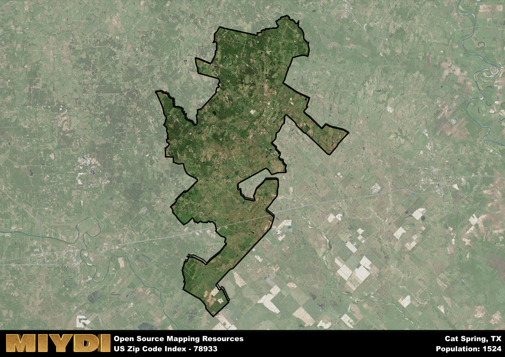

**Area Name:** Cat Spring

**Zip Code:** 78933

**State:** TX

Cat Spring is a part of the Houston-The Woodlands-Sugar Land - TX Metro Area, and makes up  of the Metro's population.  

# Cat Spring: A Charming Zip Code in Texas Hill Country  

Located in southeastern Texas Hill Country, the zip code 78933 encompasses the small community of Cat Spring. Bordered by neighboring towns such as Sealy and Bellville, Cat Spring is situated within a rural landscape characterized by rolling hills and lush greenery. Despite its tranquil surroundings, Cat Spring is only a short drive away from the bustling metropolitan area of Houston, allowing residents to enjoy a peaceful lifestyle while still being connected to urban amenities.

Cat Spring has a rich historical background, dating back to the early 19th century when German immigrants settled in the area. The community was named after a nearby spring where wildcats were once known to gather, giving rise to the unique moniker. Over the years, Cat Spring has evolved into a close-knit agricultural community, known for its picturesque farms and ranches. The area's historic buildings and cultural heritage reflect its pioneer roots, adding to its distinctive charm.

Today, Cat Spring boasts a thriving agrarian economy, with farming and ranching playing a significant role in the local industry. The community is also home to quaint shops, bed and breakfasts, and family-owned businesses that cater to both residents and visitors. Outdoor enthusiasts can explore the scenic countryside through hiking trails and nature reserves, while history buffs can visit landmarks such as the Cat Spring Agricultural Society Hall. With its blend of rural charm and modern conveniences, Cat Spring offers a unique escape from the hustle and bustle of city life.

# Cat Spring Demographics

The population of Cat Spring is 1524.  
Cat Spring has a population density of 15.99 per square mile.  
The area of Cat Spring is 95.31 square miles.  

## Cat Spring Income and Economic Data

These demographic numbers are sourced from IRS return data, providing comprehensive insights into the population dynamics and economic trends within Cat Spring.

**Breakdown of return types for Cat Spring**

The table offers insight into the composition of tax returns filed with the IRS, categorizing them into three main types. Single returns represent filings by individuals, joint returns by married couples, and head of household returns by individuals who qualify as heads of households, typically having dependents. This breakdown provides an understanding of the different filing statuses adopted by taxpayers when submitting their tax documentation.

| Return Types filed for Cat Spring                              | Percentage          |
|----------------------------------------------------------|---------------------|
| Single Returns                                            | 0.4 |
| Joint Returns                                             | 0.56 |
| Head Household Returns                                    | 0.06 |

The income and economic data presented here is sourced from the IRS income brackets, utilized for categorizing tax returns by income levels. This table displays income ranges for both single filers and married couples, along with the corresponding number of returns and the percentage within each bracket, providing valuable insight into the distribution of taxes across various income groups.

| Bracket Name       | Single Filer Income Range | Married Couple Range | Number of Returns | Percentage of Returns |
|--------------------|----------------------------|----------------------|-------------------|-----------------------|
| 10% Bracket        | Up to $10,275              | Up to $20,550        | 190 | 0.26% |
| 12% Bracket        | $10,276 - $41,775          | $20,551 - $83,550    | 120 | 0.17% |
| 22% Bracket        | $41,776 - $89,075          | $83,551 - $178,150   | 110 | 0.15% |
| 24% Bracket        | $89,076 - $170,050         | $178,151 - $340,100  | 80 | 0.11% |
| 32% Bracket        | $170,051 - $215,950        | $340,101 - $431,900  | 140 | 0.19% |
| 35% Bracket        | $215,951 - $539,900        | $431,901 - $647,850  | 80 | 0.11% |

### Exploring Taxpayer Diversity: A Breakdown of Different Types of Tax Returns in Cat Spring

The table offers insights into various types of tax returns filed, reflecting different aspects of taxpayer activities and demographics. Categories include charitable returns for donations, dependent returns for claimed dependents, educator population, elderly population, real estate returns, self-employment returns, student loan returns, and unemployment returns, providing valuable insights into taxpayer behavior and demographics.

| Cat Spring Filing Types                    | Count | Percentage |
|--------------------------------------|-------|------------|
| Charitable Donations                 | 70 | 0.097% |
| Dependents Claimed                   | 0 | 0% |
| Educator Residents                   | 0 | 0% |
| Elderly Population                   | 310 | 0.43% |
| Farming Population                   | 170 | 0.236% |
| Real Estate Transactions             | 70 | 0.097% |
| Self-Employed Individuals            | 130 | 0.181% |
| Student Loan Cases                   | 30 | 0.042% |
| Unemployment Benefit Filings         | 60 | 0.08% |

## Cat Spring AI and Census Variables

The values presented in this dataset for Cat Spring are AI-optimized, streamlined, and categorized into relevant buckets for enhanced utility in AI and mapping programs. These simplified values have been optimized to facilitate efficient analysis and integration into various technological applications, offering users accessible and actionable insights into demographics within the Cat Spring area.

| AI Variables for Cat Spring | Value |
|-------------|-------|
| Shape Area | 328956332.894531 |
| Shape Length | 164378.311208536 |
| CBSA Federal Processing Standard Code | 26420 |

## How to use this free AI optimized Geo-Spatial Data for Cat Spring, TX

This data is made freely available under the Creative Commons license, allowing for unrestricted use for any purpose. Users can access static resources directly from GitHub or leverage more advanced functionalities by utilizing the GeoJSON files. All datasets originate from official government or private sector sources and are meticulously compiled into relevant datasets within QGIS. However, the versatility of the data ensures compatibility with any mapping application.

## Data Accuracy Disclaimer
It's important to note that the data provided here may contain errors or discrepancies and should be considered as 'close enough' for business applications and AI rather than a definitive source of truth. This data is aggregated from multiple sources, some of which publish information on wildly different intervals, leading to potential inconsistencies. Additionally, certain data points may not be corrected for Covid-related changes, further impacting accuracy. Moreover, the assumption that demographic trends are consistent throughout a region may lead to discrepancies, as trends often concentrate in areas of highest population density. As a result, dense areas may be slightly underrepresented, while rural areas may be slightly overrepresented, resulting in a more conservative dataset. Furthermore, the focus primarily on areas within US Major and Minor Statistical areas means that approximately 40 million Americans living outside of these areas may not be fully represented. Lastly, the historical background and area descriptions generated using AI are susceptible to potential mistakes, so users should exercise caution when interpreting the information provided.
