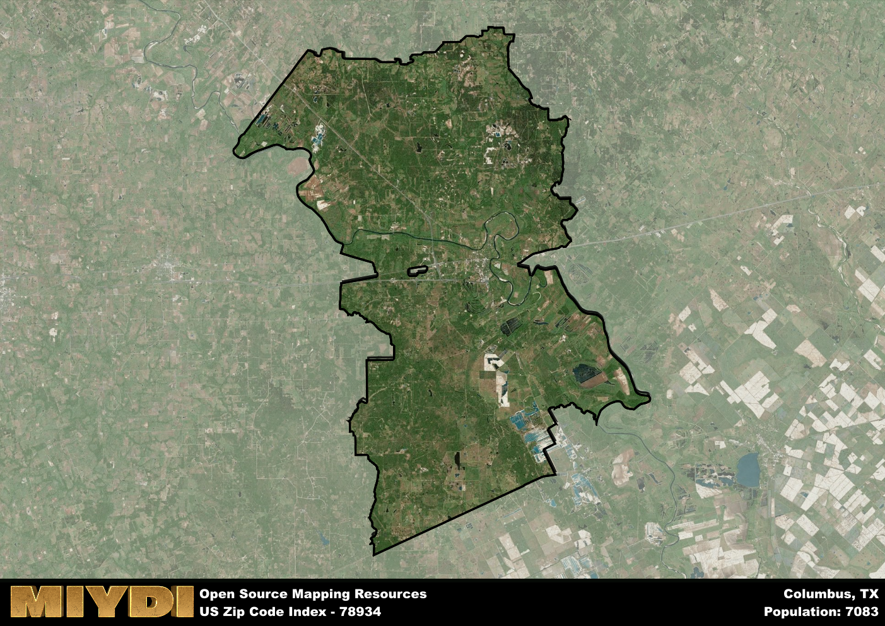

**Area Name:** Columbus

**Zip Code:** 78934

**State:** TX

# Columbus: A Historic Gem in Texas  
Located in zip code 78934, Columbus is a charming neighborhood situated in the heart of Texas. Bordered by the Colorado River to the east, Columbus seamlessly integrates with nearby cities such as Weimar and Eagle Lake. As part of the Greater Houston metropolitan area, Columbus serves as a key link between rural and urban landscapes, offering residents a mix of small-town charm and access to major population centers.

Columbus boasts a rich historical narrative dating back to its founding in 1821. Originally settled by Stephen F. Austin's colonists, Columbus quickly grew into a bustling town known for its role in the Texas Revolution. The town was officially established in 1837 and named after Christopher Columbus. Over the years, Columbus has preserved its historic architecture and landmarks, providing visitors with a glimpse into its storied past.

Today, Columbus is a thriving community known for its diverse economic activities and cultural attractions. The area's economy is primarily driven by agriculture, with cotton and corn being major crops. Residents and visitors can enjoy a variety of recreational amenities, including parks, hiking trails, and the nearby Attwater Prairie Chicken National Wildlife Refuge. Columbus also boasts historic sites such as the Stafford Opera House and the Colorado County Courthouse, adding to its unique charm and appeal within the Greater Houston area.

# Columbus Demographics

The population of Columbus is 7083.  
Columbus has a population density of 32.43 per square mile.  
The area of Columbus is 218.43 square miles.  

## Columbus Income and Economic Data

These demographic numbers are sourced from IRS return data, providing comprehensive insights into the population dynamics and economic trends within Columbus.

**Breakdown of return types for Columbus**

The table offers insight into the composition of tax returns filed with the IRS, categorizing them into three main types. Single returns represent filings by individuals, joint returns by married couples, and head of household returns by individuals who qualify as heads of households, typically having dependents. This breakdown provides an understanding of the different filing statuses adopted by taxpayers when submitting their tax documentation.

| Return Types filed for Columbus                              | Percentage          |
|----------------------------------------------------------|---------------------|
| Single Returns                                            | 0.44 |
| Joint Returns                                             | 0.41 |
| Head Household Returns                                    | 0.13 |

The income and economic data presented here is sourced from the IRS income brackets, utilized for categorizing tax returns by income levels. This table displays income ranges for both single filers and married couples, along with the corresponding number of returns and the percentage within each bracket, providing valuable insight into the distribution of taxes across various income groups.

| Bracket Name       | Single Filer Income Range | Married Couple Range | Number of Returns | Percentage of Returns |
|--------------------|----------------------------|----------------------|-------------------|-----------------------|
| 10% Bracket        | Up to $10,275              | Up to $20,550        | 1120 | 0.34% |
| 12% Bracket        | $10,276 - $41,775          | $20,551 - $83,550    | 790 | 0.24% |
| 22% Bracket        | $41,776 - $89,075          | $83,551 - $178,150   | 460 | 0.14% |
| 24% Bracket        | $89,076 - $170,050         | $178,151 - $340,100  | 300 | 0.09% |
| 32% Bracket        | $170,051 - $215,950        | $340,101 - $431,900  | 450 | 0.14% |
| 35% Bracket        | $215,951 - $539,900        | $431,901 - $647,850  | 160 | 0.05% |

### Exploring Taxpayer Diversity: A Breakdown of Different Types of Tax Returns in Columbus

The table offers insights into various types of tax returns filed, reflecting different aspects of taxpayer activities and demographics. Categories include charitable returns for donations, dependent returns for claimed dependents, educator population, elderly population, real estate returns, self-employment returns, student loan returns, and unemployment returns, providing valuable insights into taxpayer behavior and demographics.

| Columbus Filing Types                    | Count | Percentage |
|--------------------------------------|-------|------------|
| Charitable Donations                 | 150 | 0.046% |
| Dependents Claimed                   | 100 | 0.03% |
| Educator Residents                   | 70 | 0.021% |
| Elderly Population                   | 1100 | 0.34% |
| Farming Population                   | 330 | 0.101% |
| Real Estate Transactions             | 150 | 0.046% |
| Self-Employed Individuals            | 550 | 0.168% |
| Student Loan Cases                   | 130 | 0.04% |
| Unemployment Benefit Filings         | 280 | 0.09% |

## Columbus AI and Census Variables

The values presented in this dataset for Columbus are AI-optimized, streamlined, and categorized into relevant buckets for enhanced utility in AI and mapping programs. These simplified values have been optimized to facilitate efficient analysis and integration into various technological applications, offering users accessible and actionable insights into demographics within the Columbus area.

| AI Variables for Columbus | Value |
|-------------|-------|
| Shape Area | 752363856.097656 |
| Shape Length | 182495.091935262 |

## How to use this free AI optimized Geo-Spatial Data for Columbus, TX

This data is made freely available under the Creative Commons license, allowing for unrestricted use for any purpose. Users can access static resources directly from GitHub or leverage more advanced functionalities by utilizing the GeoJSON files. All datasets originate from official government or private sector sources and are meticulously compiled into relevant datasets within QGIS. However, the versatility of the data ensures compatibility with any mapping application.

## Data Accuracy Disclaimer
It's important to note that the data provided here may contain errors or discrepancies and should be considered as 'close enough' for business applications and AI rather than a definitive source of truth. This data is aggregated from multiple sources, some of which publish information on wildly different intervals, leading to potential inconsistencies. Additionally, certain data points may not be corrected for Covid-related changes, further impacting accuracy. Moreover, the assumption that demographic trends are consistent throughout a region may lead to discrepancies, as trends often concentrate in areas of highest population density. As a result, dense areas may be slightly underrepresented, while rural areas may be slightly overrepresented, resulting in a more conservative dataset. Furthermore, the focus primarily on areas within US Major and Minor Statistical areas means that approximately 40 million Americans living outside of these areas may not be fully represented. Lastly, the historical background and area descriptions generated using AI are susceptible to potential mistakes, so users should exercise caution when interpreting the information provided.
