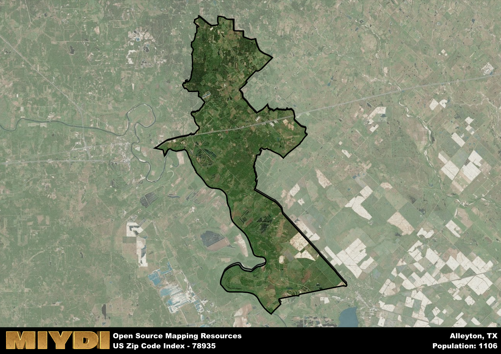

**Area Name:** Alleyton

**Zip Code:** 78935

**State:** TX

# Alleyton: A Historic and Vibrant Community in Zip Code 78935  

Located in southeastern Texas, the zip code area 78935 encompasses the charming neighborhood of Alleyton. Situated within close proximity to major cities like Houston and Austin, Alleyton serves as a tranquil retreat from the bustling urban centers. The area is bordered by the Colorado River to the east, offering picturesque views and recreational opportunities for residents and visitors alike. Alleyton seamlessly integrates with the larger metropolitan context, providing a peaceful residential enclave while remaining well-connected to the region's economic and cultural hubs.

Alleyton has a rich historical narrative dating back to the mid-19th century when it was founded as a small settlement along the Colorado River. Initially established as a trading post, Alleyton quickly grew into a thriving community fueled by the arrival of the railroad in the late 1800s. The area played a significant role in the development of the region's transportation network, serving as a crucial stop for travelers and goods moving between Houston and San Antonio. Over the years, Alleyton has preserved its historic charm, with many well-preserved buildings and landmarks that tell the story of its past.

Today, Alleyton boasts a blend of residential neighborhoods, small businesses, and recreational facilities that cater to its diverse population. The area is known for its strong sense of community, with local events and gatherings fostering a close-knit atmosphere among residents. Alleyton offers a range of amenities, including parks, shops, and restaurants, making it a desirable place to live and visit. Additionally, the neighborhood is home to several historic sites, such as the Alleyton Historic District, which showcase the area's unique heritage. With its mix of history, natural beauty, and modern conveniences, Alleyton remains a hidden gem within the larger urban fabric of southeastern Texas.

# Alleyton Demographics

The population of Alleyton is 1106.  
Alleyton has a population density of 19.42 per square mile.  
The area of Alleyton is 56.95 square miles.  

## Alleyton Income and Economic Data

These demographic numbers are sourced from IRS return data, providing comprehensive insights into the population dynamics and economic trends within Alleyton.

**Breakdown of return types for Alleyton**

The table offers insight into the composition of tax returns filed with the IRS, categorizing them into three main types. Single returns represent filings by individuals, joint returns by married couples, and head of household returns by individuals who qualify as heads of households, typically having dependents. This breakdown provides an understanding of the different filing statuses adopted by taxpayers when submitting their tax documentation.

| Return Types filed for Alleyton                              | Percentage          |
|----------------------------------------------------------|---------------------|
| Single Returns                                            | 0.43 |
| Joint Returns                                             | 0.45 |
| Head Household Returns                                    | 0.11 |

The income and economic data presented here is sourced from the IRS income brackets, utilized for categorizing tax returns by income levels. This table displays income ranges for both single filers and married couples, along with the corresponding number of returns and the percentage within each bracket, providing valuable insight into the distribution of taxes across various income groups.

| Bracket Name       | Single Filer Income Range | Married Couple Range | Number of Returns | Percentage of Returns |
|--------------------|----------------------------|----------------------|-------------------|-----------------------|
| 10% Bracket        | Up to $10,275              | Up to $20,550        | 170 | 0.36% |
| 12% Bracket        | $10,276 - $41,775          | $20,551 - $83,550    | 100 | 0.21% |
| 22% Bracket        | $41,776 - $89,075          | $83,551 - $178,150   | 70 | 0.15% |
| 24% Bracket        | $89,076 - $170,050         | $178,151 - $340,100  | 30 | 0.06% |
| 32% Bracket        | $170,051 - $215,950        | $340,101 - $431,900  | 70 | 0.15% |
| 35% Bracket        | $215,951 - $539,900        | $431,901 - $647,850  | 30 | 0.06% |

### Exploring Taxpayer Diversity: A Breakdown of Different Types of Tax Returns in Alleyton

The table offers insights into various types of tax returns filed, reflecting different aspects of taxpayer activities and demographics. Categories include charitable returns for donations, dependent returns for claimed dependents, educator population, elderly population, real estate returns, self-employment returns, student loan returns, and unemployment returns, providing valuable insights into taxpayer behavior and demographics.

| Alleyton Filing Types                    | Count | Percentage |
|--------------------------------------|-------|------------|
| Charitable Donations                 | 20 | 0.043% |
| Dependents Claimed                   | 0 | 0% |
| Educator Residents                   | 0 | 0% |
| Elderly Population                   | 150 | 0.32% |
| Farming Population                   | 60 | 0.128% |
| Real Estate Transactions             | 30 | 0.064% |
| Self-Employed Individuals            | 80 | 0.17% |
| Student Loan Cases                   | 0 | 0% |
| Unemployment Benefit Filings         | 40 | 0.09% |

## Alleyton AI and Census Variables

The values presented in this dataset for Alleyton are AI-optimized, streamlined, and categorized into relevant buckets for enhanced utility in AI and mapping programs. These simplified values have been optimized to facilitate efficient analysis and integration into various technological applications, offering users accessible and actionable insights into demographics within the Alleyton area.

| AI Variables for Alleyton | Value |
|-------------|-------|
| Shape Area | 196108110.214844 |
| Shape Length | 113470.954691126 |

## How to use this free AI optimized Geo-Spatial Data for Alleyton, TX

This data is made freely available under the Creative Commons license, allowing for unrestricted use for any purpose. Users can access static resources directly from GitHub or leverage more advanced functionalities by utilizing the GeoJSON files. All datasets originate from official government or private sector sources and are meticulously compiled into relevant datasets within QGIS. However, the versatility of the data ensures compatibility with any mapping application.

## Data Accuracy Disclaimer
It's important to note that the data provided here may contain errors or discrepancies and should be considered as 'close enough' for business applications and AI rather than a definitive source of truth. This data is aggregated from multiple sources, some of which publish information on wildly different intervals, leading to potential inconsistencies. Additionally, certain data points may not be corrected for Covid-related changes, further impacting accuracy. Moreover, the assumption that demographic trends are consistent throughout a region may lead to discrepancies, as trends often concentrate in areas of highest population density. As a result, dense areas may be slightly underrepresented, while rural areas may be slightly overrepresented, resulting in a more conservative dataset. Furthermore, the focus primarily on areas within US Major and Minor Statistical areas means that approximately 40 million Americans living outside of these areas may not be fully represented. Lastly, the historical background and area descriptions generated using AI are susceptible to potential mistakes, so users should exercise caution when interpreting the information provided.
