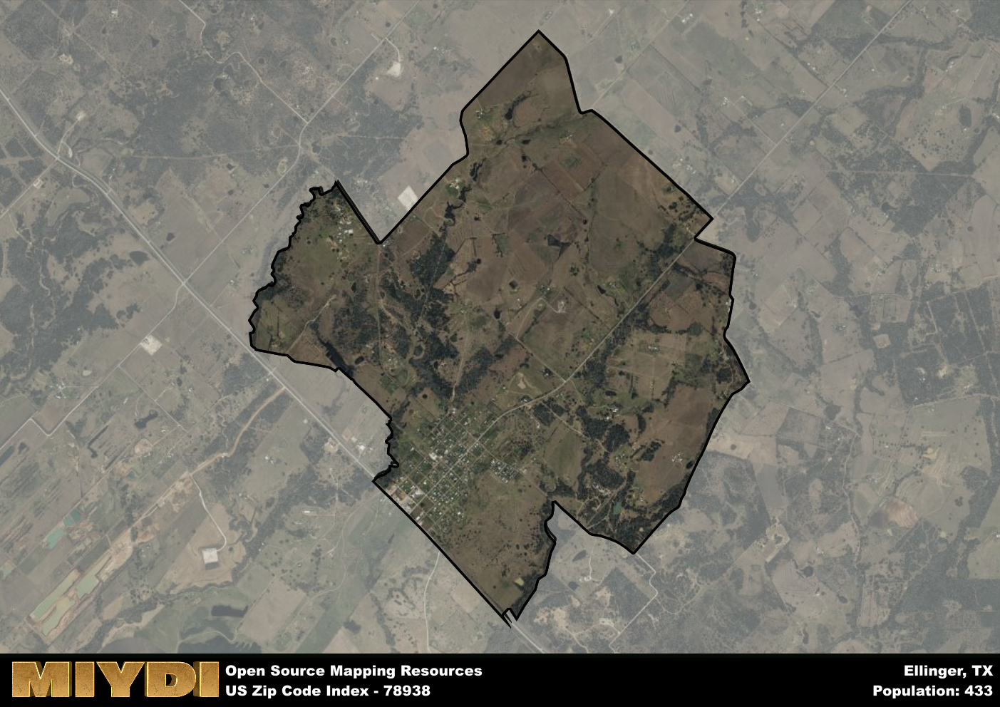

**Area Name:** Ellinger

**Zip Code:** 78938

**State:** TX

# Ellinger: A Historic Gem in Central Texas  
Ellinger, corresponding to the zip code 78938, is a charming neighborhood located in central Texas. Bordered by the towns of Fayetteville to the north, Industry to the south, and New Ulm to the east, Ellinger is an integral part of the larger metropolitan area surrounding the city of Austin. Situated in Fayette County, Ellinger boasts a rich history and a close-knit community that has thrived in the heart of Texas.

Established in the mid-19th century by German immigrants, Ellinger has a deep-rooted history that is still visible in its architecture and cultural traditions. The area was named after John Henry Ellis, a prominent figure in the early settlement of the region. Over the years, Ellinger has evolved into a vibrant community known for its agricultural heritage, with many residents still involved in farming and ranching activities. The town has preserved its historic charm through the preservation of its original buildings and landmarks, offering visitors a glimpse into its storied past.

Today, Ellinger continues to maintain its agricultural roots while embracing modern amenities and services. The area is home to a variety of small businesses, including family-owned shops and restaurants that cater to both locals and visitors. Residents enjoy access to recreational facilities such as parks and community centers, as well as proximity to outdoor activities like hiking and fishing. Ellinger also boasts several historic sites, including the Ellinger C of Christ church, which serves as a reminder of the area's strong sense of community and heritage.

# Ellinger Demographics

The population of Ellinger is 433.  
Ellinger has a population density of 91.74 per square mile.  
The area of Ellinger is 4.72 square miles.  

## Ellinger Income and Economic Data

These demographic numbers are sourced from IRS return data, providing comprehensive insights into the population dynamics and economic trends within Ellinger.

**Breakdown of return types for Ellinger**

The table offers insight into the composition of tax returns filed with the IRS, categorizing them into three main types. Single returns represent filings by individuals, joint returns by married couples, and head of household returns by individuals who qualify as heads of households, typically having dependents. This breakdown provides an understanding of the different filing statuses adopted by taxpayers when submitting their tax documentation.

| Return Types filed for Ellinger                              | Percentage          |
|----------------------------------------------------------|---------------------|
| Single Returns                                            | 0.47 |
| Joint Returns                                             | 0.41 |
| Head Household Returns                                    | 0.12 |

The income and economic data presented here is sourced from the IRS income brackets, utilized for categorizing tax returns by income levels. This table displays income ranges for both single filers and married couples, along with the corresponding number of returns and the percentage within each bracket, providing valuable insight into the distribution of taxes across various income groups.

| Bracket Name       | Single Filer Income Range | Married Couple Range | Number of Returns | Percentage of Returns |
|--------------------|----------------------------|----------------------|-------------------|-----------------------|
| 10% Bracket        | Up to $10,275              | Up to $20,550        | 60 | 0.35% |
| 12% Bracket        | $10,276 - $41,775          | $20,551 - $83,550    | 50 | 0.29% |
| 22% Bracket        | $41,776 - $89,075          | $83,551 - $178,150   | 40 | 0.24% |
| 24% Bracket        | $89,076 - $170,050         | $178,151 - $340,100  | 0 | 0% |
| 32% Bracket        | $170,051 - $215,950        | $340,101 - $431,900  | 20 | 0.12% |
| 35% Bracket        | $215,951 - $539,900        | $431,901 - $647,850  | 0 | 0% |

### Exploring Taxpayer Diversity: A Breakdown of Different Types of Tax Returns in Ellinger

The table offers insights into various types of tax returns filed, reflecting different aspects of taxpayer activities and demographics. Categories include charitable returns for donations, dependent returns for claimed dependents, educator population, elderly population, real estate returns, self-employment returns, student loan returns, and unemployment returns, providing valuable insights into taxpayer behavior and demographics.

| Ellinger Filing Types                    | Count | Percentage |
|--------------------------------------|-------|------------|
| Charitable Donations                 | 0 | 0% |
| Dependents Claimed                   | 0 | 0% |
| Educator Residents                   | 0 | 0% |
| Elderly Population                   | 60 | 0.35% |
| Farming Population                   | 30 | 0.176% |
| Real Estate Transactions             | 0 | 0% |
| Self-Employed Individuals            | 20 | 0.118% |
| Student Loan Cases                   | 0 | 0% |
| Unemployment Benefit Filings         | 0 | 0% |

## Ellinger AI and Census Variables

The values presented in this dataset for Ellinger are AI-optimized, streamlined, and categorized into relevant buckets for enhanced utility in AI and mapping programs. These simplified values have been optimized to facilitate efficient analysis and integration into various technological applications, offering users accessible and actionable insights into demographics within the Ellinger area.

| AI Variables for Ellinger | Value |
|-------------|-------|
| Shape Area | 16303568.8945313 |
| Shape Length | 20777.8982923545 |

## How to use this free AI optimized Geo-Spatial Data for Ellinger, TX

This data is made freely available under the Creative Commons license, allowing for unrestricted use for any purpose. Users can access static resources directly from GitHub or leverage more advanced functionalities by utilizing the GeoJSON files. All datasets originate from official government or private sector sources and are meticulously compiled into relevant datasets within QGIS. However, the versatility of the data ensures compatibility with any mapping application.

## Data Accuracy Disclaimer
It's important to note that the data provided here may contain errors or discrepancies and should be considered as 'close enough' for business applications and AI rather than a definitive source of truth. This data is aggregated from multiple sources, some of which publish information on wildly different intervals, leading to potential inconsistencies. Additionally, certain data points may not be corrected for Covid-related changes, further impacting accuracy. Moreover, the assumption that demographic trends are consistent throughout a region may lead to discrepancies, as trends often concentrate in areas of highest population density. As a result, dense areas may be slightly underrepresented, while rural areas may be slightly overrepresented, resulting in a more conservative dataset. Furthermore, the focus primarily on areas within US Major and Minor Statistical areas means that approximately 40 million Americans living outside of these areas may not be fully represented. Lastly, the historical background and area descriptions generated using AI are susceptible to potential mistakes, so users should exercise caution when interpreting the information provided.
