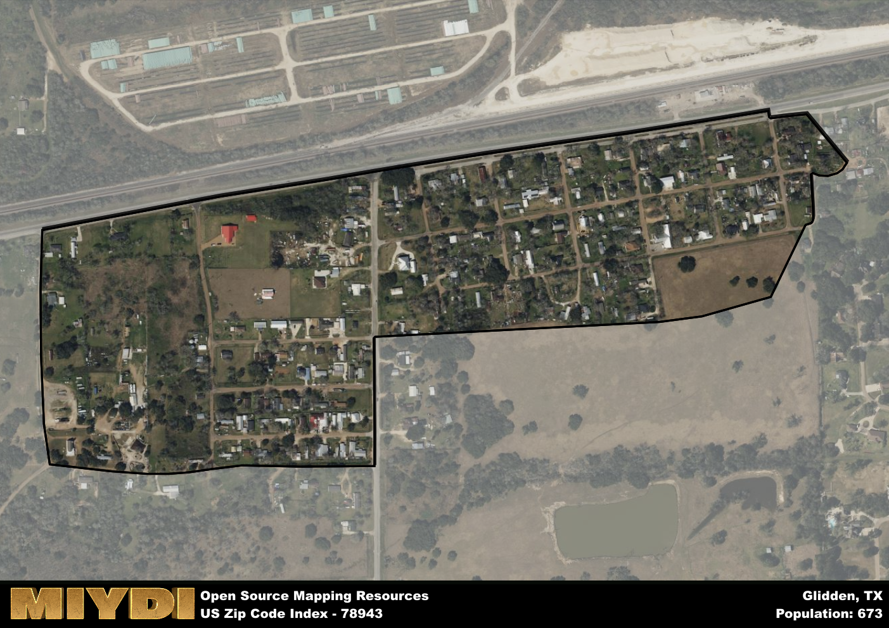

**Area Name:** Glidden

**Zip Code:** 78943

**State:** TX

# Glidden: A Quaint Community in Texas  
Located in central Texas, the zip code 78943 area corresponds to the small town of Glidden. Situated within Colorado County, Glidden is surrounded by rural farmland and is approximately 10 miles southeast of the city of Columbus. Despite its proximity to Columbus, Glidden remains a distinct community with its own unique identity and charm.

Originally settled in the mid-19th century, Glidden was named after Joseph Glidden, the inventor of barbed wire. The town experienced steady growth during the late 1800s and early 1900s, with agriculture playing a significant role in its economy. Today, Glidden maintains its small-town atmosphere with a mix of historic buildings and modern amenities, making it a popular destination for those seeking a peaceful retreat from the hustle and bustle of urban life.

Presently, Glidden is home to a close-knit community that values its agricultural heritage. Residents enjoy a range of local services, including a post office, schools, and small businesses. The area also offers ample opportunities for outdoor recreation, such as fishing and hiking, thanks to its proximity to the Colorado River. Visitors can explore the town's historic sites, including the Glidden Railroad Depot, which serves as a reminder of the area's rich past.

# Glidden Demographics

The population of Glidden is 673.  
Glidden has a population density of 4206.25 per square mile.  
The area of Glidden is 0.16 square miles.  

## Glidden Income and Economic Data

These demographic numbers are sourced from IRS return data, providing comprehensive insights into the population dynamics and economic trends within Glidden.

**Breakdown of return types for Glidden**

The table offers insight into the composition of tax returns filed with the IRS, categorizing them into three main types. Single returns represent filings by individuals, joint returns by married couples, and head of household returns by individuals who qualify as heads of households, typically having dependents. This breakdown provides an understanding of the different filing statuses adopted by taxpayers when submitting their tax documentation.

| Return Types filed for Glidden                              | Percentage          |
|----------------------------------------------------------|---------------------|
| Single Returns                                            | 0.44 |
| Joint Returns                                             | 0.28 |
| Head Household Returns                                    | 0.22 |

The income and economic data presented here is sourced from the IRS income brackets, utilized for categorizing tax returns by income levels. This table displays income ranges for both single filers and married couples, along with the corresponding number of returns and the percentage within each bracket, providing valuable insight into the distribution of taxes across various income groups.

| Bracket Name       | Single Filer Income Range | Married Couple Range | Number of Returns | Percentage of Returns |
|--------------------|----------------------------|----------------------|-------------------|-----------------------|
| 10% Bracket        | Up to $10,275              | Up to $20,550        | 70 | 0.39% |
| 12% Bracket        | $10,276 - $41,775          | $20,551 - $83,550    | 60 | 0.33% |
| 22% Bracket        | $41,776 - $89,075          | $83,551 - $178,150   | 50 | 0.28% |
| 24% Bracket        | $89,076 - $170,050         | $178,151 - $340,100  | 0 | 0% |
| 32% Bracket        | $170,051 - $215,950        | $340,101 - $431,900  | 0 | 0% |
| 35% Bracket        | $215,951 - $539,900        | $431,901 - $647,850  | 0 | 0% |

### Exploring Taxpayer Diversity: A Breakdown of Different Types of Tax Returns in Glidden

The table offers insights into various types of tax returns filed, reflecting different aspects of taxpayer activities and demographics. Categories include charitable returns for donations, dependent returns for claimed dependents, educator population, elderly population, real estate returns, self-employment returns, student loan returns, and unemployment returns, providing valuable insights into taxpayer behavior and demographics.

| Glidden Filing Types                    | Count | Percentage |
|--------------------------------------|-------|------------|
| Charitable Donations                 | 0 | 0% |
| Dependents Claimed                   | 0 | 0% |
| Educator Residents                   | 0 | 0% |
| Elderly Population                   | 20 | 0.11% |
| Farming Population                   | 0 | 0% |
| Real Estate Transactions             | 0 | 0% |
| Self-Employed Individuals            | 20 | 0.111% |
| Student Loan Cases                   | 0 | 0% |
| Unemployment Benefit Filings         | 0 | 0% |

## Glidden AI and Census Variables

The values presented in this dataset for Glidden are AI-optimized, streamlined, and categorized into relevant buckets for enhanced utility in AI and mapping programs. These simplified values have been optimized to facilitate efficient analysis and integration into various technological applications, offering users accessible and actionable insights into demographics within the Glidden area.

| AI Variables for Glidden | Value |
|-------------|-------|
| Shape Area | 538984.359375 |
| Shape Length | 3765.26789383812 |

## How to use this free AI optimized Geo-Spatial Data for Glidden, TX

This data is made freely available under the Creative Commons license, allowing for unrestricted use for any purpose. Users can access static resources directly from GitHub or leverage more advanced functionalities by utilizing the GeoJSON files. All datasets originate from official government or private sector sources and are meticulously compiled into relevant datasets within QGIS. However, the versatility of the data ensures compatibility with any mapping application.

## Data Accuracy Disclaimer
It's important to note that the data provided here may contain errors or discrepancies and should be considered as 'close enough' for business applications and AI rather than a definitive source of truth. This data is aggregated from multiple sources, some of which publish information on wildly different intervals, leading to potential inconsistencies. Additionally, certain data points may not be corrected for Covid-related changes, further impacting accuracy. Moreover, the assumption that demographic trends are consistent throughout a region may lead to discrepancies, as trends often concentrate in areas of highest population density. As a result, dense areas may be slightly underrepresented, while rural areas may be slightly overrepresented, resulting in a more conservative dataset. Furthermore, the focus primarily on areas within US Major and Minor Statistical areas means that approximately 40 million Americans living outside of these areas may not be fully represented. Lastly, the historical background and area descriptions generated using AI are susceptible to potential mistakes, so users should exercise caution when interpreting the information provided.
