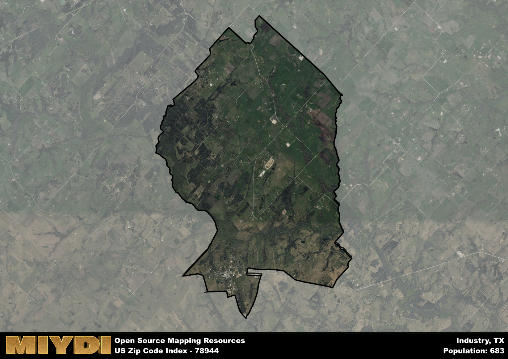

**Area Name:** Industry

**Zip Code:** 78944

**State:** TX

Industry is a part of the Houston-The Woodlands-Sugar Land - TX Metro Area, and makes up 0.01% of the Metro's population.  

# Exploring Industry: Zip Code 78944

Industry, located within zip code 78944, is a vibrant neighborhood situated in the greater metropolitan area of Houston, Texas. Bordered by Highway 290 to the south and FM 1458 to the west, Industry seamlessly integrates with the nearby cities of Bellville and Hempstead. As a key part of the Houston metropolitan area, Industry benefits from its proximity to the economic and cultural opportunities of the larger urban fabric while maintaining its own unique small-town charm.

Founded in the mid-19th century by German immigrants, Industry has a rich historical legacy that is still evident in its architecture and traditions today. The area flourished as a farming and ranching community, and its heritage is celebrated through annual festivals and events that showcase its cultural roots. The name "Industry" reflects the hardworking spirit of its early settlers and continues to define the area's ethos of perseverance and community pride.

Presently, Industry is a dynamic mix of residential, commercial, and agricultural spaces. The neighborhood boasts a variety of local businesses, from quaint shops to family-owned restaurants, that cater to both residents and visitors. Outdoor enthusiasts can enjoy the numerous parks and recreational areas in the vicinity, while history buffs can explore the historic landmarks that dot the landscape. With a strong sense of community and a thriving economy, Industry is a hidden gem within the bustling Houston metropolitan area.

# Industry Demographics

The population of Industry is 683.  
Industry has a population density of 49.6 per square mile.  
The area of Industry is 13.77 square miles.  

## Industry Income and Economic Data

These demographic numbers are sourced from IRS return data, providing comprehensive insights into the population dynamics and economic trends within Industry.

**Breakdown of return types for Industry**

The table offers insight into the composition of tax returns filed with the IRS, categorizing them into three main types. Single returns represent filings by individuals, joint returns by married couples, and head of household returns by individuals who qualify as heads of households, typically having dependents. This breakdown provides an understanding of the different filing statuses adopted by taxpayers when submitting their tax documentation.

| Return Types filed for Industry                              | Percentage          |
|----------------------------------------------------------|---------------------|
| Single Returns                                            | 0.44 |
| Joint Returns                                             | 0.44 |
| Head Household Returns                                    | 0.12 |

The income and economic data presented here is sourced from the IRS income brackets, utilized for categorizing tax returns by income levels. This table displays income ranges for both single filers and married couples, along with the corresponding number of returns and the percentage within each bracket, providing valuable insight into the distribution of taxes across various income groups.

| Bracket Name       | Single Filer Income Range | Married Couple Range | Number of Returns | Percentage of Returns |
|--------------------|----------------------------|----------------------|-------------------|-----------------------|
| 10% Bracket        | Up to $10,275              | Up to $20,550        | 110 | 0.32% |
| 12% Bracket        | $10,276 - $41,775          | $20,551 - $83,550    | 80 | 0.24% |
| 22% Bracket        | $41,776 - $89,075          | $83,551 - $178,150   | 40 | 0.12% |
| 24% Bracket        | $89,076 - $170,050         | $178,151 - $340,100  | 40 | 0.12% |
| 32% Bracket        | $170,051 - $215,950        | $340,101 - $431,900  | 50 | 0.15% |
| 35% Bracket        | $215,951 - $539,900        | $431,901 - $647,850  | 20 | 0.06% |

### Exploring Taxpayer Diversity: A Breakdown of Different Types of Tax Returns in Industry

The table offers insights into various types of tax returns filed, reflecting different aspects of taxpayer activities and demographics. Categories include charitable returns for donations, dependent returns for claimed dependents, educator population, elderly population, real estate returns, self-employment returns, student loan returns, and unemployment returns, providing valuable insights into taxpayer behavior and demographics.

| Industry Filing Types                    | Count | Percentage |
|--------------------------------------|-------|------------|
| Charitable Donations                 | 0 | 0% |
| Dependents Claimed                   | 0 | 0% |
| Educator Residents                   | 0 | 0% |
| Elderly Population                   | 140 | 0.41% |
| Farming Population                   | 70 | 0.206% |
| Real Estate Transactions             | 0 | 0% |
| Self-Employed Individuals            | 90 | 0.265% |
| Student Loan Cases                   | 0 | 0% |
| Unemployment Benefit Filings         | 20 | 0.06% |

### Exploring Real Estate Trends: A Comprehensive Analysis of the Industry Area and its Neighbors

This table contains an in-depth examination of the real estate market in the Industry area. Sourced from trusted real estate market firms, this dataset provides a wealth of raw data detailing the local real estate landscape, along with comparative analyses juxtaposing the market dynamics with those of neighboring areas. Explore the intricacies of the Industry real estate market and gain valuable insights into its relationship with adjacent regions.

| Real Estate Data for Industry                       | Value    |
|------------------------------------------------|----------|
| Real Estate Prices to Income Ratio           | 2.538 |

This table offers essential real estate data for the Industry area, including average and median listing prices, median days on market, and property size. It also presents ratio metrics as percentages, providing insights into how the local market compares to the surrounding region. A ratio of 100% signifies performance in line with the regional average, while values above or below indicate overperformance or underperformance, respectively, relative to expectations.

## Industry Sports and Recreation Data

#### Annual Youth Sports Spending for Industry

This table provides fundamental insights into the Sports and Recreation data for the Industry area, detailing the estimated annual expenditure on Youth Athletics. This includes estimated spending by the major consumer brackets. 
| Sports Spending for Industry| Value |
|-------------------------|-------|
| Athlete Spending Compared to the region | 1.47% |
| Total Youth Athlete Spending | 06,352 |
| Athletic Spending - Essential Focused Consumer | 6,009 |
| Athletic Spending - Typical Consumer | 8,007 |
| Athletic Spending - Affluent Consumers | 2,314 |

#### Youth Coaching Estimates for Industry

This table presents the estimated number of coaches for the Industry area, derived from comprehensive national coaching surveys and athletic participation rates by state. It offers valuable insights into the vital role of coaching personnel in fostering athletic development and facilitating sports participation within the local community.

| Coaching Data for Industry | Value |
|-------------|-------|
| Total Coaches | 11 |
| Paid Coaches | 3 |
| Volunteer Coaches | 8 |

#### Youth Athlete Participation for Industry

This table shows the estimated total number of youth athletes in the Industry area, sourced from comprehensive national coaching surveys and athletic participation rates by state.

| Total YA Athletes in Industry | Value |
|-------------|-------|
| Total High School Athletes | 17 |
| Total Youth Athletes | 51 |
| Total Young Adult Athletes | 34 |
| Total Athletes to Age 25 | 102 |

#### High School Age Athletes - Breakdown by Sport for Industry

This table shows insights regarding high school age estimated players by sport in the Industry area, derived from national and state-level athletic participation trends. 

| HS Players by Sport in Industry | Value |
|-------------|-------|
| Football Players | 4 |
| Basketball Players | 2 |
| Soccer Players | 2 |
| Volleyball Players | 1 |
| Baseball Players | 2 |
| Tennis Players | 1 |
| Track Athletes | 3 |
| Golf Players | 1 |
| Swimming Athletes | 1 |
| Wrestling Competitors | 1 |
| Lacrosse Players | 0 |

Estimating the number of younger athletes presents unique challenges due to their varied starting ages, typically beginning around six years old, and a gradual decline in participation rates as they age. Unlike high school-aged athletes, younger athletes are less likely to switch sports as they grow older, contributing to the stability of participation numbers within specific sports at younger ages.  

As a general trend, the total number of younger athletes is approximately three times the number of high school-aged athletes, underscoring the significant presence of youth athletes in sports programs and highlighting the importance of early engagement in athletic activities.

## Industry AI and Census Variables

The values presented in this dataset for Industry are AI-optimized, streamlined, and categorized into relevant buckets for enhanced utility in AI and mapping programs. These simplified values have been optimized to facilitate efficient analysis and integration into various technological applications, offering users accessible and actionable insights into demographics within the Industry area.

| AI Variables for Industry | Value |
|-------------|-------|
| Shape Area | 47714102.234375 |
| Shape Length | 36192.874402958 |
| CBSA Federal Processing Standard Code | 26420 |
| RE Income Ratio | 2.538 |
| RE Activity Flag | 1 |

## How to use this free AI optimized Geo-Spatial Data for Industry, TX

This data is made freely available under the Creative Commons license, allowing for unrestricted use for any purpose. Users can access static resources directly from GitHub or leverage more advanced functionalities by utilizing the GeoJSON files. All datasets originate from official government or private sector sources and are meticulously compiled into relevant datasets within QGIS. However, the versatility of the data ensures compatibility with any mapping application.

## Data Accuracy Disclaimer
It's important to note that the data provided here may contain errors or discrepancies and should be considered as 'close enough' for business applications and AI rather than a definitive source of truth. This data is aggregated from multiple sources, some of which publish information on wildly different intervals, leading to potential inconsistencies. Additionally, certain data points may not be corrected for Covid-related changes, further impacting accuracy. Moreover, the assumption that demographic trends are consistent throughout a region may lead to discrepancies, as trends often concentrate in areas of highest population density. As a result, dense areas may be slightly underrepresented, while rural areas may be slightly overrepresented, resulting in a more conservative dataset. Furthermore, the focus primarily on areas within US Major and Minor Statistical areas means that approximately 40 million Americans living outside of these areas may not be fully represented. Lastly, the historical background and area descriptions generated using AI are susceptible to potential mistakes, so users should exercise caution when interpreting the information provided.
