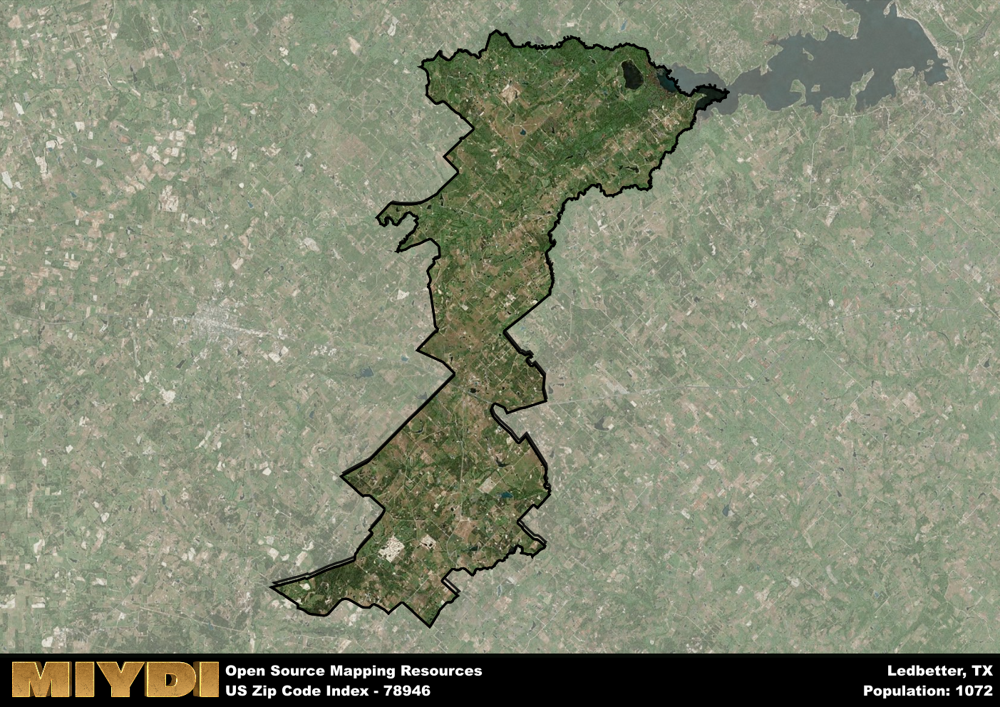

**Area Name:** Ledbetter

**Zip Code:** 78946

**State:** TX

Ledbetter is a part of the Brenham - TX Micro Area, and makes up  of the Metro's population.  

# Ledbetter: A Hidden Gem in Central Texas  
Located in Central Texas, zip code 78946 encompasses the charming neighborhood of Ledbetter. Bordered by rolling hills and vast farmlands, Ledbetter seamlessly integrates with the nearby cities of Giddings and La Grange. Situated within an hour's drive of Austin, the state capital, Ledbetter offers a tranquil escape from the bustling urban life while still being easily accessible to major population centers.

Ledbetter has a rich historical narrative dating back to its founding in the 19th century. Originally settled by German immigrants, the area quickly grew into a thriving agricultural community known for its fertile soil and abundant crops. The town was named after William B. Ledbetter, a prominent landowner who played a crucial role in the development of the area. Over the years, Ledbetter has maintained its rural charm while embracing modern conveniences, making it a sought-after destination for those seeking a peaceful retreat.

Today, Ledbetter boasts a mix of small businesses, family farms, and historic sites that reflect its unique character. Visitors can explore local wineries, enjoy farm-to-table dining experiences, and immerse themselves in the area's rich cultural heritage. With its scenic countryside views and friendly community atmosphere, Ledbetter offers a slice of authentic Texan life that is sure to leave a lasting impression on all who visit.

# Ledbetter Demographics

The population of Ledbetter is 1072.  
Ledbetter has a population density of 10.25 per square mile.  
The area of Ledbetter is 104.56 square miles.  

## Ledbetter Income and Economic Data

These demographic numbers are sourced from IRS return data, providing comprehensive insights into the population dynamics and economic trends within Ledbetter.

**Breakdown of return types for Ledbetter**

The table offers insight into the composition of tax returns filed with the IRS, categorizing them into three main types. Single returns represent filings by individuals, joint returns by married couples, and head of household returns by individuals who qualify as heads of households, typically having dependents. This breakdown provides an understanding of the different filing statuses adopted by taxpayers when submitting their tax documentation.

| Return Types filed for Ledbetter                              | Percentage          |
|----------------------------------------------------------|---------------------|
| Single Returns                                            | 0.48 |
| Joint Returns                                             | 0.37 |
| Head Household Returns                                    | 0.13 |

The income and economic data presented here is sourced from the IRS income brackets, utilized for categorizing tax returns by income levels. This table displays income ranges for both single filers and married couples, along with the corresponding number of returns and the percentage within each bracket, providing valuable insight into the distribution of taxes across various income groups.

| Bracket Name       | Single Filer Income Range | Married Couple Range | Number of Returns | Percentage of Returns |
|--------------------|----------------------------|----------------------|-------------------|-----------------------|
| 10% Bracket        | Up to $10,275              | Up to $20,550        | 200 | 0.37% |
| 12% Bracket        | $10,276 - $41,775          | $20,551 - $83,550    | 120 | 0.22% |
| 22% Bracket        | $41,776 - $89,075          | $83,551 - $178,150   | 80 | 0.15% |
| 24% Bracket        | $89,076 - $170,050         | $178,151 - $340,100  | 50 | 0.09% |
| 32% Bracket        | $170,051 - $215,950        | $340,101 - $431,900  | 70 | 0.13% |
| 35% Bracket        | $215,951 - $539,900        | $431,901 - $647,850  | 20 | 0.04% |

### Exploring Taxpayer Diversity: A Breakdown of Different Types of Tax Returns in Ledbetter

The table offers insights into various types of tax returns filed, reflecting different aspects of taxpayer activities and demographics. Categories include charitable returns for donations, dependent returns for claimed dependents, educator population, elderly population, real estate returns, self-employment returns, student loan returns, and unemployment returns, providing valuable insights into taxpayer behavior and demographics.

| Ledbetter Filing Types                    | Count | Percentage |
|--------------------------------------|-------|------------|
| Charitable Donations                 | 0 | 0% |
| Dependents Claimed                   | 0 | 0% |
| Educator Residents                   | 0 | 0% |
| Elderly Population                   | 170 | 0.31% |
| Farming Population                   | 110 | 0.204% |
| Real Estate Transactions             | 0 | 0% |
| Self-Employed Individuals            | 70 | 0.13% |
| Student Loan Cases                   | 0 | 0% |
| Unemployment Benefit Filings         | 50 | 0.09% |

## Ledbetter AI and Census Variables

The values presented in this dataset for Ledbetter are AI-optimized, streamlined, and categorized into relevant buckets for enhanced utility in AI and mapping programs. These simplified values have been optimized to facilitate efficient analysis and integration into various technological applications, offering users accessible and actionable insights into demographics within the Ledbetter area.

| AI Variables for Ledbetter | Value |
|-------------|-------|
| Shape Area | 363718558.832031 |
| Shape Length | 178527.983243852 |
| CBSA Federal Processing Standard Code | 14780 |

## How to use this free AI optimized Geo-Spatial Data for Ledbetter, TX

This data is made freely available under the Creative Commons license, allowing for unrestricted use for any purpose. Users can access static resources directly from GitHub or leverage more advanced functionalities by utilizing the GeoJSON files. All datasets originate from official government or private sector sources and are meticulously compiled into relevant datasets within QGIS. However, the versatility of the data ensures compatibility with any mapping application.

## Data Accuracy Disclaimer
It's important to note that the data provided here may contain errors or discrepancies and should be considered as 'close enough' for business applications and AI rather than a definitive source of truth. This data is aggregated from multiple sources, some of which publish information on wildly different intervals, leading to potential inconsistencies. Additionally, certain data points may not be corrected for Covid-related changes, further impacting accuracy. Moreover, the assumption that demographic trends are consistent throughout a region may lead to discrepancies, as trends often concentrate in areas of highest population density. As a result, dense areas may be slightly underrepresented, while rural areas may be slightly overrepresented, resulting in a more conservative dataset. Furthermore, the focus primarily on areas within US Major and Minor Statistical areas means that approximately 40 million Americans living outside of these areas may not be fully represented. Lastly, the historical background and area descriptions generated using AI are susceptible to potential mistakes, so users should exercise caution when interpreting the information provided.
