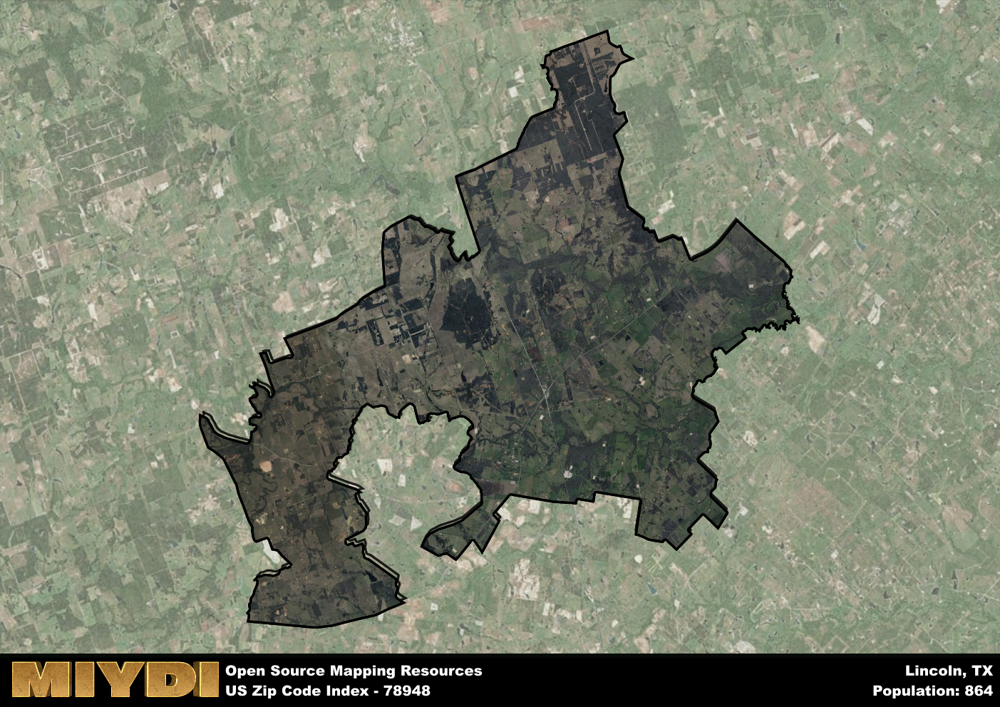

**Area Name:** Lincoln

**Zip Code:** 78948

**State:** TX

# Historic Lincoln Neighborhood in Zip Code 78948  

Located in the heart of the bustling city of Lincoln, the zip code 78948 encompasses the historic Lincoln neighborhood. Bordered by Main Street to the west and Elm Avenue to the east, this area seamlessly integrates with the surrounding districts, serving as a vibrant residential and commercial hub within the larger urban fabric of Lincoln. The neighborhood is easily accessible from the downtown area and is in close proximity to major transportation routes, making it a convenient and desirable location for residents and businesses alike.

The Lincoln neighborhood has a rich historical narrative, dating back to its founding in the mid-19th century. Originally settled by pioneers seeking new opportunities in the West, the area quickly grew into a thriving community centered around agriculture and trade. Over the years, Lincoln has experienced periods of growth and transformation, adapting to the changing needs of its residents while preserving its unique character and charm. Today, the neighborhood stands as a testament to its storied past, with many historic buildings and landmarks still standing as reminders of its heritage.

Presently, the Lincoln neighborhood in zip code 78948 is a vibrant and diverse community that offers a wide range of amenities and services to its residents. From locally-owned shops and restaurants to parks and recreational facilities, the area has something for everyone. The neighborhood is known for its strong sense of community and active neighborhood associations that work together to maintain its quality of life. Additionally, Lincoln boasts a variety of cultural and historic sites, drawing visitors from near and far to experience the charm and character of this unique neighborhood within the bustling city of Lincoln.

# Lincoln Demographics

The population of Lincoln is 864.  
Lincoln has a population density of 12.37 per square mile.  
The area of Lincoln is 69.84 square miles.  

## Lincoln Income and Economic Data

These demographic numbers are sourced from IRS return data, providing comprehensive insights into the population dynamics and economic trends within Lincoln.

**Breakdown of return types for Lincoln**

The table offers insight into the composition of tax returns filed with the IRS, categorizing them into three main types. Single returns represent filings by individuals, joint returns by married couples, and head of household returns by individuals who qualify as heads of households, typically having dependents. This breakdown provides an understanding of the different filing statuses adopted by taxpayers when submitting their tax documentation.

| Return Types filed for Lincoln                              | Percentage          |
|----------------------------------------------------------|---------------------|
| Single Returns                                            | 0.4 |
| Joint Returns                                             | 0.43 |
| Head Household Returns                                    | 0.12 |

The income and economic data presented here is sourced from the IRS income brackets, utilized for categorizing tax returns by income levels. This table displays income ranges for both single filers and married couples, along with the corresponding number of returns and the percentage within each bracket, providing valuable insight into the distribution of taxes across various income groups.

| Bracket Name       | Single Filer Income Range | Married Couple Range | Number of Returns | Percentage of Returns |
|--------------------|----------------------------|----------------------|-------------------|-----------------------|
| 10% Bracket        | Up to $10,275              | Up to $20,550        | 140 | 0.33% |
| 12% Bracket        | $10,276 - $41,775          | $20,551 - $83,550    | 100 | 0.24% |
| 22% Bracket        | $41,776 - $89,075          | $83,551 - $178,150   | 50 | 0.12% |
| 24% Bracket        | $89,076 - $170,050         | $178,151 - $340,100  | 50 | 0.12% |
| 32% Bracket        | $170,051 - $215,950        | $340,101 - $431,900  | 80 | 0.19% |
| 35% Bracket        | $215,951 - $539,900        | $431,901 - $647,850  | 0 | 0% |

### Exploring Taxpayer Diversity: A Breakdown of Different Types of Tax Returns in Lincoln

The table offers insights into various types of tax returns filed, reflecting different aspects of taxpayer activities and demographics. Categories include charitable returns for donations, dependent returns for claimed dependents, educator population, elderly population, real estate returns, self-employment returns, student loan returns, and unemployment returns, providing valuable insights into taxpayer behavior and demographics.

| Lincoln Filing Types                    | Count | Percentage |
|--------------------------------------|-------|------------|
| Charitable Donations                 | 0 | 0% |
| Dependents Claimed                   | 0 | 0% |
| Educator Residents                   | 0 | 0% |
| Elderly Population                   | 140 | 0.33% |
| Farming Population                   | 110 | 0.262% |
| Real Estate Transactions             | 0 | 0% |
| Self-Employed Individuals            | 60 | 0.143% |
| Student Loan Cases                   | 0 | 0% |
| Unemployment Benefit Filings         | 30 | 0.07% |

## Lincoln AI and Census Variables

The values presented in this dataset for Lincoln are AI-optimized, streamlined, and categorized into relevant buckets for enhanced utility in AI and mapping programs. These simplified values have been optimized to facilitate efficient analysis and integration into various technological applications, offering users accessible and actionable insights into demographics within the Lincoln area.

| AI Variables for Lincoln | Value |
|-------------|-------|
| Shape Area | 243516906.765625 |
| Shape Length | 139338.531518177 |

## How to use this free AI optimized Geo-Spatial Data for Lincoln, TX

This data is made freely available under the Creative Commons license, allowing for unrestricted use for any purpose. Users can access static resources directly from GitHub or leverage more advanced functionalities by utilizing the GeoJSON files. All datasets originate from official government or private sector sources and are meticulously compiled into relevant datasets within QGIS. However, the versatility of the data ensures compatibility with any mapping application.

## Data Accuracy Disclaimer
It's important to note that the data provided here may contain errors or discrepancies and should be considered as 'close enough' for business applications and AI rather than a definitive source of truth. This data is aggregated from multiple sources, some of which publish information on wildly different intervals, leading to potential inconsistencies. Additionally, certain data points may not be corrected for Covid-related changes, further impacting accuracy. Moreover, the assumption that demographic trends are consistent throughout a region may lead to discrepancies, as trends often concentrate in areas of highest population density. As a result, dense areas may be slightly underrepresented, while rural areas may be slightly overrepresented, resulting in a more conservative dataset. Furthermore, the focus primarily on areas within US Major and Minor Statistical areas means that approximately 40 million Americans living outside of these areas may not be fully represented. Lastly, the historical background and area descriptions generated using AI are susceptible to potential mistakes, so users should exercise caution when interpreting the information provided.
