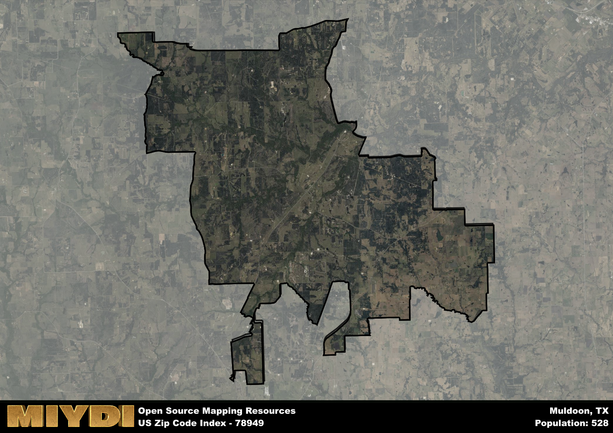

**Area Name:** Muldoon

**Zip Code:** 78949

**State:** TX

# Muldoon: A Charming Neighborhood in Central Texas  
Muldoon, located within the 78949 zip code, is a quaint neighborhood situated in central Texas, surrounded by the cities of La Grange, Smithville, and Bastrop. Nestled in rolling hills and lush greenery, Muldoon seamlessly integrates with the larger metropolitan area, providing a peaceful retreat for residents while still maintaining easy access to urban amenities.

Originally settled by German and Czech immigrants in the mid-19th century, Muldoon has a rich historical background that has shaped its character. The neighborhood was named after Father Muldoon, a Catholic priest who played a significant role in establishing the local church and community. Over the years, Muldoon has evolved into a tight-knit community, known for its friendly atmosphere and strong sense of heritage.

Today, Muldoon boasts a mix of agricultural and residential properties, with many residents engaged in farming and ranching. The area offers a variety of local services, including small businesses, churches, and schools. Residents and visitors alike can enjoy the natural beauty of the surrounding countryside, as well as historic sites such as the Muldoon Church and Cemetery, which provide a glimpse into the area's past. With its peaceful ambiance and close-knit community, Muldoon continues to be a hidden gem in central Texas.

# Muldoon Demographics

The population of Muldoon is 528.  
Muldoon has a population density of 6.72 per square mile.  
The area of Muldoon is 78.53 square miles.  

## Muldoon Income and Economic Data

These demographic numbers are sourced from IRS return data, providing comprehensive insights into the population dynamics and economic trends within Muldoon.

**Breakdown of return types for Muldoon**

The table offers insight into the composition of tax returns filed with the IRS, categorizing them into three main types. Single returns represent filings by individuals, joint returns by married couples, and head of household returns by individuals who qualify as heads of households, typically having dependents. This breakdown provides an understanding of the different filing statuses adopted by taxpayers when submitting their tax documentation.

| Return Types filed for Muldoon                              | Percentage          |
|----------------------------------------------------------|---------------------|
| Single Returns                                            | 0.38 |
| Joint Returns                                             | 0.54 |
| Head Household Returns                                    | 0 |

The income and economic data presented here is sourced from the IRS income brackets, utilized for categorizing tax returns by income levels. This table displays income ranges for both single filers and married couples, along with the corresponding number of returns and the percentage within each bracket, providing valuable insight into the distribution of taxes across various income groups.

| Bracket Name       | Single Filer Income Range | Married Couple Range | Number of Returns | Percentage of Returns |
|--------------------|----------------------------|----------------------|-------------------|-----------------------|
| 10% Bracket        | Up to $10,275              | Up to $20,550        | 60 | 0.25% |
| 12% Bracket        | $10,276 - $41,775          | $20,551 - $83,550    | 50 | 0.21% |
| 22% Bracket        | $41,776 - $89,075          | $83,551 - $178,150   | 40 | 0.17% |
| 24% Bracket        | $89,076 - $170,050         | $178,151 - $340,100  | 30 | 0.13% |
| 32% Bracket        | $170,051 - $215,950        | $340,101 - $431,900  | 60 | 0.25% |
| 35% Bracket        | $215,951 - $539,900        | $431,901 - $647,850  | 0 | 0% |

### Exploring Taxpayer Diversity: A Breakdown of Different Types of Tax Returns in Muldoon

The table offers insights into various types of tax returns filed, reflecting different aspects of taxpayer activities and demographics. Categories include charitable returns for donations, dependent returns for claimed dependents, educator population, elderly population, real estate returns, self-employment returns, student loan returns, and unemployment returns, providing valuable insights into taxpayer behavior and demographics.

| Muldoon Filing Types                    | Count | Percentage |
|--------------------------------------|-------|------------|
| Charitable Donations                 | 0 | 0% |
| Dependents Claimed                   | 0 | 0% |
| Educator Residents                   | 0 | 0% |
| Elderly Population                   | 110 | 0.46% |
| Farming Population                   | 60 | 0.25% |
| Real Estate Transactions             | 0 | 0% |
| Self-Employed Individuals            | 30 | 0.125% |
| Student Loan Cases                   | 0 | 0% |
| Unemployment Benefit Filings         | 0 | 0% |

## Muldoon AI and Census Variables

The values presented in this dataset for Muldoon are AI-optimized, streamlined, and categorized into relevant buckets for enhanced utility in AI and mapping programs. These simplified values have been optimized to facilitate efficient analysis and integration into various technological applications, offering users accessible and actionable insights into demographics within the Muldoon area.

| AI Variables for Muldoon | Value |
|-------------|-------|
| Shape Area | 271102810.585938 |
| Shape Length | 129568.988324949 |

## How to use this free AI optimized Geo-Spatial Data for Muldoon, TX

This data is made freely available under the Creative Commons license, allowing for unrestricted use for any purpose. Users can access static resources directly from GitHub or leverage more advanced functionalities by utilizing the GeoJSON files. All datasets originate from official government or private sector sources and are meticulously compiled into relevant datasets within QGIS. However, the versatility of the data ensures compatibility with any mapping application.

## Data Accuracy Disclaimer
It's important to note that the data provided here may contain errors or discrepancies and should be considered as 'close enough' for business applications and AI rather than a definitive source of truth. This data is aggregated from multiple sources, some of which publish information on wildly different intervals, leading to potential inconsistencies. Additionally, certain data points may not be corrected for Covid-related changes, further impacting accuracy. Moreover, the assumption that demographic trends are consistent throughout a region may lead to discrepancies, as trends often concentrate in areas of highest population density. As a result, dense areas may be slightly underrepresented, while rural areas may be slightly overrepresented, resulting in a more conservative dataset. Furthermore, the focus primarily on areas within US Major and Minor Statistical areas means that approximately 40 million Americans living outside of these areas may not be fully represented. Lastly, the historical background and area descriptions generated using AI are susceptible to potential mistakes, so users should exercise caution when interpreting the information provided.
