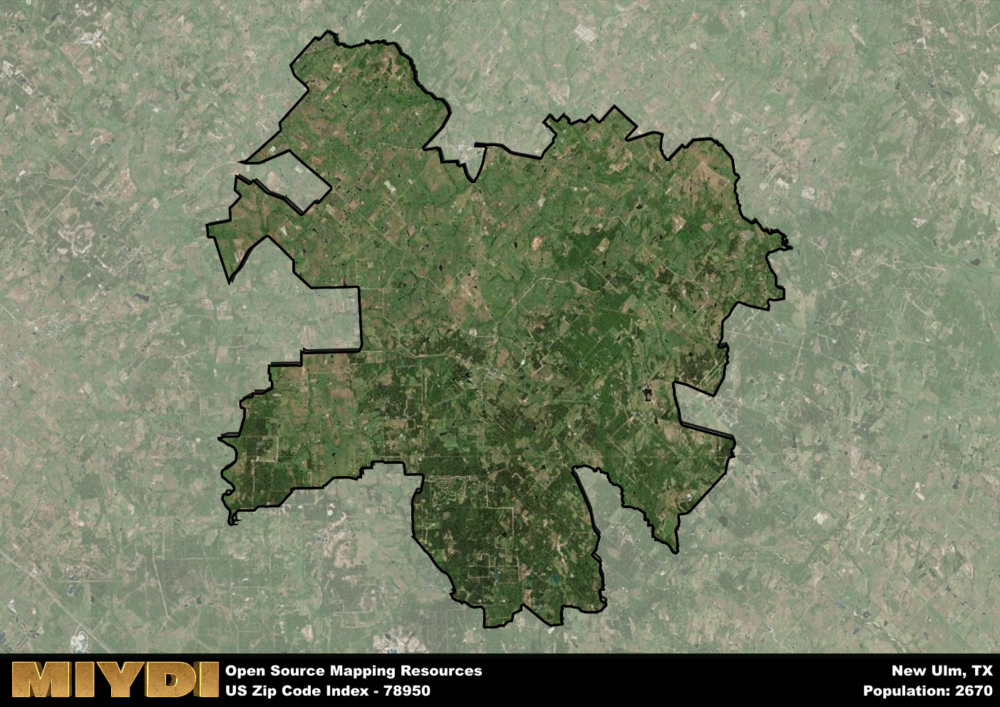

**Area Name:** New Ulm

**Zip Code:** 78950

**State:** TX

New Ulm is a part of the Houston-The Woodlands-Sugar Land - TX Metro Area, and makes up  of the Metro's population.  

# New Ulm: A Historic Gem in Central Texas  

Located in Central Texas, the zip code 78950 corresponds to the charming town of New Ulm. Nestled within Austin County, New Ulm is a small, tight-knit community with a population of approximately 1,000 residents. Surrounded by lush greenery and rolling hills, the area enjoys a peaceful and picturesque setting. Despite its rural feel, New Ulm is conveniently located near major cities like Houston and Austin, making it a desirable location for those seeking a tranquil retreat within reach of urban amenities.

Founded in the mid-19th century by German immigrants, New Ulm has a rich history that is still evident in its architecture and cultural traditions. The town was named after the city of Ulm in Germany, reflecting the strong heritage of its founding settlers. Over the years, New Ulm has evolved from a farming community into a vibrant town known for its welcoming atmosphere and strong sense of community. Visitors can explore historic buildings, such as the New Ulm Historic District, which showcases the town's Germanic roots.

Today, New Ulm offers a mix of agricultural and small business enterprises that sustain its economy. Local residents enjoy a range of services, including family-owned shops, restaurants, and recreational facilities. The area is home to several parks and outdoor recreational areas, providing opportunities for hiking, fishing, and picnicking. New Ulm also hosts cultural events and festivals that celebrate its German heritage, drawing visitors from near and far. With its blend of history, natural beauty, and community spirit, New Ulm remains a hidden gem in the heart of Texas.

# New Ulm Demographics

The population of New Ulm is 2670.  
New Ulm has a population density of 21.59 per square mile.  
The area of New Ulm is 123.64 square miles.  

## New Ulm Income and Economic Data

These demographic numbers are sourced from IRS return data, providing comprehensive insights into the population dynamics and economic trends within New Ulm.

**Breakdown of return types for New Ulm**

The table offers insight into the composition of tax returns filed with the IRS, categorizing them into three main types. Single returns represent filings by individuals, joint returns by married couples, and head of household returns by individuals who qualify as heads of households, typically having dependents. This breakdown provides an understanding of the different filing statuses adopted by taxpayers when submitting their tax documentation.

| Return Types filed for New Ulm                              | Percentage          |
|----------------------------------------------------------|---------------------|
| Single Returns                                            | 0.41 |
| Joint Returns                                             | 0.54 |
| Head Household Returns                                    | 0.05 |

The income and economic data presented here is sourced from the IRS income brackets, utilized for categorizing tax returns by income levels. This table displays income ranges for both single filers and married couples, along with the corresponding number of returns and the percentage within each bracket, providing valuable insight into the distribution of taxes across various income groups.

| Bracket Name       | Single Filer Income Range | Married Couple Range | Number of Returns | Percentage of Returns |
|--------------------|----------------------------|----------------------|-------------------|-----------------------|
| 10% Bracket        | Up to $10,275              | Up to $20,550        | 290 | 0.29% |
| 12% Bracket        | $10,276 - $41,775          | $20,551 - $83,550    | 180 | 0.18% |
| 22% Bracket        | $41,776 - $89,075          | $83,551 - $178,150   | 140 | 0.14% |
| 24% Bracket        | $89,076 - $170,050         | $178,151 - $340,100  | 100 | 0.1% |
| 32% Bracket        | $170,051 - $215,950        | $340,101 - $431,900  | 190 | 0.19% |
| 35% Bracket        | $215,951 - $539,900        | $431,901 - $647,850  | 90 | 0.09% |

### Exploring Taxpayer Diversity: A Breakdown of Different Types of Tax Returns in New Ulm

The table offers insights into various types of tax returns filed, reflecting different aspects of taxpayer activities and demographics. Categories include charitable returns for donations, dependent returns for claimed dependents, educator population, elderly population, real estate returns, self-employment returns, student loan returns, and unemployment returns, providing valuable insights into taxpayer behavior and demographics.

| New Ulm Filing Types                    | Count | Percentage |
|--------------------------------------|-------|------------|
| Charitable Donations                 | 60 | 0.061% |
| Dependents Claimed                   | 20 | 0.02% |
| Educator Residents                   | 0 | 0% |
| Elderly Population                   | 450 | 0.45% |
| Farming Population                   | 230 | 0.232% |
| Real Estate Transactions             | 70 | 0.071% |
| Self-Employed Individuals            | 220 | 0.222% |
| Student Loan Cases                   | 20 | 0.02% |
| Unemployment Benefit Filings         | 60 | 0.06% |

## New Ulm AI and Census Variables

The values presented in this dataset for New Ulm are AI-optimized, streamlined, and categorized into relevant buckets for enhanced utility in AI and mapping programs. These simplified values have been optimized to facilitate efficient analysis and integration into various technological applications, offering users accessible and actionable insights into demographics within the New Ulm area.

| AI Variables for New Ulm | Value |
|-------------|-------|
| Shape Area | 427625093.074219 |
| Shape Length | 170478.245219052 |
| CBSA Federal Processing Standard Code | 26420 |

## How to use this free AI optimized Geo-Spatial Data for New Ulm, TX

This data is made freely available under the Creative Commons license, allowing for unrestricted use for any purpose. Users can access static resources directly from GitHub or leverage more advanced functionalities by utilizing the GeoJSON files. All datasets originate from official government or private sector sources and are meticulously compiled into relevant datasets within QGIS. However, the versatility of the data ensures compatibility with any mapping application.

## Data Accuracy Disclaimer
It's important to note that the data provided here may contain errors or discrepancies and should be considered as 'close enough' for business applications and AI rather than a definitive source of truth. This data is aggregated from multiple sources, some of which publish information on wildly different intervals, leading to potential inconsistencies. Additionally, certain data points may not be corrected for Covid-related changes, further impacting accuracy. Moreover, the assumption that demographic trends are consistent throughout a region may lead to discrepancies, as trends often concentrate in areas of highest population density. As a result, dense areas may be slightly underrepresented, while rural areas may be slightly overrepresented, resulting in a more conservative dataset. Furthermore, the focus primarily on areas within US Major and Minor Statistical areas means that approximately 40 million Americans living outside of these areas may not be fully represented. Lastly, the historical background and area descriptions generated using AI are susceptible to potential mistakes, so users should exercise caution when interpreting the information provided.
