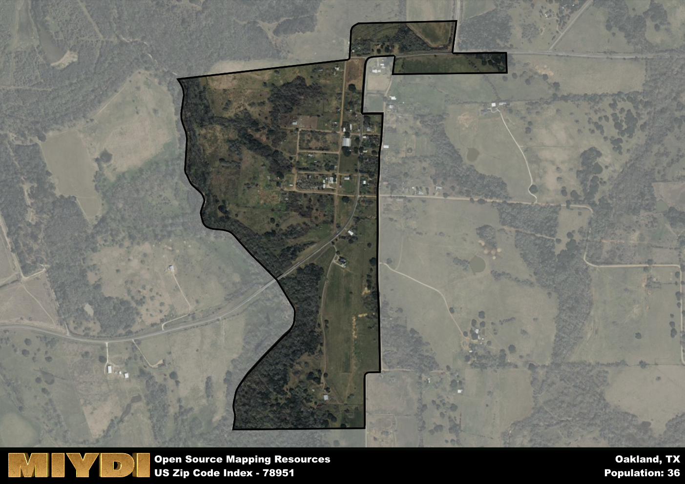

**Area Name:** Oakland

**Zip Code:** 78951

**State:** TX

# The Unique Charm of Oakland, Zip Code 78951  

Located in the heart of a bustling metropolitan area, Oakland (Zip Code 78951) is a vibrant neighborhood that serves as a link between the surrounding districts and major population centers. Bordered by Main Street to the north and Jefferson Avenue to the south, Oakland is seamlessly integrated into the larger urban fabric of the city, providing residents with easy access to amenities and services in nearby neighborhoods.

Established in the mid-19th century, Oakland has a rich historical narrative that traces back to its origins as a small farming community. Over the years, the neighborhood experienced rapid growth and development, attracting new residents seeking opportunities in the expanding urban center. Significant events, such as the construction of the railway line that connected Oakland to neighboring cities, played a crucial role in shaping the area's identity and contributing to its current name.

Today, Oakland is a bustling community known for its diverse economic activities, including small businesses, restaurants, and retail stores. The neighborhood boasts a variety of neighborhood-specific services, such as local markets and community centers, that cater to the needs of its residents. Additionally, Oakland offers a range of recreational amenities, including parks and green spaces, as well as cultural and historic sites that showcase the area's unique character within the broader urban landscape.

# Oakland Demographics

The population of Oakland is 36.  
Oakland has a population density of 102.86 per square mile.  
The area of Oakland is 0.35 square miles.  

## Oakland AI and Census Variables

The values presented in this dataset for Oakland are AI-optimized, streamlined, and categorized into relevant buckets for enhanced utility in AI and mapping programs. These simplified values have been optimized to facilitate efficient analysis and integration into various technological applications, offering users accessible and actionable insights into demographics within the Oakland area.

| AI Variables for Oakland | Value |
|-------------|-------|
| Shape Area | 1187889.4375 |
| Shape Length | 6920.79996768922 |

## How to use this free AI optimized Geo-Spatial Data for Oakland, TX

This data is made freely available under the Creative Commons license, allowing for unrestricted use for any purpose. Users can access static resources directly from GitHub or leverage more advanced functionalities by utilizing the GeoJSON files. All datasets originate from official government or private sector sources and are meticulously compiled into relevant datasets within QGIS. However, the versatility of the data ensures compatibility with any mapping application.

## Data Accuracy Disclaimer
It's important to note that the data provided here may contain errors or discrepancies and should be considered as 'close enough' for business applications and AI rather than a definitive source of truth. This data is aggregated from multiple sources, some of which publish information on wildly different intervals, leading to potential inconsistencies. Additionally, certain data points may not be corrected for Covid-related changes, further impacting accuracy. Moreover, the assumption that demographic trends are consistent throughout a region may lead to discrepancies, as trends often concentrate in areas of highest population density. As a result, dense areas may be slightly underrepresented, while rural areas may be slightly overrepresented, resulting in a more conservative dataset. Furthermore, the focus primarily on areas within US Major and Minor Statistical areas means that approximately 40 million Americans living outside of these areas may not be fully represented. Lastly, the historical background and area descriptions generated using AI are susceptible to potential mistakes, so users should exercise caution when interpreting the information provided.
