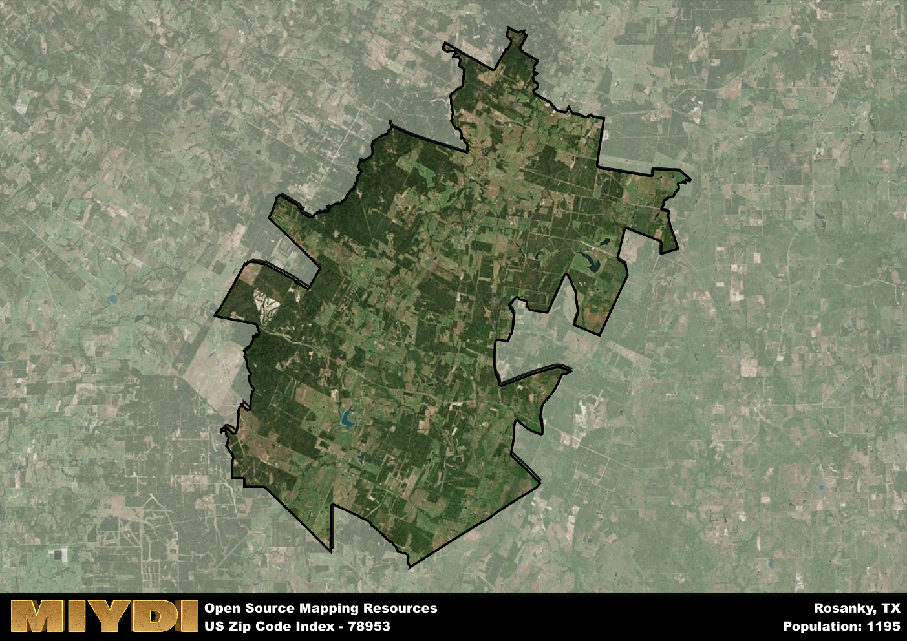

**Area Name:** Rosanky

**Zip Code:** 78953

**State:** TX

Rosanky is a part of the Austin-Round Rock-Georgetown - TX Metro Area, and makes up  of the Metro's population.  

# Rosanky: A Charming Neighborhood in Central Texas  

Located in central Texas, the zip code 78953 area of Rosanky is situated within Bastrop County. Bordered by the neighboring towns of Bastrop to the northwest and Smithville to the east, Rosanky is a rural community that offers a peaceful retreat from the bustling cities of Austin and San Antonio. Despite its small size, Rosanky plays an integral role in the greater metropolitan area by providing a tranquil escape for residents seeking a slower pace of life.

Originally settled in the 1800s, Rosanky has a rich history rooted in agriculture and ranching. The area was named after early settler Edward Rosanky and grew steadily as families established homesteads and farms in the fertile countryside. Over the years, Rosanky has maintained its rural charm and tight-knit community spirit, with many residents tracing their lineage back several generations. Today, the area continues to honor its heritage through annual festivals and events that celebrate its cultural roots.

Present-day Rosanky boasts a thriving community centered around agriculture, small businesses, and local services. Residents and visitors alike can enjoy the picturesque countryside with opportunities for hiking, fishing, and horseback riding. The area also features historic sites such as the Rosanky Community Hall, a focal point for social gatherings and events. With its blend of history, natural beauty, and community pride, Rosanky remains a hidden gem in the heart of central Texas.

# Rosanky Demographics

The population of Rosanky is 1195.  
Rosanky has a population density of 13.06 per square mile.  
The area of Rosanky is 91.48 square miles.  

## Rosanky Income and Economic Data

These demographic numbers are sourced from IRS return data, providing comprehensive insights into the population dynamics and economic trends within Rosanky.

**Breakdown of return types for Rosanky**

The table offers insight into the composition of tax returns filed with the IRS, categorizing them into three main types. Single returns represent filings by individuals, joint returns by married couples, and head of household returns by individuals who qualify as heads of households, typically having dependents. This breakdown provides an understanding of the different filing statuses adopted by taxpayers when submitting their tax documentation.

| Return Types filed for Rosanky                              | Percentage          |
|----------------------------------------------------------|---------------------|
| Single Returns                                            | 0.37 |
| Joint Returns                                             | 0.54 |
| Head Household Returns                                    | 0.1 |

The income and economic data presented here is sourced from the IRS income brackets, utilized for categorizing tax returns by income levels. This table displays income ranges for both single filers and married couples, along with the corresponding number of returns and the percentage within each bracket, providing valuable insight into the distribution of taxes across various income groups.

| Bracket Name       | Single Filer Income Range | Married Couple Range | Number of Returns | Percentage of Returns |
|--------------------|----------------------------|----------------------|-------------------|-----------------------|
| 10% Bracket        | Up to $10,275              | Up to $20,550        | 140 | 0.27% |
| 12% Bracket        | $10,276 - $41,775          | $20,551 - $83,550    | 130 | 0.25% |
| 22% Bracket        | $41,776 - $89,075          | $83,551 - $178,150   | 70 | 0.13% |
| 24% Bracket        | $89,076 - $170,050         | $178,151 - $340,100  | 50 | 0.1% |
| 32% Bracket        | $170,051 - $215,950        | $340,101 - $431,900  | 130 | 0.25% |
| 35% Bracket        | $215,951 - $539,900        | $431,901 - $647,850  | 0 | 0% |

### Exploring Taxpayer Diversity: A Breakdown of Different Types of Tax Returns in Rosanky

The table offers insights into various types of tax returns filed, reflecting different aspects of taxpayer activities and demographics. Categories include charitable returns for donations, dependent returns for claimed dependents, educator population, elderly population, real estate returns, self-employment returns, student loan returns, and unemployment returns, providing valuable insights into taxpayer behavior and demographics.

| Rosanky Filing Types                    | Count | Percentage |
|--------------------------------------|-------|------------|
| Charitable Donations                 | 0 | 0% |
| Dependents Claimed                   | 0 | 0% |
| Educator Residents                   | 0 | 0% |
| Elderly Population                   | 200 | 0.38% |
| Farming Population                   | 120 | 0.231% |
| Real Estate Transactions             | 0 | 0% |
| Self-Employed Individuals            | 100 | 0.192% |
| Student Loan Cases                   | 0 | 0% |
| Unemployment Benefit Filings         | 50 | 0.1% |

## Rosanky AI and Census Variables

The values presented in this dataset for Rosanky are AI-optimized, streamlined, and categorized into relevant buckets for enhanced utility in AI and mapping programs. These simplified values have been optimized to facilitate efficient analysis and integration into various technological applications, offering users accessible and actionable insights into demographics within the Rosanky area.

| AI Variables for Rosanky | Value |
|-------------|-------|
| Shape Area | 316035648.757813 |
| Shape Length | 134703.390281159 |
| CBSA Federal Processing Standard Code | 12420 |

## How to use this free AI optimized Geo-Spatial Data for Rosanky, TX

This data is made freely available under the Creative Commons license, allowing for unrestricted use for any purpose. Users can access static resources directly from GitHub or leverage more advanced functionalities by utilizing the GeoJSON files. All datasets originate from official government or private sector sources and are meticulously compiled into relevant datasets within QGIS. However, the versatility of the data ensures compatibility with any mapping application.

## Data Accuracy Disclaimer
It's important to note that the data provided here may contain errors or discrepancies and should be considered as 'close enough' for business applications and AI rather than a definitive source of truth. This data is aggregated from multiple sources, some of which publish information on wildly different intervals, leading to potential inconsistencies. Additionally, certain data points may not be corrected for Covid-related changes, further impacting accuracy. Moreover, the assumption that demographic trends are consistent throughout a region may lead to discrepancies, as trends often concentrate in areas of highest population density. As a result, dense areas may be slightly underrepresented, while rural areas may be slightly overrepresented, resulting in a more conservative dataset. Furthermore, the focus primarily on areas within US Major and Minor Statistical areas means that approximately 40 million Americans living outside of these areas may not be fully represented. Lastly, the historical background and area descriptions generated using AI are susceptible to potential mistakes, so users should exercise caution when interpreting the information provided.
