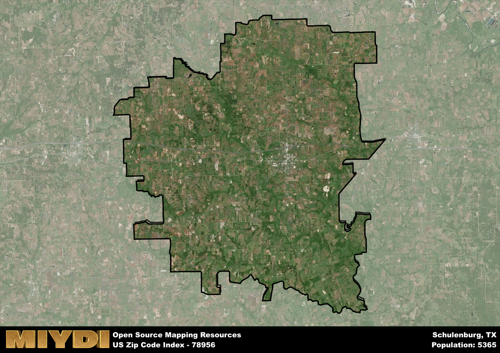

**Area Name:** Schulenburg

**Zip Code:** 78956

**State:** TX

# Schulenburg: A Historic Gem in Central Texas

Located in Fayette County, the zip code 78956 encompasses the charming town of Schulenburg. Situated in the heart of Central Texas, Schulenburg is surrounded by rolling hills and picturesque countryside. The town is conveniently located near major highways, including Interstate 10 and State Highway 77, making it easily accessible from cities like Houston, San Antonio, and Austin. Schulenburg is a vital part of the Central Texas region, serving as a hub for agriculture, commerce, and tourism.

Schulenburg has a rich historical heritage that dates back to the mid-19th century. Founded by German and Czech settlers, the town quickly grew into a thriving community known for its agricultural prowess and vibrant cultural scene. Schulenburg played a significant role in the development of the region, serving as a key stop along the railroad and a center for trade and commerce. Today, the town still retains much of its historic charm, with well-preserved buildings, museums, and festivals that celebrate its diverse heritage.

Present-day Schulenburg is a bustling small town with a strong sense of community. The area is known for its agriculture, with cattle ranching, poultry farming, and crop production playing a vital role in the local economy. Schulenburg also offers a variety of services and amenities for residents and visitors alike, including shops, restaurants, and recreational facilities. The town is home to several historic sites, such as the Stanzel Model Aircraft Museum and the Painted Churches of Texas, which attract tourists from near and far. Schulenburg's blend of history, culture, and natural beauty makes it a must-visit destination in Central Texas.

# Schulenburg Demographics

The population of Schulenburg is 5365.  
Schulenburg has a population density of 30.43 per square mile.  
The area of Schulenburg is 176.32 square miles.  

## Schulenburg Income and Economic Data

These demographic numbers are sourced from IRS return data, providing comprehensive insights into the population dynamics and economic trends within Schulenburg.

**Breakdown of return types for Schulenburg**

The table offers insight into the composition of tax returns filed with the IRS, categorizing them into three main types. Single returns represent filings by individuals, joint returns by married couples, and head of household returns by individuals who qualify as heads of households, typically having dependents. This breakdown provides an understanding of the different filing statuses adopted by taxpayers when submitting their tax documentation.

| Return Types filed for Schulenburg                              | Percentage          |
|----------------------------------------------------------|---------------------|
| Single Returns                                            | 0.47 |
| Joint Returns                                             | 0.41 |
| Head Household Returns                                    | 0.11 |

The income and economic data presented here is sourced from the IRS income brackets, utilized for categorizing tax returns by income levels. This table displays income ranges for both single filers and married couples, along with the corresponding number of returns and the percentage within each bracket, providing valuable insight into the distribution of taxes across various income groups.

| Bracket Name       | Single Filer Income Range | Married Couple Range | Number of Returns | Percentage of Returns |
|--------------------|----------------------------|----------------------|-------------------|-----------------------|
| 10% Bracket        | Up to $10,275              | Up to $20,550        | 860 | 0.34% |
| 12% Bracket        | $10,276 - $41,775          | $20,551 - $83,550    | 650 | 0.26% |
| 22% Bracket        | $41,776 - $89,075          | $83,551 - $178,150   | 370 | 0.15% |
| 24% Bracket        | $89,076 - $170,050         | $178,151 - $340,100  | 220 | 0.09% |
| 32% Bracket        | $170,051 - $215,950        | $340,101 - $431,900  | 340 | 0.13% |
| 35% Bracket        | $215,951 - $539,900        | $431,901 - $647,850  | 100 | 0.04% |

### Exploring Taxpayer Diversity: A Breakdown of Different Types of Tax Returns in Schulenburg

The table offers insights into various types of tax returns filed, reflecting different aspects of taxpayer activities and demographics. Categories include charitable returns for donations, dependent returns for claimed dependents, educator population, elderly population, real estate returns, self-employment returns, student loan returns, and unemployment returns, providing valuable insights into taxpayer behavior and demographics.

| Schulenburg Filing Types                    | Count | Percentage |
|--------------------------------------|-------|------------|
| Charitable Donations                 | 100 | 0.039% |
| Dependents Claimed                   | 90 | 0.035% |
| Educator Residents                   | 70 | 0.028% |
| Elderly Population                   | 920 | 0.36% |
| Farming Population                   | 490 | 0.193% |
| Real Estate Transactions             | 90 | 0.035% |
| Self-Employed Individuals            | 440 | 0.173% |
| Student Loan Cases                   | 110 | 0.043% |
| Unemployment Benefit Filings         | 190 | 0.07% |

## Schulenburg AI and Census Variables

The values presented in this dataset for Schulenburg are AI-optimized, streamlined, and categorized into relevant buckets for enhanced utility in AI and mapping programs. These simplified values have been optimized to facilitate efficient analysis and integration into various technological applications, offering users accessible and actionable insights into demographics within the Schulenburg area.

| AI Variables for Schulenburg | Value |
|-------------|-------|
| Shape Area | 607114920.398438 |
| Shape Length | 164522.970635434 |

## How to use this free AI optimized Geo-Spatial Data for Schulenburg, TX

This data is made freely available under the Creative Commons license, allowing for unrestricted use for any purpose. Users can access static resources directly from GitHub or leverage more advanced functionalities by utilizing the GeoJSON files. All datasets originate from official government or private sector sources and are meticulously compiled into relevant datasets within QGIS. However, the versatility of the data ensures compatibility with any mapping application.

## Data Accuracy Disclaimer
It's important to note that the data provided here may contain errors or discrepancies and should be considered as 'close enough' for business applications and AI rather than a definitive source of truth. This data is aggregated from multiple sources, some of which publish information on wildly different intervals, leading to potential inconsistencies. Additionally, certain data points may not be corrected for Covid-related changes, further impacting accuracy. Moreover, the assumption that demographic trends are consistent throughout a region may lead to discrepancies, as trends often concentrate in areas of highest population density. As a result, dense areas may be slightly underrepresented, while rural areas may be slightly overrepresented, resulting in a more conservative dataset. Furthermore, the focus primarily on areas within US Major and Minor Statistical areas means that approximately 40 million Americans living outside of these areas may not be fully represented. Lastly, the historical background and area descriptions generated using AI are susceptible to potential mistakes, so users should exercise caution when interpreting the information provided.
