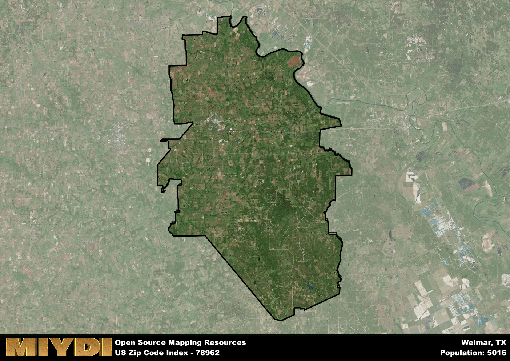

**Area Name:** Weimar

**Zip Code:** 78962

**State:** TX

# Weimar: A Historic Gem in Central Texas

Located in central Texas, zip code 78962 encompasses the charming town of Weimar. Bordered by rolling hills and lush farmlands, Weimar is situated within close proximity to major cities such as Austin and Houston. The area serves as a crucial hub for transportation, with easy access to major highways and rail lines, making it a strategic location for both residents and businesses.

Weimar has a rich history dating back to its founding in the late 19th century by German immigrants. The town's name pays homage to the city of Weimar in Germany, reflecting the cultural heritage of its early settlers. Over the years, Weimar has experienced steady growth, evolving into a vibrant community known for its strong sense of tradition and community pride. Significant events such as the establishment of local churches and schools have shaped the town's identity and contributed to its unique character.

Today, Weimar boasts a thriving economy supported by agriculture, manufacturing, and small businesses. Residents enjoy a range of neighborhood-specific services, including local shops, restaurants, and healthcare facilities. The town is home to several recreational amenities, such as parks, sports facilities, and community events that bring residents together. Weimar's historic downtown area showcases well-preserved architecture and cultural sites, providing visitors with a glimpse into the town's storied past.

# Weimar Demographics

The population of Weimar is 5016.  
Weimar has a population density of 23.86 per square mile.  
The area of Weimar is 210.25 square miles.  

## Weimar Income and Economic Data

These demographic numbers are sourced from IRS return data, providing comprehensive insights into the population dynamics and economic trends within Weimar.

**Breakdown of return types for Weimar**

The table offers insight into the composition of tax returns filed with the IRS, categorizing them into three main types. Single returns represent filings by individuals, joint returns by married couples, and head of household returns by individuals who qualify as heads of households, typically having dependents. This breakdown provides an understanding of the different filing statuses adopted by taxpayers when submitting their tax documentation.

| Return Types filed for Weimar                              | Percentage          |
|----------------------------------------------------------|---------------------|
| Single Returns                                            | 0.43 |
| Joint Returns                                             | 0.47 |
| Head Household Returns                                    | 0.09 |

The income and economic data presented here is sourced from the IRS income brackets, utilized for categorizing tax returns by income levels. This table displays income ranges for both single filers and married couples, along with the corresponding number of returns and the percentage within each bracket, providing valuable insight into the distribution of taxes across various income groups.

| Bracket Name       | Single Filer Income Range | Married Couple Range | Number of Returns | Percentage of Returns |
|--------------------|----------------------------|----------------------|-------------------|-----------------------|
| 10% Bracket        | Up to $10,275              | Up to $20,550        | 740 | 0.32% |
| 12% Bracket        | $10,276 - $41,775          | $20,551 - $83,550    | 520 | 0.23% |
| 22% Bracket        | $41,776 - $89,075          | $83,551 - $178,150   | 330 | 0.14% |
| 24% Bracket        | $89,076 - $170,050         | $178,151 - $340,100  | 230 | 0.1% |
| 32% Bracket        | $170,051 - $215,950        | $340,101 - $431,900  | 350 | 0.15% |
| 35% Bracket        | $215,951 - $539,900        | $431,901 - $647,850  | 120 | 0.05% |

### Exploring Taxpayer Diversity: A Breakdown of Different Types of Tax Returns in Weimar

The table offers insights into various types of tax returns filed, reflecting different aspects of taxpayer activities and demographics. Categories include charitable returns for donations, dependent returns for claimed dependents, educator population, elderly population, real estate returns, self-employment returns, student loan returns, and unemployment returns, providing valuable insights into taxpayer behavior and demographics.

| Weimar Filing Types                    | Count | Percentage |
|--------------------------------------|-------|------------|
| Charitable Donations                 | 90 | 0.039% |
| Dependents Claimed                   | 70 | 0.031% |
| Educator Residents                   | 70 | 0.031% |
| Elderly Population                   | 840 | 0.37% |
| Farming Population                   | 350 | 0.153% |
| Real Estate Transactions             | 100 | 0.044% |
| Self-Employed Individuals            | 390 | 0.17% |
| Student Loan Cases                   | 100 | 0.044% |
| Unemployment Benefit Filings         | 170 | 0.07% |

## Weimar AI and Census Variables

The values presented in this dataset for Weimar are AI-optimized, streamlined, and categorized into relevant buckets for enhanced utility in AI and mapping programs. These simplified values have been optimized to facilitate efficient analysis and integration into various technological applications, offering users accessible and actionable insights into demographics within the Weimar area.

| AI Variables for Weimar | Value |
|-------------|-------|
| Shape Area | 723483212.339844 |
| Shape Length | 158700.138572262 |

## How to use this free AI optimized Geo-Spatial Data for Weimar, TX

This data is made freely available under the Creative Commons license, allowing for unrestricted use for any purpose. Users can access static resources directly from GitHub or leverage more advanced functionalities by utilizing the GeoJSON files. All datasets originate from official government or private sector sources and are meticulously compiled into relevant datasets within QGIS. However, the versatility of the data ensures compatibility with any mapping application.

## Data Accuracy Disclaimer
It's important to note that the data provided here may contain errors or discrepancies and should be considered as 'close enough' for business applications and AI rather than a definitive source of truth. This data is aggregated from multiple sources, some of which publish information on wildly different intervals, leading to potential inconsistencies. Additionally, certain data points may not be corrected for Covid-related changes, further impacting accuracy. Moreover, the assumption that demographic trends are consistent throughout a region may lead to discrepancies, as trends often concentrate in areas of highest population density. As a result, dense areas may be slightly underrepresented, while rural areas may be slightly overrepresented, resulting in a more conservative dataset. Furthermore, the focus primarily on areas within US Major and Minor Statistical areas means that approximately 40 million Americans living outside of these areas may not be fully represented. Lastly, the historical background and area descriptions generated using AI are susceptible to potential mistakes, so users should exercise caution when interpreting the information provided.
