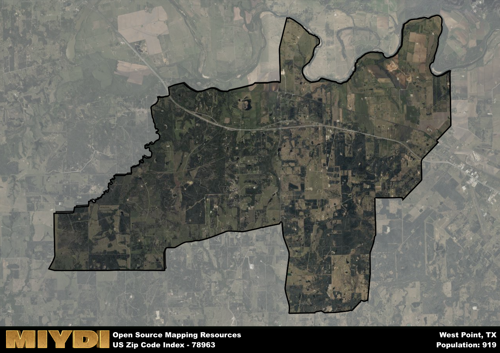

**Area Name:** West Point

**Zip Code:** 78963

**State:** TX

# West Point: A Charming Neighborhood in Central Texas  

Located in the heart of Central Texas, West Point (zip code 78963) is a picturesque neighborhood nestled between the cities of La Grange and Giddings. Boasting rolling hills and lush greenery, West Point seamlessly integrates with the surrounding rural landscape, offering a peaceful retreat from the hustle and bustle of nearby urban centers. The zip code area is bordered by the Colorado River to the east and is easily accessible via State Highway 71, connecting residents to the larger metropolitan areas of Austin and Houston.

Originally settled by German immigrants in the mid-19th century, West Point has a rich history rooted in agriculture and farming. The area's development was shaped by the arrival of the railroad in the late 1800s, facilitating trade and commerce in the region. Over the years, West Point has evolved into a close-knit community known for its strong sense of heritage and tradition. The neighborhood takes pride in preserving its German cultural roots through annual festivals and events that celebrate its unique history.

Today, West Point remains a thriving community with a mix of residential and agricultural land. The area is home to family-owned farms, ranches, and vineyards, contributing to a vibrant local economy centered around agriculture. Residents enjoy a range of neighborhood-specific services, including quaint country stores, local eateries serving up traditional German cuisine, and cozy bed and breakfast establishments. Outdoor enthusiasts can explore the scenic countryside through hiking trails and fishing spots along the Colorado River, while history buffs can visit historic sites like the West Point School Museum, offering a glimpse into the area's past.

# West Point Demographics

The population of West Point is 919.  
West Point has a population density of 21.98 per square mile.  
The area of West Point is 41.82 square miles.  

## West Point Income and Economic Data

These demographic numbers are sourced from IRS return data, providing comprehensive insights into the population dynamics and economic trends within West Point.

**Breakdown of return types for West Point**

The table offers insight into the composition of tax returns filed with the IRS, categorizing them into three main types. Single returns represent filings by individuals, joint returns by married couples, and head of household returns by individuals who qualify as heads of households, typically having dependents. This breakdown provides an understanding of the different filing statuses adopted by taxpayers when submitting their tax documentation.

| Return Types filed for West Point                              | Percentage          |
|----------------------------------------------------------|---------------------|
| Single Returns                                            | 0.38 |
| Joint Returns                                             | 0.48 |
| Head Household Returns                                    | 0.1 |

The income and economic data presented here is sourced from the IRS income brackets, utilized for categorizing tax returns by income levels. This table displays income ranges for both single filers and married couples, along with the corresponding number of returns and the percentage within each bracket, providing valuable insight into the distribution of taxes across various income groups.

| Bracket Name       | Single Filer Income Range | Married Couple Range | Number of Returns | Percentage of Returns |
|--------------------|----------------------------|----------------------|-------------------|-----------------------|
| 10% Bracket        | Up to $10,275              | Up to $20,550        | 120 | 0.29% |
| 12% Bracket        | $10,276 - $41,775          | $20,551 - $83,550    | 120 | 0.29% |
| 22% Bracket        | $41,776 - $89,075          | $83,551 - $178,150   | 70 | 0.17% |
| 24% Bracket        | $89,076 - $170,050         | $178,151 - $340,100  | 40 | 0.1% |
| 32% Bracket        | $170,051 - $215,950        | $340,101 - $431,900  | 70 | 0.17% |
| 35% Bracket        | $215,951 - $539,900        | $431,901 - $647,850  | 0 | 0% |

### Exploring Taxpayer Diversity: A Breakdown of Different Types of Tax Returns in West Point

The table offers insights into various types of tax returns filed, reflecting different aspects of taxpayer activities and demographics. Categories include charitable returns for donations, dependent returns for claimed dependents, educator population, elderly population, real estate returns, self-employment returns, student loan returns, and unemployment returns, providing valuable insights into taxpayer behavior and demographics.

| West Point Filing Types                    | Count | Percentage |
|--------------------------------------|-------|------------|
| Charitable Donations                 | 0 | 0% |
| Dependents Claimed                   | 0 | 0% |
| Educator Residents                   | 0 | 0% |
| Elderly Population                   | 120 | 0.29% |
| Farming Population                   | 80 | 0.19% |
| Real Estate Transactions             | 0 | 0% |
| Self-Employed Individuals            | 80 | 0.19% |
| Student Loan Cases                   | 0 | 0% |
| Unemployment Benefit Filings         | 50 | 0.12% |

## West Point AI and Census Variables

The values presented in this dataset for West Point are AI-optimized, streamlined, and categorized into relevant buckets for enhanced utility in AI and mapping programs. These simplified values have been optimized to facilitate efficient analysis and integration into various technological applications, offering users accessible and actionable insights into demographics within the West Point area.

| AI Variables for West Point | Value |
|-------------|-------|
| Shape Area | 144707728.996094 |
| Shape Length | 78134.0289318089 |

## How to use this free AI optimized Geo-Spatial Data for West Point, TX

This data is made freely available under the Creative Commons license, allowing for unrestricted use for any purpose. Users can access static resources directly from GitHub or leverage more advanced functionalities by utilizing the GeoJSON files. All datasets originate from official government or private sector sources and are meticulously compiled into relevant datasets within QGIS. However, the versatility of the data ensures compatibility with any mapping application.

## Data Accuracy Disclaimer
It's important to note that the data provided here may contain errors or discrepancies and should be considered as 'close enough' for business applications and AI rather than a definitive source of truth. This data is aggregated from multiple sources, some of which publish information on wildly different intervals, leading to potential inconsistencies. Additionally, certain data points may not be corrected for Covid-related changes, further impacting accuracy. Moreover, the assumption that demographic trends are consistent throughout a region may lead to discrepancies, as trends often concentrate in areas of highest population density. As a result, dense areas may be slightly underrepresented, while rural areas may be slightly overrepresented, resulting in a more conservative dataset. Furthermore, the focus primarily on areas within US Major and Minor Statistical areas means that approximately 40 million Americans living outside of these areas may not be fully represented. Lastly, the historical background and area descriptions generated using AI are susceptible to potential mistakes, so users should exercise caution when interpreting the information provided.
