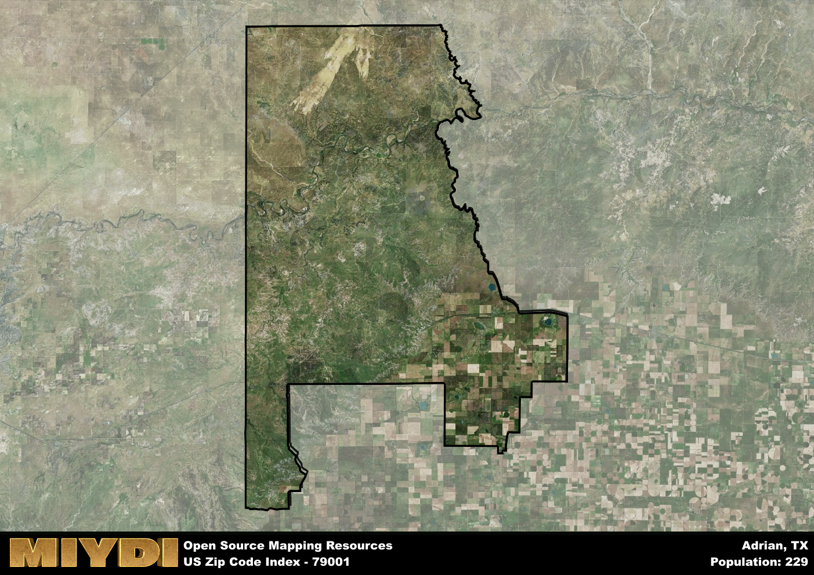

**Area Name:** Adrian

**Zip Code:** 79001

**State:** TX

Adrian is a part of the Amarillo - TX Metro Area, and makes up  of the Metro's population.  

# Historic Adrian, Texas: A Charming Small Town in the Heart of the Texas Panhandle  

Located in the Texas Panhandle, the zip code 79001 corresponds to the area of Adrian, Texas. Situated within Oldham County, Adrian is a small town that lies along historic Route 66. It is surrounded by vast expanses of flat prairie land, with Amarillo to the east and Tucumcari, New Mexico, to the west. Despite its small size, Adrian serves as a significant stop for travelers driving along Route 66, offering a glimpse into the quintessential American roadside experience.

Adrian has a rich history dating back to its establishment in the late 19th century. Originally a railroad town, it saw growth with the construction of Route 66 in the 1920s, becoming a popular stopping point for travelers heading west. The town's economy thrived during this period, with motels, diners, and service stations catering to the needs of tourists. Today, Adrian maintains its small-town charm and historical significance, attracting visitors interested in exploring its retro Americana vibe and iconic Route 66 landmarks.

Present-day Adrian is a mix of residential neighborhoods and businesses catering to travelers passing through on Route 66. The town is home to a variety of local shops, restaurants, and services, providing essential amenities for residents and visitors alike. In addition to its commercial offerings, Adrian boasts several historic sites and landmarks, including the Midpoint Cafe, which marks the halfway point on Route 66 between Chicago and Los Angeles. The town's economy is driven by tourism, agriculture, and local businesses, contributing to its unique character and inviting atmosphere.

# Adrian Demographics

The population of Adrian is 229.  
Adrian has a population density of 0.33 per square mile.  
The area of Adrian is 698.38 square miles.  

## Adrian Income and Economic Data

These demographic numbers are sourced from IRS return data, providing comprehensive insights into the population dynamics and economic trends within Adrian.

**Breakdown of return types for Adrian**

The table offers insight into the composition of tax returns filed with the IRS, categorizing them into three main types. Single returns represent filings by individuals, joint returns by married couples, and head of household returns by individuals who qualify as heads of households, typically having dependents. This breakdown provides an understanding of the different filing statuses adopted by taxpayers when submitting their tax documentation.

| Return Types filed for Adrian                              | Percentage          |
|----------------------------------------------------------|---------------------|
| Single Returns                                            | 0.46 |
| Joint Returns                                             | 0.46 |
| Head Household Returns                                    | 0 |

The income and economic data presented here is sourced from the IRS income brackets, utilized for categorizing tax returns by income levels. This table displays income ranges for both single filers and married couples, along with the corresponding number of returns and the percentage within each bracket, providing valuable insight into the distribution of taxes across various income groups.

| Bracket Name       | Single Filer Income Range | Married Couple Range | Number of Returns | Percentage of Returns |
|--------------------|----------------------------|----------------------|-------------------|-----------------------|
| 10% Bracket        | Up to $10,275              | Up to $20,550        | 40 | 0.31% |
| 12% Bracket        | $10,276 - $41,775          | $20,551 - $83,550    | 30 | 0.23% |
| 22% Bracket        | $41,776 - $89,075          | $83,551 - $178,150   | 40 | 0.31% |
| 24% Bracket        | $89,076 - $170,050         | $178,151 - $340,100  | 0 | 0% |
| 32% Bracket        | $170,051 - $215,950        | $340,101 - $431,900  | 20 | 0.15% |
| 35% Bracket        | $215,951 - $539,900        | $431,901 - $647,850  | 0 | 0% |

### Exploring Taxpayer Diversity: A Breakdown of Different Types of Tax Returns in Adrian

The table offers insights into various types of tax returns filed, reflecting different aspects of taxpayer activities and demographics. Categories include charitable returns for donations, dependent returns for claimed dependents, educator population, elderly population, real estate returns, self-employment returns, student loan returns, and unemployment returns, providing valuable insights into taxpayer behavior and demographics.

| Adrian Filing Types                    | Count | Percentage |
|--------------------------------------|-------|------------|
| Charitable Donations                 | 0 | 0% |
| Dependents Claimed                   | 0 | 0% |
| Educator Residents                   | 0 | 0% |
| Elderly Population                   | 40 | 0.31% |
| Farming Population                   | 30 | 0.231% |
| Real Estate Transactions             | 0 | 0% |
| Self-Employed Individuals            | 0 | 0% |
| Student Loan Cases                   | 0 | 0% |
| Unemployment Benefit Filings         | 0 | 0% |

## Adrian AI and Census Variables

The values presented in this dataset for Adrian are AI-optimized, streamlined, and categorized into relevant buckets for enhanced utility in AI and mapping programs. These simplified values have been optimized to facilitate efficient analysis and integration into various technological applications, offering users accessible and actionable insights into demographics within the Adrian area.

| AI Variables for Adrian | Value |
|-------------|-------|
| Shape Area | 2725376210.55469 |
| Shape Length | 326405.317401018 |
| CBSA Federal Processing Standard Code | 11100 |

## How to use this free AI optimized Geo-Spatial Data for Adrian, TX

This data is made freely available under the Creative Commons license, allowing for unrestricted use for any purpose. Users can access static resources directly from GitHub or leverage more advanced functionalities by utilizing the GeoJSON files. All datasets originate from official government or private sector sources and are meticulously compiled into relevant datasets within QGIS. However, the versatility of the data ensures compatibility with any mapping application.

## Data Accuracy Disclaimer
It's important to note that the data provided here may contain errors or discrepancies and should be considered as 'close enough' for business applications and AI rather than a definitive source of truth. This data is aggregated from multiple sources, some of which publish information on wildly different intervals, leading to potential inconsistencies. Additionally, certain data points may not be corrected for Covid-related changes, further impacting accuracy. Moreover, the assumption that demographic trends are consistent throughout a region may lead to discrepancies, as trends often concentrate in areas of highest population density. As a result, dense areas may be slightly underrepresented, while rural areas may be slightly overrepresented, resulting in a more conservative dataset. Furthermore, the focus primarily on areas within US Major and Minor Statistical areas means that approximately 40 million Americans living outside of these areas may not be fully represented. Lastly, the historical background and area descriptions generated using AI are susceptible to potential mistakes, so users should exercise caution when interpreting the information provided.
