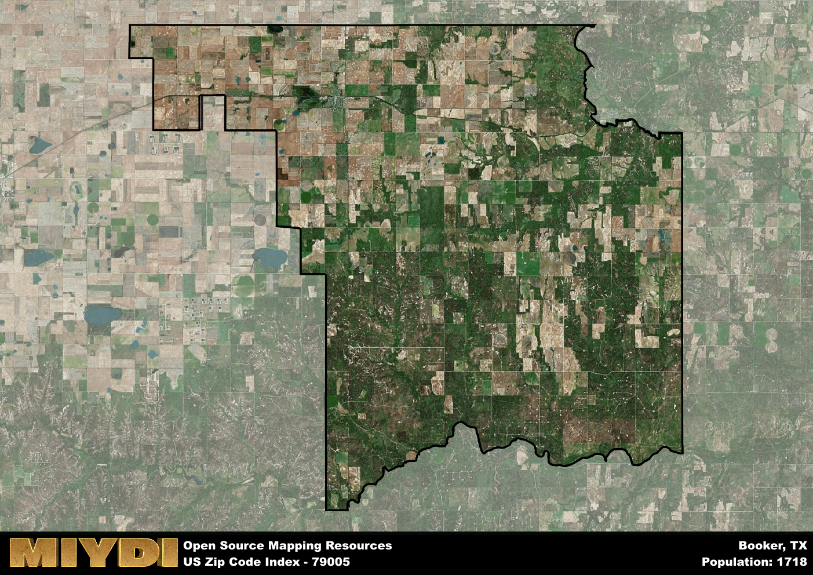

**Area Name:** Booker

**Zip Code:** 79005

**State:** TX

# Booker, TX - Zip Code 79005

Located in the northeastern corner of Texas, the zip code 79005 area is synonymous with the charming town of Booker. Situated in Lipscomb County, Booker is bordered by the towns of Darrouzett and Follett, and is approximately 180 miles northeast of Amarillo. Despite its small size, Booker plays a significant role in the region as a hub for agricultural activities and a close-knit community.

Booker has a rich history dating back to the early 1900s when it was founded as a railroad town. Originally named Loretta, it was later renamed Booker in honor of one of the Santa Fe Railway officials. The town experienced rapid growth due to its strategic location along the railroad and the fertile farming land surrounding it. Over the years, Booker has maintained its agricultural roots while embracing modern developments to sustain its economy.

Today, Booker remains a vibrant community with a focus on agriculture, particularly wheat and corn farming. The town offers essential services such as schools, medical facilities, and local businesses to meet the needs of its residents. Additionally, Booker boasts recreational amenities like parks, sports facilities, and a community center for social gatherings. Visitors can explore the town's historic sites, including the original railroad depot, showcasing Booker's enduring legacy as a vital part of the Texas Panhandle.

# Booker Demographics

The population of Booker is 1718.  
Booker has a population density of 5.72 per square mile.  
The area of Booker is 300.57 square miles.  

## Booker Income and Economic Data

These demographic numbers are sourced from IRS return data, providing comprehensive insights into the population dynamics and economic trends within Booker.

**Breakdown of return types for Booker**

The table offers insight into the composition of tax returns filed with the IRS, categorizing them into three main types. Single returns represent filings by individuals, joint returns by married couples, and head of household returns by individuals who qualify as heads of households, typically having dependents. This breakdown provides an understanding of the different filing statuses adopted by taxpayers when submitting their tax documentation.

| Return Types filed for Booker                              | Percentage          |
|----------------------------------------------------------|---------------------|
| Single Returns                                            | 0.38 |
| Joint Returns                                             | 0.47 |
| Head Household Returns                                    | 0.13 |

The income and economic data presented here is sourced from the IRS income brackets, utilized for categorizing tax returns by income levels. This table displays income ranges for both single filers and married couples, along with the corresponding number of returns and the percentage within each bracket, providing valuable insight into the distribution of taxes across various income groups.

| Bracket Name       | Single Filer Income Range | Married Couple Range | Number of Returns | Percentage of Returns |
|--------------------|----------------------------|----------------------|-------------------|-----------------------|
| 10% Bracket        | Up to $10,275              | Up to $20,550        | 180 | 0.3% |
| 12% Bracket        | $10,276 - $41,775          | $20,551 - $83,550    | 150 | 0.25% |
| 22% Bracket        | $41,776 - $89,075          | $83,551 - $178,150   | 100 | 0.17% |
| 24% Bracket        | $89,076 - $170,050         | $178,151 - $340,100  | 70 | 0.12% |
| 32% Bracket        | $170,051 - $215,950        | $340,101 - $431,900  | 80 | 0.13% |
| 35% Bracket        | $215,951 - $539,900        | $431,901 - $647,850  | 20 | 0.03% |

### Exploring Taxpayer Diversity: A Breakdown of Different Types of Tax Returns in Booker

The table offers insights into various types of tax returns filed, reflecting different aspects of taxpayer activities and demographics. Categories include charitable returns for donations, dependent returns for claimed dependents, educator population, elderly population, real estate returns, self-employment returns, student loan returns, and unemployment returns, providing valuable insights into taxpayer behavior and demographics.

| Booker Filing Types                    | Count | Percentage |
|--------------------------------------|-------|------------|
| Charitable Donations                 | 0 | 0% |
| Dependents Claimed                   | 0 | 0% |
| Educator Residents                   | 0 | 0% |
| Elderly Population                   | 150 | 0.25% |
| Farming Population                   | 60 | 0.1% |
| Real Estate Transactions             | 0 | 0% |
| Self-Employed Individuals            | 110 | 0.183% |
| Student Loan Cases                   | 0 | 0% |
| Unemployment Benefit Filings         | 40 | 0.07% |

## Booker AI and Census Variables

The values presented in this dataset for Booker are AI-optimized, streamlined, and categorized into relevant buckets for enhanced utility in AI and mapping programs. These simplified values have been optimized to facilitate efficient analysis and integration into various technological applications, offering users accessible and actionable insights into demographics within the Booker area.

| AI Variables for Booker | Value |
|-------------|-------|
| Shape Area | 1203198848.20313 |
| Shape Length | 194254.192425922 |

## How to use this free AI optimized Geo-Spatial Data for Booker, TX

This data is made freely available under the Creative Commons license, allowing for unrestricted use for any purpose. Users can access static resources directly from GitHub or leverage more advanced functionalities by utilizing the GeoJSON files. All datasets originate from official government or private sector sources and are meticulously compiled into relevant datasets within QGIS. However, the versatility of the data ensures compatibility with any mapping application.

## Data Accuracy Disclaimer
It's important to note that the data provided here may contain errors or discrepancies and should be considered as 'close enough' for business applications and AI rather than a definitive source of truth. This data is aggregated from multiple sources, some of which publish information on wildly different intervals, leading to potential inconsistencies. Additionally, certain data points may not be corrected for Covid-related changes, further impacting accuracy. Moreover, the assumption that demographic trends are consistent throughout a region may lead to discrepancies, as trends often concentrate in areas of highest population density. As a result, dense areas may be slightly underrepresented, while rural areas may be slightly overrepresented, resulting in a more conservative dataset. Furthermore, the focus primarily on areas within US Major and Minor Statistical areas means that approximately 40 million Americans living outside of these areas may not be fully represented. Lastly, the historical background and area descriptions generated using AI are susceptible to potential mistakes, so users should exercise caution when interpreting the information provided.
