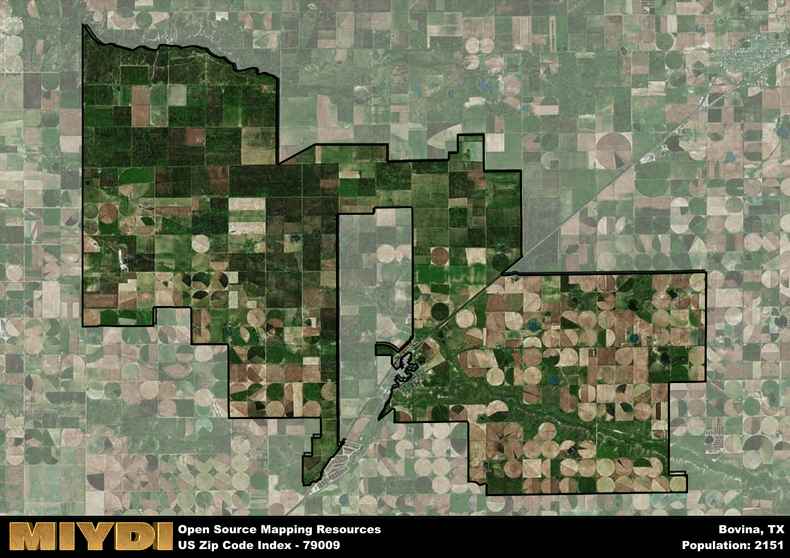

**Area Name:** Bovina

**Zip Code:** 79009

**State:** TX

Bovina is a part of the Clovis - NM Micro Area, and makes up  of the Metro's population.  

# Bovina: A Quaint Neighborhood in the Texas Panhandle  

Located in the Texas Panhandle, zip code 79009 encompasses the charming neighborhood of Bovina. Bovina is situated in Parmer County, just east of the New Mexico border. It is surrounded by vast plains and agricultural lands, with the city of Clovis, New Mexico, being the nearest major population center. Bovina is well-connected to nearby cities such as Amarillo and Lubbock via major highways, making it an integral part of the region's transportation network.

Bovina has a rich history dating back to the late 19th century when it was established as a cattle shipping point along the railroad. The town grew rapidly as agriculture became the dominant industry in the area, attracting settlers looking to capitalize on the fertile soil. The name "Bovina" is derived from the Latin word for cattle, reflecting the town's roots in the livestock industry. Today, Bovina maintains its small-town charm while embracing modern agricultural practices and technologies.

Presently, Bovina is a thriving community with a strong agricultural economy centered around livestock, cotton, and dairy farming. The neighborhood offers essential services such as schools, healthcare facilities, and shopping options to its residents. Bovina also boasts a number of parks and recreational facilities, providing ample opportunities for outdoor activities. Visitors can explore the town's historic sites, including the Bovina Depot Museum, which showcases the area's railroad heritage. With its blend of rural charm and modern amenities, Bovina continues to be a welcoming neighborhood in the Texas Panhandle.

# Bovina Demographics

The population of Bovina is 2151.  
Bovina has a population density of 19.17 per square mile.  
The area of Bovina is 112.21 square miles.  

## Bovina Income and Economic Data

These demographic numbers are sourced from IRS return data, providing comprehensive insights into the population dynamics and economic trends within Bovina.

**Breakdown of return types for Bovina**

The table offers insight into the composition of tax returns filed with the IRS, categorizing them into three main types. Single returns represent filings by individuals, joint returns by married couples, and head of household returns by individuals who qualify as heads of households, typically having dependents. This breakdown provides an understanding of the different filing statuses adopted by taxpayers when submitting their tax documentation.

| Return Types filed for Bovina                              | Percentage          |
|----------------------------------------------------------|---------------------|
| Single Returns                                            | 0.41 |
| Joint Returns                                             | 0.37 |
| Head Household Returns                                    | 0.22 |

The income and economic data presented here is sourced from the IRS income brackets, utilized for categorizing tax returns by income levels. This table displays income ranges for both single filers and married couples, along with the corresponding number of returns and the percentage within each bracket, providing valuable insight into the distribution of taxes across various income groups.

| Bracket Name       | Single Filer Income Range | Married Couple Range | Number of Returns | Percentage of Returns |
|--------------------|----------------------------|----------------------|-------------------|-----------------------|
| 10% Bracket        | Up to $10,275              | Up to $20,550        | 270 | 0.33% |
| 12% Bracket        | $10,276 - $41,775          | $20,551 - $83,550    | 260 | 0.31% |
| 22% Bracket        | $41,776 - $89,075          | $83,551 - $178,150   | 170 | 0.2% |
| 24% Bracket        | $89,076 - $170,050         | $178,151 - $340,100  | 70 | 0.08% |
| 32% Bracket        | $170,051 - $215,950        | $340,101 - $431,900  | 60 | 0.07% |
| 35% Bracket        | $215,951 - $539,900        | $431,901 - $647,850  | 0 | 0% |

### Exploring Taxpayer Diversity: A Breakdown of Different Types of Tax Returns in Bovina

The table offers insights into various types of tax returns filed, reflecting different aspects of taxpayer activities and demographics. Categories include charitable returns for donations, dependent returns for claimed dependents, educator population, elderly population, real estate returns, self-employment returns, student loan returns, and unemployment returns, providing valuable insights into taxpayer behavior and demographics.

| Bovina Filing Types                    | Count | Percentage |
|--------------------------------------|-------|------------|
| Charitable Donations                 | 0 | 0% |
| Dependents Claimed                   | 0 | 0% |
| Educator Residents                   | 0 | 0% |
| Elderly Population                   | 160 | 0.19% |
| Farming Population                   | 40 | 0.048% |
| Real Estate Transactions             | 0 | 0% |
| Self-Employed Individuals            | 80 | 0.096% |
| Student Loan Cases                   | 0 | 0% |
| Unemployment Benefit Filings         | 20 | 0.02% |

## Bovina AI and Census Variables

The values presented in this dataset for Bovina are AI-optimized, streamlined, and categorized into relevant buckets for enhanced utility in AI and mapping programs. These simplified values have been optimized to facilitate efficient analysis and integration into various technological applications, offering users accessible and actionable insights into demographics within the Bovina area.

| AI Variables for Bovina | Value |
|-------------|-------|
| Shape Area | 429447132.445313 |
| Shape Length | 168730.370429908 |
| CBSA Federal Processing Standard Code | 17580 |

## How to use this free AI optimized Geo-Spatial Data for Bovina, TX

This data is made freely available under the Creative Commons license, allowing for unrestricted use for any purpose. Users can access static resources directly from GitHub or leverage more advanced functionalities by utilizing the GeoJSON files. All datasets originate from official government or private sector sources and are meticulously compiled into relevant datasets within QGIS. However, the versatility of the data ensures compatibility with any mapping application.

## Data Accuracy Disclaimer
It's important to note that the data provided here may contain errors or discrepancies and should be considered as 'close enough' for business applications and AI rather than a definitive source of truth. This data is aggregated from multiple sources, some of which publish information on wildly different intervals, leading to potential inconsistencies. Additionally, certain data points may not be corrected for Covid-related changes, further impacting accuracy. Moreover, the assumption that demographic trends are consistent throughout a region may lead to discrepancies, as trends often concentrate in areas of highest population density. As a result, dense areas may be slightly underrepresented, while rural areas may be slightly overrepresented, resulting in a more conservative dataset. Furthermore, the focus primarily on areas within US Major and Minor Statistical areas means that approximately 40 million Americans living outside of these areas may not be fully represented. Lastly, the historical background and area descriptions generated using AI are susceptible to potential mistakes, so users should exercise caution when interpreting the information provided.
